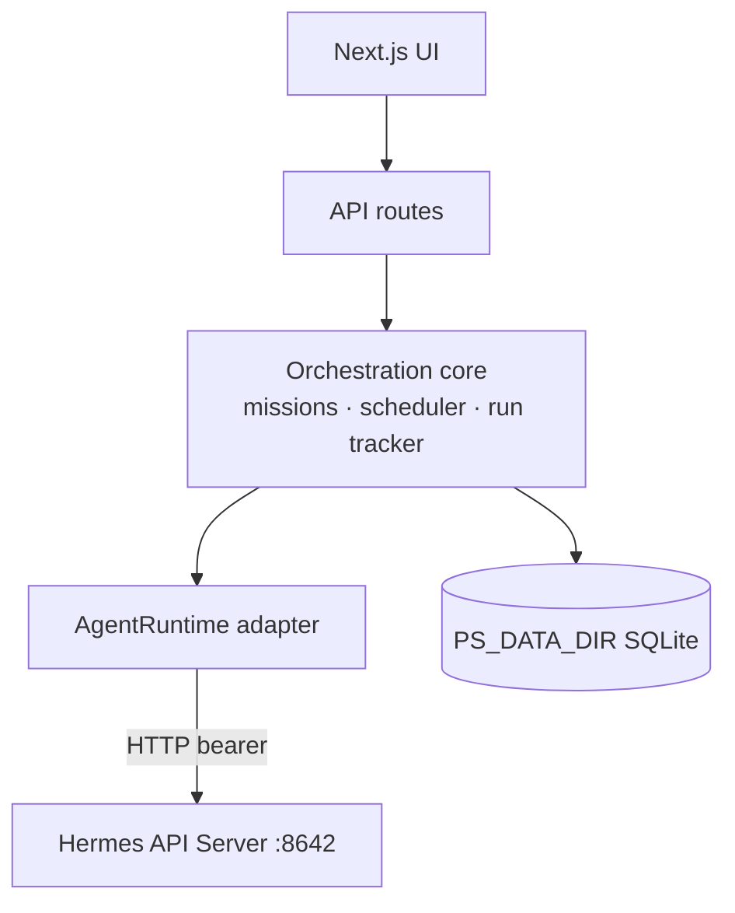

# PatterStage platform vision

PatterStage is the **Next.js control plane and orchestrator** I ship for [Hermes Agent](https://github.com/NousResearch/hermes-agent). It owns missions, scheduling, configuration, sessions, memory, and day-to-day operator workflows. Agent **execution** is handed off to a backend over its HTTP API — Hermes today, any framework tomorrow — through a single runtime adapter. PatterStage state lives in its own SQLite database; the agent is a remote service it talks to, not a process it shell-spawns.

## Architecture (layers)

- **Orchestration core** (`src/lib/orchestration/`) owns the mission lifecycle, the **PatterStage-owned scheduler**, and run reconciliation. It is framework-agnostic.
- **Runtime adapter** (`src/lib/runtime/`) is the one seam to a backend. `AgentRuntime` is modelled on async run semantics (submit / poll / stream / stop / approve + discovery); `HermesRuntime` implements it over the Hermes **API Server** (`API_SERVER_ENABLED=true`, default `http://127.0.0.1:8642`, bearer auth). Swapping in another framework means implementing `AgentRuntime` — nothing above the seam changes.
- **PatterStage state** lives under **`PS_DATA_DIR`** (SQLite: missions, **runs**, **schedules**, models, credentials, profiles, sessions, templates, stories). The **Hermes install** (`HERMES_HOME`) is touched only for config Hermes reads from files (`config.yaml` / `.env` / profile files), behind one write-back module with drift detection.

## Scheduling — PatterStage owns the timer

The "when does this run" decision lives in PatterStage, **not** in the agent.

- A `schedules` row is the source of truth (`next_run_at`, cron/interval/one-shot, `catch_up_policy`, repeat). The **scheduler tick** (`src/lib/orchestration/scheduler/`) selects due rows and dispatches a run via the runtime, then advances `next_run_at`.
- The scheduler is **traffic-independent**: `src/instrumentation.ts` boots it at server start, so it fires on an idle host with zero inbound HTTP.
- It is **restart-safe** (due work is recomputed from `next_run_at`, never an in-memory timer) and **exactly-once** (each occurrence is claimed under a deterministic run-id PK guard; `Idempotency-Key` protects the backend submit).
- `parseSchedule` + a dependency-free cron evaluator (`src/lib/schedule/next-run.ts`) compute fire times. There is no Hermes `jobs.json` and no Python cron bridge.

## Runs (not bash)

A mission dispatch is a single HTTP **run**: `runtime.submitRun()` returns a `run_id`; a `runs` row tracks it; `RunSync` reconciles it by polling `runtime.getRun()` on the background tick. Cancellation is `runtime.stopRun()`. There are no bash wrappers, pid files, `status.json` polling, or process-group signals.

## Core features

| Area | Role |
|------|------|
| Missions | CRUD + dispatch as HTTP runs; live run state via `runs`. |
| Scheduling | PatterStage-owned `schedules` + scheduler tick → runtime. `/api/schedules`. |
| Model / provider | SQLite registry + `/api/models`, `/api/credentials`; write-through to Hermes `config.yaml` / `.env`. |
| Config / sessions / memory / gateway / logs / skills / personalities | Hermes-aligned surfaces; sessions/skills/toolsets discovered via the runtime. |
| Stats & analytics | `/api/stats` aggregate powers the command-center dashboard (throughput, mission mix, run-activity heatmap, vitals, token usage) + per-entity insight strips + per-agent performance. Light derived progression (level / streak / achievements) presents engagement as stats — never gates functionality. |

## Testing the whole stack anywhere

`docker compose up --build` runs PatterStage against a **mock Hermes API Server** (`mock-hermes/`) — no real agent or API keys needed. The fast smoke (`npm run test:e2e-runtime`) drives mission → run → reconcile, schedules, and cancel through the real HTTP surface. For higher fidelity, **`npm run test:e2e-hermes`** brings up the **real** Hermes Agent (official image, pinned digest) + a mock LLM and validates 18 contract points, a full-stack smoke, and a DB upgrade-path step — this local run is the **merge gate** for runtime/DB changes. For a real agent in dev, point `HERMES_GATEWAY_URL` at a running `hermes gateway` (API server enabled).

## Security

- Treat the UI and API as **same-trust**: run on a private network or behind your own access controls.
- The runtime authenticates to the Hermes API Server with a bearer key (`API_SERVER_KEY`); keep that gateway bound to localhost — it grants the agent's full toolset including terminal access.

## Related docs

- [PATTERSTAGE.md](PATTERSTAGE.md) — repository overview and where to read next.
- [MISSIONS.md](MISSIONS.md) — mission board, dispatch, cancellation.
- [HERMES_CONFIG_INTEGRATION.md](HERMES_CONFIG_INTEGRATION.md) — Hermes path/config integration.
- [DEPLOY.md](DEPLOY.md) — host, port, TLS, Docker.
