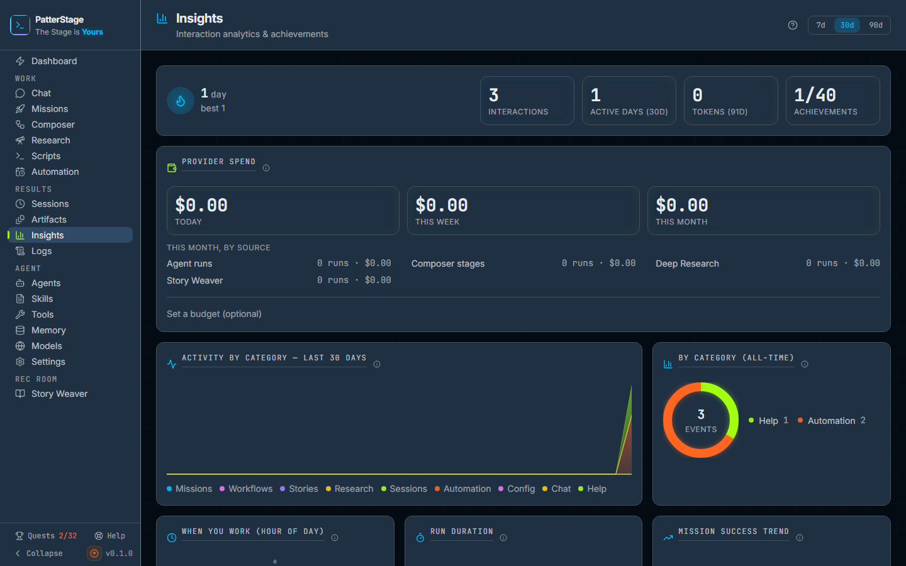

# PatterStage: User walkthrough

This guide is the **operator manual** for PatterStage. It describes every area of the web app and how to use it day to day. It is for **operators** who already installed Hermes and PatterStage (see [README](../README.md)). For REST API details and deployment, use the [documentation index](README.md).

The guide is written for the **Junior developer / operator**: every page is documented, every common action has a "Typical use" walkthrough, and "Notes" call out non-obvious behaviour. If you have not used PatterStage before, read the "What PatterStage is" section and the "Dashboard" section first, then jump to the page you need.

**How this guide is organised:** one section per sidebar entry, grouped by sidebar section (Orchestration, Operations, Laboratory, Main, Config, Rec Room) and in sidebar order within each group. Cross-references to the sibling technical docs ([MISSIONS.md](MISSIONS.md), [DEPLOY.md](DEPLOY.md), [API.md](API.md), [CATALOG_AND_PROFILES.md](CATALOG_AND_PROFILES.md), [TOOLS_AND_MISSIONS.md](TOOLS_AND_MISSIONS.md), [MIGRATION.md](MIGRATION.md), [ENV_REFERENCE.md](ENV_REFERENCE.md), [TESTING.md](TESTING.md), [SYSTEM-CRON.md](SYSTEM-CRON.md), [HERMES_CONFIG_INTEGRATION.md](HERMES_CONFIG_INTEGRATION.md), [RUNTIME_ARCHITECTURE.md](RUNTIME_ARCHITECTURE.md)) are made inline.

---

## Table of contents

1. [What PatterStage is](#what-patterstage-is)
2. [First run, and how you get in](#first-run-and-how-you-get-in)
3. [How it works behind the scenes](#how-it-works-behind-the-scenes)
4. [What changed in the July 2026 rebuild](#what-changed-in-the-july-2026-rebuild)
5. [Governance: the `org/` directory](#governance-the-org-directory)
6. [Dashboard](#dashboard)
7. [Orchestration → Missions](#orchestration--missions)
8. [Orchestration → Composer](#orchestration--composer)
9. [Orchestration → Scripts](#orchestration--scripts)
10. [Orchestration → Chat](#orchestration--chat)
11. [Operations → Agents](#operations--agents)
12. [Operations → Skills](#operations--skills)
13. [Operations → Tools](#operations--tools)
14. [Agent → Agents → Identity](#agent--agents--identity-was-operations--personalities)
15. [Laboratory → Insights](#laboratory--insights)
16. [Laboratory → Insights: provider spend](#laboratory--insights-provider-spend)
17. [Laboratory → Deep Research](#laboratory--deep-research)
18. [Laboratory → Artifacts](#laboratory--artifacts)
19. [Main → Sessions](#main--sessions)
20. [Main → Sessions (detail)](#main--sessions-detail)
21. [Main → Memory](#main--memory)
22. [Main → Logs](#main--logs)
23. [Config → All Settings](#config--all-settings)
24. [Config → Models](#config--models)
25. [Config → A section](#config--a-section)
26. [Config → Seed](#config--seed)
27. [Rec Room → Story Weaver (dashboard)](#rec-room--story-weaver-dashboard)
28. [Rec Room → Story Weaver / create](#rec-room--story-weaver--create)
29. [Rec Room → Story Weaver / library](#rec-room--story-weaver--library)
30. [Rec Room → Story Weaver / characters](#rec-room--story-weaver--characters)
31. [Rec Room → Story Weaver / themes](#rec-room--story-weaver--themes)
32. [Rec Room → Story Weaver / [id]: Story Reader](#rec-room--story-weaver--id-story-reader)
33. [Sidebar deploy buttons (Update / Rebuild / Restart)](#sidebar-deploy-buttons-update--rebuild--restart)
34. [Suggested workflows](#suggested-workflows)
35. [Related documentation](#related-documentation)

---

## What PatterStage is

**Hermes Agent** runs on your machine: it executes tools, delegates sub-tasks to subagents, talks to chat platforms, and stores config under `~/.hermes/`.

**PatterStage** is the **web dashboard** for that install. You use it to see health at a glance, dispatch missions, schedule recurring work, run host scripts, browse sessions, tune models, and edit agent behaviour, without living in the terminal.

PatterStage is **a Next.js app** that talks to a SQLite database under `~/patterstage/data` and to the active Hermes install under `~/.hermes`. Everything you can do in the dashboard, you can also do through a REST API. See [API.md](API.md). The dashboard never bypasses the API to write files on disk directly, so the data path is auditable.

**Why a separate app and not just a CLI?** Some things are easier in a UI: a session transcript with markdown rendering, a kanban mission board, a per-profile drift banner, a per-row Push/Pull on model records. PatterStage is the place to drive those workflows.

**The sidebar groups features into six sections**, in this order:

| Section | Purpose |
|---------|---------|
| **Main** | Overview, sessions, memory, logs |
| **Orchestration** | Missions (one-off + recurring), Composer workflows, Scripts (host cron), Chat |
| **Operations** | Agent profiles, skills, tools, personalities |
| **Laboratory** | Insights (analytics, achievements and provider spend), Deep Research, Artifacts |
| **Rec Room** | Story Weaver (interactive fiction) |
| **Config** | Models, HERMES.md, environment, YAML sections |

The first five are not a hand-written list. `src/components/layout/sidebar-config.ts`
builds them from every registered module's `nav` in registration order, so a
section appears where its module sits in `src/lib/modules/registry.ts`. **Config
Settings** is assembled separately, from the same modules' pinned links and
config groups, and always renders last.

At the bottom of the sidebar are three deploy buttons (**Update**, **Restart**, and **Rebuild**) that run the host's deploy runner, `scripts/tooling/ps-deploy.mjs`, and rebuild the running PatterStage process. See [Sidebar deploy buttons](#sidebar-deploy-buttons-update--rebuild--restart) and [DEPLOY.md](DEPLOY.md).

---

---

## First run, and how you get in

PatterStage has **one operator: you.** There is no signup, no user table, no roles.

On first boot it mints a random token into `PS_DATA_DIR/auth-token` at file mode
0600 and prints a URL containing `?ps_token=…`. Opening that URL exchanges the
token for an httpOnly cookie and immediately redirects to strip the token from the
address bar, so it never sits in your browser history.

Three ways to authenticate, all the same token:

| how | when to use it |
|---|---|
| `?ps_token=…` once, then the cookie | normal browser use |
| `Authorization: Bearer <token>` | scripts, curl, another machine |
| `PS_AUTH_MODE=none` | ONLY on a machine nobody else can reach |

**It fails closed.** No token configured means no access, not open access. Before
July 2026 this was the opposite: the app had no authentication at all, `requireAuth()`
was a misnamed read-only-flag check, and anyone on your LAN could write a script
file and then execute it. If you ever see a route other than `/api/health` answer
without a token, that is a bug worth reporting loudly.

**Read-only mode.** `PS_READ_ONLY=1` blocks writes by HTTP **method**, not by route.
Every GET keeps working, so the UI stays fully browsable. That distinction matters:
the older per-route version returned 503 from 35 GET handlers and bricked the very
mode it was meant to make safe.

---

## How it works behind the scenes

You do not need this section to use PatterStage. Read it when something behaves
unexpectedly and you want to know where to look.

### The shape of it

```
your browser
     │
     ▼
src/proxy.ts ......... authenticates EVERY request, fails closed
     │
     ▼
src/app/ ............. routing only. Pages and route handlers are thin
     │                 shells that delegate; almost no logic lives here.
     ▼
src/lib/ ............. core. The console's own logic: jobs, schedules,
     │                 runs, the four verbs, the database.
     ├─► src/lib/runtime/ ..... THE PORT. The only place that knows an
     │                          agent framework exists.
     └─► src/modules/ ........ product modules. hermes/ and rec-room/.
                               Core never imports these; it reaches them
                               through one of three composition points.
```

**The rule that keeps this honest:** core may not import a module. It is enforced
by a lint rule, not by convention, because a boundary you can cross without a red
build does not exist. Exactly one exception remains in the whole repository, and it
carries a written reason explaining why moving the code would make things worse.

### The port: Brain and Body

PatterStage talks to your agent through three small interfaces, and **only these
three files know it is Hermes**:

- **`AgentRuntime`**: what the agent *does*: submit a run, poll it, stream it,
  stop it, approve a gate.
- **`AgentWorkspace`**: where its *files* are: root, logs, config, env, memory.
- **`AgentGateway`**: where it *answers*: the base URL and the chat endpoint.

The vocabulary matters and it is deliberate. The **Brain** is the LLM: you select
it, and it never grows. The **Body** is everything you build up over time, the
profile, skills, tools, memory. When PatterStage shows an agent's level, it is
measuring the Body. Swapping to a stronger model raises throughput, not level, and
the two are reported separately on purpose.

### Where your data lives

One SQLite file under `PS_DATA_DIR`, currently at schema version 34 with 47 tables.
Both numbers move, so the authority is `MIGRATION_HEAD_SCHEMA_VERSION` in
`src/lib/db-schema.ts`: that constant is the head a migrated database must reach.
Nothing leaves your machine except the calls your agent makes to whichever model
provider you configured.

- **`missions`, `schedules`, `runs`**: the work. A mission is what you asked for;
  a schedule decides when; a run is one execution.
- **`sessions`**: one row per agent session, synced from the agent's own store.
- **`agent_profiles`, `agent_root`**: your agent's configuration, mirrored from
  its files so the UI can edit them.
- **`credentials`**: API keys. **Stored in plaintext today.** They are on your own
  machine behind file permissions, but this is worth knowing rather than assuming.
- **`analytics_events`, `chat_messages`**: append-only, and the two tables that
  grow with use rather than with anything you create. Both now carry a declared
  retention window (400 days and 365 days), and both ship with the prune
  **switched off**, so nothing is ever deleted by an upgrade. Turning it on and
  running it are two separate commands you type yourself: `npm run db:retention`
  shows the policy and exactly what a prune would take, and changes nothing.
  See [MIGRATION.md](MIGRATION.md) for the rules and
  [ADR-0009](../org/decisions/ADR-0009-retention-for-the-readings-tables.md) for
  why those numbers.

**Migrations run forward only.** There is no down-migration, which is why the
update script backs up the database *before* migrating: the backup is the rollback.
A migration that fails does not record itself as applied, so a half-applied schema
cannot be silently remembered as complete.

### How work actually runs

1. You commission a mission. It lands in `missions` with a status.
2. A schedule (or an immediate dispatch) makes it due.
3. The scheduler claims it with a **deterministic occurrence id** used as a primary
   key. That is the exactly-once guarantee: two ticks racing produce the same id,
   and the second insert simply fails.
4. `AgentRuntime.submitRun` sends it to the gateway. If the gateway is at capacity
   and answers 429, the adapter **retries** rather than treating it as failure -
   before July 2026 a busy gateway looked identical to a stage that produced a bad
   verdict.
5. Progress streams back over SSE. Runs are recovered from `next_run_at` on boot
   rather than from in-memory timers, so a restart does not lose scheduled work.

### The Composer, and why its gates are strict

A **workflow** is a graph: nodes are stages, edges are `on_pass` / `on_fail` /
named outcomes. Some stages are *assessing* stages, which must state a verdict.

Four things it now refuses to do, each of which it used to do silently:

- A stage with **no** `VERDICT:` marker **fails**. It used to pass, so a stage that
  ran out of tokens was indistinguishable from one that verified something.
- A verdict inside a `<think>` block **does not count.** A reasoning model that
  weighed "VERDICT: PASS" while concluding FAIL used to route `on_pass`.
- A human gate on a **failed** stage routes `on_fail`, not `on_approve`.
- Editing a workflow no longer silently deletes every run it ever had.

### The gates you inherit

`npm run lint` runs nine checks in this order, and they are the repo's actual law:

| check | what it stops |
|---|---|
| `check-agent-files` | `AGENTS.md` over 40 lines, or `CLAUDE.md` drifting from it |
| `check-doc-links` | a link in `docs/` pointing at a file that does not exist |
| `check-derived-views` | a derived view (`org/TASKS.md`) disagreeing with the records under `org/tasks/` |
| `check-read-only-guards` | a read-only guard inside a `GET`, `HEAD` or `OPTIONS` handler, the defect described under [Read-only mode](#first-run-and-how-you-get-in) |
| `design-lint` | 11 rules on a **shrink-only** baseline: it may fall, never rise |
| `contrast-check` | a text tier drifting below the WCAG AA floor it claims to clear |
| `coverage-floor-check` | a declared coverage floor being edited downwards |
| `eslint` | zero warnings tolerated |
| `typecheck:tests` | a test that lies about a real function signature |

Then `tsc`, `jest` (3,214 tests at the time of writing; read the run, not this number), and `next build`.

**The shrink-only baseline is the important idea.** Turning ten design rules on
against a large codebase produces hundreds of failures, and a gate that is red on
day one gets deleted rather than fixed. So today's violations are recorded and
allowed; anything **new** fails. The number can only go down.

---

## What changed in the July 2026 rebuild

Read this if you used PatterStage before and something has moved.

**Security, and this one was serious.** The app had no authentication whatsoever.
From your LAN, unauthenticated, an attacker could write a script file and then
execute it. Also fixed: a crontab allowlist that checked substrings rather than
resolving paths, your `.env` served in plaintext over HTTP, and a fetcher that
would retrieve any URL a search result pointed at including `127.0.0.1`.

**Silent-failure bugs.** Every migration applier swallowed exceptions and then
recorded the migration as applied. The four Composer defects above. A stale event
stream that could approve a gate **on the wrong run**.

**Benchmarks were deleted**, and the reason is worth knowing: the tables had zero
rows in every database, it had never been run once, and all 94 items were
closed-book, so skills, tools and memory could not move the number it claimed to
measure. Four mechanisms were rescued into core first, including the trajectory
recorder (the only thing that captures what an agent *did* rather than what it
output) and the 429 retry.

**The agent surface became a module.** Everything Hermes-shaped now lives in
`src/modules/hermes/`. This is what makes "framework-agnostic" checkable instead of
aspirational: a lint rule can now assert that nothing outside that directory knows
the Hermes filesystem.

**Gamification survived, honestly.** The agent's level is real, it counts
completed runs, active days, skills, toolsets, memory facts. The *capability rating*
is gone, because it was computed from content that could not measure capability. The
Agents page now shows every input behind the level, so no number makes a claim it
cannot support.

**Two columns were renamed** in migration 030: `hermes_md` → `framework_md`,
`cron_jobs.hermes_job_id` → `external_job_id`.

---

## Governance: the `org/` directory

New in July 2026, and it will look odd if you are not expecting it. PatterStage now
governs itself with the PatterTech EOS at scale **ORG**:

- **`docs/VENTURE_BRIEF.md`**: what this is, who it serves, and the three cheapest
  ways it dies. Written from the operator's own words.
- **`docs/LOCKBOOK.md`**: the pinned build contract, and the structural contracts a
  future edit must not break. Split into what is *enforced* and what is *ruled but
  not yet enforced*, so the difference is visible.
- **`docs/RULINGS.json`**: the rulings themselves, one record each, carrying the
  argument that produced them.
- **`org/tasks/`**: the work, one JSON record per task, each tracing to the warrant
  that asked for it.
- **`org/decisions/`**: the architecture decision records. A recorded decision wins
  over anything you infer from the code.
- **`org/QUESTIONS.md`**: the open questions, recorded rather than guessed at.
- **`docs/EOS_FEEDBACK.md`**: defects PatterStage found in the EOS itself.

If a rule in `docs/LOCKBOOK.md` and the code disagree, the lock-book is the
intention and the code is the bug.


## Dashboard


*The dashboard with work in flight, showing the header bar, stat pills, Mission Dispatch strip and system monitor this section walks through.*

The dashboard is your **operations board**, not the primary place to launch missions and not the place for history. It answers "what is happening on this machine right now?" at a glance and gives you one-click access into the deeper pages; the charts, the mission mix and the trophy case live on [Insights](#laboratory--insights). Polls `/api/monitor` every 10 seconds, `/api/agents` every 15 seconds, and `/api/missions` every 15 seconds.

### What you see

**Header bar**
- **ONLINE** status dot (green) when `/api/monitor` reports the agent framework is available; **NOT INSTALLED** (orange, with a tooltip naming the agent) when the monitor says it is not. A monitor that cannot tell either way is read as available, so this badge only ever goes orange on a definite answer.
- Subtitle showing the active model, read from `~/.hermes/config.yaml` first and from the Models registry as a fallback. If the registry disagrees, a hint suggests "push Bob to write config.yaml".

**Stat row (six pills)**
- **Gateway:** the gateway's state in the ratified words, **Healthy**, **Degraded** or **Not running**, from the same check the Subsystems panel shows; opens Settings › System.
- **Memory:** the memory provider's state in the same words, with the fact count underneath; opens Memory.
- **Scheduler:** the background scheduler's heartbeat, reading **Ticking**, **Stalled**, **Never started** or **Unknown**, with the age of the last tick and the pid holding the lease underneath; opens Settings › System. This is the only surface that tells you the scheduler has stopped: when it stops, schedules quietly do not fire and a dispatched mission stays "running" forever.
- **Spend:** this month's estimated provider spend; opens Insights, where the spend panel and the budget live.
- **Processes:** number of active Hermes processes. Shows "N Active" when there is at least one agent running, "Idle" when no agents are running, and "Offline" when the agent detector is unreachable; opens Agents.
- **Errors:** how many recent error rows the monitor holds; opens Logs.
- While the monitor has not answered yet the row shows six placeholders. If the monitor **fails**, the row is replaced by an error banner reading "Couldn't read monitor data" with a **Retry** button; nothing on this board shows green until it has actually been read. While the subsystems check is still in flight, Gateway and Memory read "Checking…"; if that check itself failed, they read "Unknown".

**Progress line**
- One row under the pills: the current streak (days, with your best), the top agent's level badge (opens Agents), your achievements as unlocked/total (opens Insights), the next automation due (or "No automation scheduled"), and a **Quests** link. If the stats read fails, the row shows "Couldn't read stats" with a Retry.

**Continue work card**
- A link to the most recent session with "open transcript" and "X minutes ago".
- A "Session browser →" link into `/sessions` for the full history.

**Mission Dispatch strip**
- Header: "Mission Dispatch · full control →".
- Collapsed: a horizontal pill strip of up to twelve mission templates; an "N more" pill expands it.
- Expanded: templates grouped by category in accordions.
- Clicking a pill opens the mission composer with that template pre-filled at `/orchestration/missions?template=ID&compose=1`.

**Active Missions list** (only when count > 0)
- One row per active mission: status dot, name, dispatch mode badge, last session id (links to transcript), status badge, "X ago" timestamp, and a **Cancel** button with a two-step confirm.
- Empty mid-mission rows show "Session loading…" until the first session record arrives.

**Two-panel system monitor**
- **Platforms panel:** one row per configured Hermes platform with a status dot, a "Configured" or "Not configured" label, and a background-sync line ("Sync: 5m ago ✓") with a "Sync now" button.
- **Errors panel:** pill filter for All / Error / Warning, deduplicated by source and message with a "(×N)" suffix on repeats.

**Running Hermes Processes**
- A section header with a refresh button.
- Cards for each process: name, status, type, model (when known), turn count, last activity timestamp.
- Empty: "No Active Processes Detected".

There is no Rec Room card and no clock on the board any more: Story Weaver is one click away in the sidebar, and the charts that used to sit under the monitor are on Insights.

### Typical use

1. Open PatterStage after install and confirm **ONLINE** is showing, the model name matches what you expect, and Hermes paths resolve.
2. Glance at the six stat pills; if Memory reads Degraded or shows 0 facts when you expected some, see [Main → Memory](#main--memory) to investigate.
3. Check **Running Hermes Processes** if a mission feels stuck: the list tells you what is actually executing.
4. Use **Sync now** on the Platforms panel when you have changed Hermes config outside the UI (via `hermes config edit` on the host, for example). Otherwise the next 5-minute background sync will pick it up.
5. Follow **Continue work** to the latest session, or click **Sessions** in the sidebar for the full history.
6. For mission work, go to **Orchestration → Missions**. The dashboard strip is for one-click dispatch of templates; the full composer is on the missions page.

---

## Orchestration → Missions


*The missions board, the five-column view that tracks a mission from Draft to Failed and holds the composer that creates them.*

The mission board is where you **compose, dispatch, schedule, and cancel** agent work. Almost all logic lives in `hooks/useMissionsPage.ts` and `components/missions/`; the page is a thin view-model wiring it all up.

### What you see

**Header**
- Refresh button to re-fetch the mission list.
- **+ New Mission** button that opens the composer sheet.

**Stat strip**
- A donut splitting missions into Successful / Failed / Dispatched / Queued with the total in the middle.
- Four tiles: **Total**, **Active**, **Done**, **Failed**.
- A success-rate ring on the right.

**Quick templates strip** (only when the composer is closed)
- Category filter pills at the top.
- Template cards below, showing the icon, name, and short description.
- **Manage templates** button opens the `TemplateManagerModal`.
- **Manage categories** button opens the `CategoryManagerModal`.

**Kanban board (five columns)**
- **Draft:** missions saved as drafts (`status=queued`, `queued_for_run=0`). They are not yet submitted to Hermes.
- **Queued:** missions waiting for the worker (`status=queued`, `queued_for_run=1`). The `MissionQueueSync` runs every 15 seconds and dispatches the oldest queued mission when no mission is currently dispatched (single-flight).
- **Dispatched:** currently running or about to run.
- **Successful:** completed successfully. This column is collapsed by default; click the chevron to expand.
- **Failed:** cancelled, errored, or terminated unexpectedly. This column is also collapsed by default.

**Filters and search above the board**
- Status filter pills (all / draft / queued / dispatched / successful / failed) that reset pagination to 0 when toggled.
- A search box that filters the visible mission names.

**Per-mission card**
- Status dot, name, age, dispatch mode badge, latest session id, optional cronJob id, optional error message.
- Clicking the card expands an inline `MissionEditorPanel` with the full mission.

**Per-mission actions (in the expanded panel)**
- **Copy prompt:** copy the assembled agent prompt to the clipboard.
- **Duplicate:** clone the mission as a new draft.
- **Edit:** re-open the composer for the existing mission (the form title becomes "Edit Mission" or "Re-Dispatch: <name>" depending on status).
- **Delete:** two-step confirm; removes the mission and any linked schedule (or legacy cron job).
- **Cancel:** two-step confirm; stops the running agent. Works for **running** and **queued** missions. The UI updates immediately. Behind it, `cancelMissionRun()` asks the gateway to stop the run over HTTP (`runtime.stopRun`), then finalises the local run, mission and session rows whether or not that call succeeded. There are no signals and no `pkill`.

**Composer sheet (opens for new / edit / re-dispatch / template-apply)**

The composer is the full form. It is organised into five sections, each collapsible:

1. **Category and name:** the category combobox is a controlled list with the eight default categories plus any user-created ones. The name is what shows on the board and in the Active Missions list.
2. **Instruction and goals:** the instruction is required, free-form, and becomes the agent's primary prompt. Goals are one per line. Context is an optional block of additional framing.
3. **Mission parameters** (optional, collapsible): local directories (path + branch + directory picker modal), references, skills, toolsets, output format, constraints. The **ToolsetSelector** only lists toolsets enabled on the selected profile.
4. **Runtime** (optional, collapsible): profile, model, provider, schedule type (interval / wall-clock / post-run), schedule string, mission duration in minutes, and timeout in minutes.
5. **Assembled agent prompt** (preview pane): shows the XML payload that will be sent to Hermes, with a **Human** / **AI** toggle (Human is the form mirror; AI is the stored agent prompt) and a copy button.
6. **Dispatch footer**, four actions:
   - **Save draft:** `dispatchMode: save`. Persists as a draft in the **Draft** column.
   - **Queue:** `dispatchMode: queue`. Persists as queued for run; the worker will pick it up.
   - **Run now:** `dispatchMode: now`. Creates the mission and dispatches immediately via `dispatchMissionNow()` (an HTTP run on the runtime).
   - **Schedule:** `dispatchMode: cron`. Creates a PatterStage **`schedules`** row (mission-linked) that the built-in scheduler fires. There is no Hermes `jobs.json` bridge. The first run starts immediately; later runs follow the schedule. Recurring missions appear in the **Scheduled missions** section below the board.

The composer also has a **Save as Template** button that stores the current form as a reusable custom template in the templates table.

### Typical use

1. Click **+ New Mission** (or pick a template from the strip).
2. Fill in the instruction and (optionally) goals.
3. Expand **Runtime** if you want a non-default profile or model.
4. Expand **Assembled agent prompt** to sanity-check the agent-facing text.
5. Click **Run now** for immediate runs, or **Schedule** for recurring work.
6. Watch the card move from **Queued** to **Dispatched**, then to **Successful** or **Failed**.
7. To stop early, expand the card and click **Cancel**. The card moves to **Failed** immediately, because local state is finalised regardless; the stop request travels to the gateway separately.

For mission lifecycle details (single-flight queue, model resolution, cancel signal sequence, session closure bridge), see [MISSIONS.md](MISSIONS.md).

### Notes

- Cancel has no platform branch: it is one HTTP stop call plus a local write, so it behaves the same on Linux, macOS and Windows. The caveat worth knowing is a different one. The stop call is best-effort, so a gateway that does not answer it leaves the remote run alive while PatterStage has already marked the mission failed. If a cancelled mission still seems to be burning tokens, check the gateway, not PatterStage.
- "Re-Dispatch" opens the same composer with the existing fields; choosing a dispatch mode creates a brand-new mission id (not an in-place update of the completed one).
- Promoting a draft or queued mission uses `action: "promote"` on `POST /api/missions`. The route the API uses depends on the mission's current status, and the UI handles this for you.

### Scheduled missions

Below the board is the **Scheduled missions** section, the recurring agent work that the PatterStage scheduler fires (no Hermes `jobs.json`). Each row shows **name · cadence · next run · last status** with **Pause/Resume**, **Run now**, and **Delete**. New recurring missions land here automatically when you dispatch with **Schedule**; you can also put an existing saved mission on a timer with **Schedule a mission** (pick the mission, a cadence like `every 30m` or `0 9 * * *`, and a catch-up policy). Deleting a mission removes its schedule.

This replaced the separate "Schedules" page: scheduling now lives with the missions it drives.

---

## Orchestration → Composer

**Orchestration → Composer** is the **graph orchestrator**. A **workflow** is a stored directed graph: nodes are **stages**, edges are guarded transitions (`always`, `on_pass`, `on_fail`, `on_approve`, `on_reject`, or a custom `on_<outcome>` branch label). A **run** executes that graph one stage at a time, and a stage is normally one agent run submitted through the runtime (`research` and `group` stages are the exceptions; see **Notes**), so a "loop" is nothing more than an edge pointing back at an earlier node, and a "human gate" is a node whose `gate` is `hil`. Missions dispatch one agent; Composer dispatches a whole process.

The page reads workflows from `GET /api/composer/workflows` (`useComposerWorkflows`), the run list from `GET /api/composer/runs` (`useComposerRuns`, polled every 4s), and the selected run plus its graph from `GET /api/composer/runs/[id]` (`useComposerRun`, polled every 3s). On top of that it opens an SSE subscription to `/api/composer/runs/[id]/events` via `useEventStream`, and prefers the streamed snapshot over the polled copy. The engine is `src/lib/composer/engine.ts`, driven by `ComposerTickSource` on the BackgroundScheduler and by reconcile whenever a stage's agent run goes terminal. The whole page is behind the `composer` feature flag; see **Notes**.

### What you see

**Header**
- `GitBranch` icon, title "Composer".
- Subtitle: "Graph-orchestrated, multi-stage agent workflows", then "with loops and human-in-the-loop gates".
- Two banners can appear beneath it: a `LoadErrorBanner` when the workflow list fails to load, and a second one prefixed "Live updates: " when the SSE endpoint reports a server-side read failure.

**Run / Build tabs**
- Two tabs, **Run** (the default) and **Build**. Run launches and watches; Build is the workflow editor.

**Launch form (Run tab)**

`ComposerRunForm` describes itself from the *selected* workflow's start-node `config.inputSpec`, so its labels change per workflow.
- **Orientation card:** the workflow name, an "N stages" count, the workflow description, then one chip per stage in `pos` order joined by arrows. An HIL stage's chip is yellow and titled "human-in-the-loop gate".
- **Objective box:** a textarea whose `Field` label comes from `objectiveLabel`. The seeded **Software Delivery** workflow labels it "Feature request / bug report" and hints "e.g. Add a dark-mode toggle to the settings page, persisted per user." A workflow with no input contract falls back to the label "Objective".
- **Examples row:** a label reading "Examples" then "click to fill", followed by one chip per example. Clicking a chip replaces the objective text.
- **"Workflow"** select and **"Agent profile"** select. Profiles come from `/api/agent/profiles`, with "Default profile" as the first option.
- Primary button: **"Review…"**. Disabled until the objective is at least 3 characters and a workflow is selected; while it is too short the form shows "Describe your objective (≥ 3 characters) to enable the run."
- Once a run is selected the form collapses to a one-line bar reading **"New run"** with the active workflow's name on the right. Clicking it re-expands the form.

**"Review before launch" modal**

Opened by "Review…", and the second half of a deliberate two-step launch. Nothing has been submitted at this point.
- Title: "Review before launch".
- The workflow name and description, the objective echoed back verbatim, then a line reading "N stages · profile <name>" (or "profile default").
- One chip per stage. Stages whose `kind` is `implement`, `build_tests` or `pr` (the `WRITE_KINDS` set) are drawn in orange and titled "This stage can modify your repository".
- When any such stage is present, an orange warning box states "This workflow can modify your repository." and names the stages that "may write code, tests, or open a pull request."
- Footer: **"Cancel"**, and the confirm button. With no write stages it reads **"Confirm & launch"**; with write stages it turns orange and reads "Confirm", then "includes write stages". Only this button issues `POST /api/composer/runs`.

**Runs list (left column)**
- Header "Runs", plus a status `Select` offering "All runs", "Running", "Awaiting gate", "Completed", "Failed".
- Each row: a title derived from the run input (first non-blank line, leading `#` stripped, truncated at 60 characters), the status word colour-coded (`running` cyan, `awaiting_approval` yellow, `completed` green, `failed` pink, `cancelled` orange), and a relative timestamp.
- Empty states: "No workflow runs yet." when there are none at all, and "No runs match this filter." when the filter hides them.

**Pipeline detail (right column)**
- Nothing selected: "Select a run to watch it live", with a second line saying stages light up as they run and that any stage can be clicked for its details.
- Selected but the graph has not arrived yet: a spinner and "Loading run…". This is deliberately not the empty state, so a click never looks like it did nothing.
- Loaded: a summary bar with the run title, the run status, its age, and either the run's error in pink or the hint "Click a stage for its verdict & output".
- **`WorkflowRunCanvas`:** the same react-flow board as the builder, read-only. Each node shows its label, an `HIL` badge on a human-gated stage, an "×N" badge once `attempt` exceeds 1, then the kind, the node-run status, and the word "fail" when the verdict failed. Border and dot colour track status: `running` cyan, `completed` green, `failed` pink, with `pending` and `skipped` left neutral. The current node carries a cyan ring and a pulsing dot, and the edges leaving it animate and glow. Edge labels show the condition unless it is `always`.
- Nodes cannot be dragged or connected here; clicking one opens the stage sheet.

**The gate prompt (top right of the canvas)**
- Shown only while the run status is `awaiting_approval` on a human-gated stage. A yellow panel reads "Gate at", then the stage label, then "your call:", with a note textarea placeholder "Optional note (e.g. what to change on reject)…" and two buttons, **"Accept"** and **"Reject"**. Both post to `/api/composer/runs/[id]/nodes/[nodeId]/approve`, carrying the note when you typed one.
- **Clarification variant:** when the run's `context.__clarify` marker is set, the same slot shows a cyan panel with the stage's question, a textarea placeholder "Your answer…", and a **"Submit answer"** button posting to `/api/composer/runs/[id]/clarify`.

**Stage side-sheet (`ComposerNodeRunDetail`)**
- Opens when you click a node. The title is the stage label; the subtitle is the kind followed by "human gate" or "auto".
- If the stage has not executed: "This stage hasn't run yet."
- Otherwise: the node-run status, "attempt N" when greater than 1, and a timestamp; a **"Verdict"** block showing `PASS` or `FAIL` plus the optional outcome label, the reasons as bullets and a **"Suggestions"** list; an **"Error"** block in pink; and an **"Output"** block with the raw stage text.
- The Output header carries a **"Save as artifact"** button, which becomes "Saving…" and then "Saved". With no output, no verdict and no error, the sheet reads "No output recorded for this stage."

**Build tab (the workflow editor)**
- Toolbar: an "Edit workflow" select (first option "+ New workflow"), a "Name" field, **"Auto-layout"**, **"Create"** or **"Save"**, and **"Delete"** for an existing workflow.
- A "Drag to add" palette on the left offering Task, Research, Validate, Test and Group, with the hint "Drag onto the board, then handle → handle to connect."
- Clicking a node opens the **"Stage"** inspector: "Label", "Kind", "Instruction (optional override)", "Research query (optional)" on a `research` node, "Sub-workflow" on a `group` node, a "Workflow input (Run form)" block on the start node ("Objective label", "Hint / placeholder", "Examples (one per line)", "Domain framing (optional)"), the "HIL gate", "Start" and "End" toggles, and **"Delete stage"**.
- Clicking an edge opens the **"Route"** inspector: "Condition" (hinted as `always · on_pass · on_fail · on_approve · on_reject · on_<outcome>`), a "Label (optional)" field, and **"Delete route"**.

### Typical use

1. Open **Orchestration → Composer** and stay on the **Run** tab.
2. In **"Workflow"**, pick **Software Delivery**. It is seeded on boot by `ensureDefaultComposerWorkflows()` and runs Review, Validate, Research, Hypothesise, Plan (HIL), Build tests (TDD), Implement, Test, Documentation, Open PR (HIL), Unit tests, Integration tests, Acceptance tests, Final assessment, Update PR (HIL), Done.
3. Write the objective in the **"Feature request / bug report"** box, or click an example chip to fill it.
4. Leave **"Agent profile"** on "Default profile" unless this run should use a specific Hermes profile.
5. Click **"Review…"**. Still nothing has been dispatched.
6. In **"Review before launch"**, check the workflow, the objective exactly as it will be submitted, and the stage chips. If the orange "This workflow can modify your repository." warning is present, confirm the scope is what you meant.
7. Click **"Confirm & launch"** (or the orange confirm button when write stages are present). The run is created, the launch form collapses onto it, and the first stage dispatches immediately rather than waiting for the next tick.
8. Watch the board. The active stage rings cyan and its outgoing edges animate; completed stages turn green and failed ones pink.
9. When the run reaches a human gate it parks at `awaiting_approval` and the gate panel appears. Click that stage first to read what it produced, then **"Accept"** to follow the `on_approve` edge or **"Reject"** to follow `on_reject`. On Software Delivery, rejecting at "Plan" loops back to "Review" and rejecting at "Open PR" loops back to "Implement". The optional note is persisted on the approval record.
10. Click any stage for its verdict and output, and use **"Save as artifact"** to keep a stage's text. When the run completes, its final stage output is captured automatically to **Laboratory → Artifacts**.

### Notes

- **This page is feature-flagged.** The flag key is `composer` and the env var is **`PS_COMPOSER`** (`src/lib/feature-flags.ts`). It **defaults to ON**: set `PS_COMPOSER=0` (or `false` / `no` / `off`) and restart, and three things happen together. The sidebar link disappears (`Sidebar.tsx` hides any link whose flag is explicitly false), the route 404s (`layout.tsx` calls `requireFeatureOr404("composer")`), and the `/api/composer/*` routes return 503 with "Composer is not enabled. Set PS_COMPOSER=1 to enable workflows." The one exception is the live stream `/api/composer/runs/[id]/events`, which carries no flag check of its own; nothing reaches it once the page 404s. The composer tick short-circuits as well, so in-flight runs simply stop advancing. Any other value, including unset, keeps it enabled.
- **"Review…" never launches anything.** The ellipsis is the convention for a control that opens a further step. The click only opens the modal; `POST /api/composer/runs` is issued by the modal's confirm button.
- **Assessing stages must state a verdict.** Kinds `validate`, `test`, `unit_test`, `integration_test`, `acceptance_test`, `final_assessment` and `review` are told by the stage prompt to end with `VERDICT: PASS` or `VERDICT: FAIL`. An assessing stage that emits no marker **fails**, with the reason "The stage did not report a verdict, so its result cannot be trusted." A verdict written inside a reasoning block (`<think>`, `<thinking>`, `<reasoning>`, `<scratchpad>` or `<reflection>`) does not count, and the literal instruction line "VERDICT: PASS or FAIL" is refused as a template rather than read as a pass.
- **A failed stage cannot be approved.** If the stage crashed or its verdict failed, the engine routes `on_fail` whatever the gate says, so clicking "Accept" on a broken stage cannot carry a run to `completed` with nothing behind it.
- **Loops are bounded.** A single stage may execute at most 5 times in one run, that is four re-runs after the first attempt (overridable per node via `config.maxAttempts`), and a run may execute at most 100 stages in total. Hitting either limit stops the run with a readable error instead of looping forever.
- **A failure with nowhere to go fails the run.** If a stage fails or is rejected and the graph has no `on_fail` or `on_reject` edge leaving it, the run fails with the stage label and the verdict reasons, for example "Review failed: the goal is too vague". That sentence is what the pink line under the run title shows.
- **With no Hermes gateway, runs fail at the first stage.** `dispatchComposerNode` submits each stage through the runtime; when the gateway is unreachable the node-run is marked `failed` with the transport error (falling back to "stage dispatch failed"), and the next composer tick routes that as an `on_fail`. Browsing workflows, reading past runs, and the whole Build tab work with no gateway at all. A gateway answering 429 is not failed on the spot: the submit is retried up to three times on a short linear backoff (2s, 4s, 6s), four attempts in all and about 12 seconds in the worst case, so a brief brush with its concurrency cap costs no attempt. A 429 that outlasts the retries still fails the stage.
- **`research` and `group` stages do not use the agent runtime.** A `research` node drives a Deep Research run and is force-failed after 20 minutes so an interrupted one cannot wedge the workflow. A `group` node spawns its referenced workflow as a nested run, blocked from recursing into a workflow already in its own parent chain and capped at 8 levels of nesting.
- **The stream is a convenience; the database is the truth.** A dropped socket is silent and self-healing, because polling still covers it. Only a genuine server-side read failure raises the "Live updates: " banner, and the last good snapshot stays on screen underneath it.
- **The view is deep-linkable.** The selected workflow and run are mirrored into the URL as `?workflow=` and `?runId=` with `history.replaceState`, so a reload or a shared link lands on the same run.
- **The unattended spend stop pauses the tick, not you.** When the operator has armed a hard spend stop and it is breached, `composerTick` refuses to advance runs on its own; approving a gate still calls the engine directly, because attended work is never blocked.
- **Editing a workflow can destroy run history.** A save from the Build tab replaces the whole graph, so once a workflow has any past run at all, completed, failed or cancelled alike, the save returns 409 and the canvas asks first, naming how many runs, with their stage outputs and approvals, would be permanently deleted. A workflow with a run still in flight is refused outright, and told to let it finish or cancel it first.
- **Artifact capture is idempotent and top-level only.** The automatic capture on completion (tagged `composer`) is skipped for nested sub-workflow runs, since the parent run holds the deliverable people care about. A manual "Save as artifact" is tagged `composer` and `saved`.
- Deeper reference, including the schema tables and the full API table: [COMPOSER.md](COMPOSER.md).

---

## Orchestration → Scripts

The **Scripts** page is a file-aware manager for **host scripts** under `PS_DATA_DIR/scripts` (backups, cleanups, health checks), separate from agent missions. (Scheduling *agent* work is done from the Missions composer's **Schedule** mode; see the [Scheduled missions](#scheduled-missions) note above.) It reads the script files (`/api/scripts`), cross-references the host crontab for each one's schedule, runs them on demand, and tails their logs. The bundled host scripts ship under `scripts/hardware/`, and `setup.sh` copies every `.sh` and `.mjs` among them into `PS_DATA_DIR/scripts`. On a stock install that means the page already has rows in it, the cross-platform `ps-db-backup.mjs`, `ps-health-check.mjs`, `ps-log-rotate.mjs`, `ps-disk-report.mjs` and `ps-system-report.mjs` among them.

### What you see

A row per script file in `PS_DATA_DIR/scripts`, each showing **name · size · schedule (or "not scheduled") · last run**, with actions:
- **Run now:** execs the script server-side (path-validated, no shell) and appends output to its log.
- **Logs:** opens a modal tailing the script's log under `PS_HARDWARE_LOG_DIR`.
- **Schedule:** puts the script on the host crontab (a 5-field cron); once scheduled it shows the cadence and an **Unschedule** action.
- **Refresh:** re-reads the files + crontab.

Seven extensions are listed, run and scheduled: `.sh`, `.mjs`, `.cjs`, `.js`, `.ps1`, `.bat` and `.cmd` (`ALLOWED_SCRIPT_EXTS` in `src/lib/scripts-manager.ts`). Drop a file with any of them into `PS_DATA_DIR/scripts` and it appears automatically. Anything else is ignored.

### Typical use

1. Drop or edit a script under `PS_DATA_DIR/scripts` (e.g. `ps-db-backup.mjs`, or `ps-backup.sh` where bash is present).
2. **Run now** to test it; check **Logs** for output.
3. **Schedule** it with a cron expression so the host runs it on a timer (or **Unschedule** to stop).

### Notes

- Running execs the script with the PatterStage process's permissions, the same as a crontab entry would. Only files directly under `PS_DATA_DIR/scripts` can be run: no traversal, one of the seven allowed extensions, and no shell interpolation. The interpreter is resolved from the extension and the OS by `interpreterFor()` in `src/lib/platform.ts`: Node for `.mjs` / `.cjs` / `.js`, bash for `.sh`, PowerShell for `.ps1`, `cmd.exe` for `.bat` / `.cmd`. A script whose interpreter is not available on this platform (a `.bat` on Linux, say) is listed but refuses to run, with a message naming the platform.
- The legacy agent-cron **Cron** page (Hermes `jobs.json`) has been **removed**: scheduled *agent* work belongs in **Missions**; existing cron jobs migrate to schedules automatically on update.

For the bundled host-script catalogue (e.g. `ps-backup.sh` for a Hindsight memory snapshot) and the script-level env vars, see [SYSTEM-CRON.md](SYSTEM-CRON.md).

### Notes

- Scripts run via the **OS scheduler** (host crontab): "the OS does work". Scheduled *missions* run via the PatterStage scheduler: "Hermes does work". They are deliberately separate surfaces.
- The legacy agent-cron **Cron** page (Hermes `jobs.json`) has been **removed**; new scheduled agent work belongs in **Missions**, and existing cron jobs are migrated to PatterStage schedules automatically on update (see [MIGRATION.md](MIGRATION.md)).

---

## Orchestration → Chat


*Orchestration Chat, with the saved-conversation sidebar on the left and a live thread on the right.*

**Orchestration → Chat** is a **web chat** with your agent, and it has two modes. In **Agent** mode, the default, a turn becomes a real PatterStage run submitted through the runtime, with tools, memory, live tool cards and human-in-the-loop approvals. In **Fast** mode a turn is a raw model completion straight from the gateway, with no tools. Missions differ from both: a mission is a structured mission prompt dispatched as its own run from the missions board.

Conversations are stored **server-side** in SQLite (`chat_conversations` and `chat_messages`, added by migration 013) and read back through `/api/chat`, so they survive a reload, a restart, and a different browser. Nothing about a conversation lives in `localStorage`.

### What you see

**Header**
- **Mode toggle** (**Agent** / **Fast**), the first control in the header. Agent is the default (`CHAT_DEFAULT_MODE`). It is disabled while a reply is streaming.
- **Model selector** (`InlineSelect`, purple accent), **shown only in Fast mode**. Its list is the Models registry plus the `hermes-agent` default; gateway `/v1/models` ids are deliberately excluded, so a model the registry does not know about is not selectable here. The model is **per-conversation**: opening a conversation adopts the model it was created with.
- **+ New Chat** button: starts a fresh conversation.

**Left sidebar (always visible)**
- "Conversations (N)" header.
- Every conversation `/api/chat` returns. There is no cap and no message-count filter.
- Per conversation: title, relative last-activity time, hover actions (**Download as JSON** with an "as CSV" submenu, and **Delete**, which is a two-step confirm).
- Active conversation highlighted with a neon-cyan left border.

**Main area**
- **GatewayBanner** at the top, shown when no conversation is open and there are no messages, is one of four banners: **offline** (gateway unreachable), **auth-missing** (gateway up but PatterStage can't authenticate, so set `API_SERVER_KEY`), **model-missing** (no agent default set), or **checking** (initial load).
- **Empty state** when nothing is selected: a large icon, "Chat with your agent" prompt, and short instruction text.
- **Message thread** when a session is active: user bubbles on the right (neon-cyan tint) and assistant bubbles on the left (neon-purple icon). Assistant messages are markdown-rendered with copy buttons on code blocks. Timestamps in 24-hour format.
- **TypingIndicator** while the assistant is streaming.

**Bottom input**
- Auto-grow textarea.
- **Enter** to send, **Shift+Enter** for a newline.
- **Send** button that becomes a **Stop** (abort) button while a stream is in progress.

### Typical use

1. Choose **Agent** (tools and memory, a real run) or **Fast** (a raw completion). Agent is the default.
2. In Fast mode, pick a model from the dropdown; it is per-conversation, so different conversations can use different models.
3. Type a question and press **Enter**.
4. If the answer is taking too long, hit **Stop** to abort.
5. To save the conversation, just leave it. It is already on the server.
6. To export, hover a conversation in the sidebar and choose **Download as JSON** or **Download as CSV**.

**Model resolution.** In Fast mode, inference uses whichever model is selected in the dropdown, and that value wins over the Models registry's agent default for this conversation. In Agent mode there is no dropdown: the run resolves its model the way any other run does. For global default behaviour, set **Agent default** at **Config → Models** and **Sync to Hermes** so `config.yaml` matches.

### Notes

- **Agent mode creates a run; Fast mode does not.** `dispatchChatTurn` (`src/lib/orchestration/chat-dispatch.ts`) calls `runtime.submitRun()` and threads the turn onto the conversation's agent session, so memory carries across turns. Because it is a real `runs` row, an Agent-mode turn also lands in the run-derived figures on **Laboratory → Insights** and in the **Agent runs** line of provider spend.
- Per-conversation model is restored when you switch back to a conversation.
- `CHAT_DEFAULT_MODEL` is a **constant in `src/types/chat.ts`**, currently `"hermes-agent"`, not an environment variable. Putting it in `.env.local` does nothing. To change what new conversations use, set **Agent default** at **Config → Models**.

---

## Operations → Agents


*The Agents page in its two-column form: the profile list on the left, the selected profile's behaviour files and sync state on the right.*

**Operations → Agents** is the agent-profile editor. It lists the seven **professional profiles** the seed pack ships (QA, SWE, DevOps, Data Scientist, Creative Lead, Support, Baseline) plus the default **Bob** persona, and lets you edit each profile's behaviour files, push and pull between PatterStage SQLite and `HERMES_HOME/profiles/`, and clone / delete profiles.

### What you see

**Header**
- Subtitle: "N profiles configured".
- **+ New Profile** button: opens a modal with name, description, and a "clone from" select (Default / Bob, or any other profile).

**Agent performance strip**
- Above the profiles, a per-agent analytics strip shows each agent's **real** usage (runs · mission success% · tokens · average run time) derived from `/api/stats` (`src/lib/stats/agent-stats.ts`). It surfaces how each profile is actually performing; agents with no activity yet are omitted.

**Drift banners (when applicable)**
- **ProfilesDriftBanner:** shows when any profile has `syncStatus="drift"` or `"error"`, with a single **Push all** action.
- **ProfileSyncBar:** for the selected profile, with **Push one**, **Push all**, **Pull one**, **Pull all**, and **Import discovered** actions.

**Two-column layout**

*Left column*, the list of profile buttons:
- Default profile: cyan border, "Local default" badge.
- Custom profiles: purple border.
- Drift / Sync error badges on the relevant rows.
- Slug line for non-default profiles.
- Two-line description clamp.
- Footer showing "N skills · M files".

*Right column*, the selected profile detail:
- Header: name, badge, slug, description, **Delete profile** button (custom profiles only).
- Info line: SOUL.md is voice/identity; `config.yaml` is runtime policy; link to **/operations/personalities** for prompt presets.
- **Behaviour files** list: each row shows file name, size, missing flag, and **Edit** or **Create** button.
- File editor (when open): preview / edit toggle, **Reset**, **Save** (with save status: idle | saving | saved | error), and **Close**.

**Modals**
- **New Agent Profile:** name, description, cloneFrom.
- **Delete Profile:** confirm.

### Typical use

1. Click a profile on the left to see its detail.
2. Edit a behaviour file (preview first, then switch to edit, then **Save**). A backup is created on every save.
3. After editing multiple files, hit **Push all** so `HERMES_HOME/profiles/<slug>/` matches SQLite.
4. If you edited `HERMES_HOME/profiles/<slug>/` on the host, hit **Pull one** or **Pull all** to absorb those edits into SQLite.
5. To start a new profile, click **+ New Profile** and either clone from Bob / another profile, or describe a new role.
6. To delete a custom profile, click **Delete profile** in the right column. Default profile cannot be deleted.

**Behaviour files.** The set of files for a profile is **profile-defined** from the profile's `files` array. The most common entries are `SOUL.md`, `AGENTS.md`, `HERMES.md`, `config.yaml`, `memories/USER.md`, and `memories/MEMORY.md`. The UI shows whatever the profile declares, including non-Markdown files like `config.yaml`.

### Notes

- PatterStage SQLite is the **source of truth** for profiles; Hermes disk is the **runtime mirror**. Push and pull keep them in sync. The data flow and sync contract are in [CATALOG_AND_PROFILES.md](CATALOG_AND_PROFILES.md).
- **Import discovered** scans `HERMES_HOME/profiles/` and imports any directories that are not yet in SQLite. Useful after a manual `cp -r` on the host.
- Bob lives in the `agent_root` SQLite row, not in `agent_profiles`. Sync uses `root: true` on push / pull. The UI shows Bob as the "Default" profile with `id: "default"`.

---

## Operations → Skills


*The skills manager, showing the Active and Inactive split that a profile's `skills.disabled` denylist produces.*

**Operations → Skills** shows the skills available to the active profile, grouped by category. Skills are denylisted per profile via `skills.disabled` in the Hermes `config.yaml`. The UI reads from `~/.hermes/skills/` and applies the profile's denylist to compute the **Active** vs **Inactive** split.

### What you see

**Header**
- **Profile selector** (compact=false): switch which profile you are managing skills for. Bob is the default.

**Helper text** (above the lists)
- Explains the denylist model: "Active" means not in the profile's `skills.disabled` list.
- Reminds you to run **Pull** (on **Operations → Agents**) after editing disk config so SQLite catches up.

**Active section** (collapsible)
- Search box (green accent).
- `SkillCategoryGrid`: groups skills by category; each category is itself collapsible.
- Per-skill card: name, description, **Active** toggle (optimistic: the UI flips first, then the server confirms), **View** (expand inline to read content), **Edit** (open the edit modal).

**Inactive section** (collapsible, default collapsed)
- Same shape; white accent; default collapsed so the active list dominates.

**Empty state** (total = 0)
- "Import skills from Hermes" button that runs the global import.

**Edit modal**
- Size `lg`; textarea with 320px minimum height.
- **Reset** (revert to original), **Cancel**, **Save**.
- Save shows "Saved!" feedback and closes on success.

**View expansion (inline, not a modal)**
- Loads `/api/skills/<name>?profile=...` and renders the content in a `<pre>` block.

**Full-page viewer:** `/operations/skills/[...path]`
- Standalone read-only SKILL.md viewer.
- Back link "← SKILLS", "Raw" / "Rendered" toggle (default Rendered).
- Title, subtitle (path · size · last modified).
- Two-column body on large screens: main (rendered markdown or raw text) and sidebar (YAML metadata panel + linked files list).
- Defensive: rejects malformed paths (embedded slashes, empty segments).

### Typical use

1. Pick a profile from the selector: you are managing **that** profile's skill set.
2. Use the search box if you have many skills. The category headers collapse.
3. Toggle **Active** on a skill to add it to the profile; toggle off to disable it. The change is optimistic; the UI confirms on success.
4. **View** a skill to read its full content. **Edit** to open the modal and tweak the SKILL.md text.
5. After editing on disk (`~/.hermes/skills/...`), go to **Operations → Agents** and run **Pull** so SQLite re-reads the catalog. The skills page will then reflect the disk state.

### Notes

- Skills live at `~/.hermes/skills/<category>/<name>/SKILL.md` and may have `references/`, `templates/`, `scripts/`, and `assets/` siblings.
- **Active** is computed as "exists in `~/.hermes/skills/` AND not in the profile's `skills.disabled` list". There is no per-profile copy of a skill on disk.
- Missions can include `recommended_toolsets` in the assembled prompt. See [TOOLS_AND_MISSIONS.md](TOOLS_AND_MISSIONS.md) for the relationship between mission toolset hints and the profile's `platform_toolsets`.
- There is a **standalone skill viewer** at `/operations/skills/<category>/<name>`, a catch-all route that renders one `SKILL.md` on its own page with a Raw/Rendered toggle, the YAML metadata, a size and last-modified subtitle, and the skill's linked files. **Nothing in the app links to it**: the Skills Manager expands a skill inline and edits it in a modal instead, so you reach the viewer by typing the URL. One URL segment per path segment; an encoded slash inside a segment is rejected with "Invalid skill path. Use the skills list to navigate."

---

## Operations → Tools

**Operations → Tools** edits **`platform_toolsets`** for each agent profile. Source of truth is SQLite; on save / push, the assembled config is mirrored to `~/.hermes/config.yaml`.

### What you see

**Header actions**
- **Pull from Hermes:** POST `/api/agent/profiles/sync/pull`, reloads from disk.
- **Push to Hermes:** POST `/api/agent/profiles/sync/push`, writes the canonical config.
- **Save & push toolsets:** PUT `/api/agent/profiles/<id>/toolsets`, then pushes. This is the "I edited in the UI and want it on disk" action.

**Banners (conditional)**
- **Drift banner** when `syncStatus="drift"` on the selected profile: "Toolset policy on disk differs from PatterStage. Pull imports disk into SQLite; Save & push or Push writes canonical config.yaml to ~/.hermes."
- **Sync-error banner** when `syncStatus="error"`.
- **Platforms diverged banner** when different platforms have different toolset configs on disk (rare; usually means you hand-edited `config.yaml` for one platform only).

**Body**
- Profile selector (left).
- "Hydrated from <source>" note: `config_yaml` (disk) or `seed pack` (catalog).
- **Enabled toolsets grid:** one button per Hermes toolset from the `HERMES_CONFIGURABLE_TOOLSETS` catalog. Click to toggle. On save, the enabled set is **fanned out to all platforms** automatically. This is the same behaviour as `hermes tools` in "configure all platforms" mode.
- "Show / Hide advanced JSON" toggle: for hand-editing the raw `platform_toolsets` object per-platform instead of using the unified grid.
- **Reference panel:** a catalog of all Hermes toolset IDs plus descriptions. Read this when you are not sure what a toolset does.

### Typical use

1. Pick the profile that will run your missions.
2. Click the toolset buttons in the grid to enable / disable. Each click updates the SQLite row immediately.
3. When the grid matches what you want, click **Save & push toolsets**. This writes to `~/.hermes/config.yaml` (or `~/.hermes/profiles/<slug>/config.yaml` for non-default profiles).
4. If you have edited `config.yaml` on the host, click **Pull from Hermes** to import disk state into SQLite.
5. If a platform needs to be different (rare), toggle **Show advanced JSON** and edit the per-platform JSON directly. The UI will warn if the platforms diverge.

### Notes

- The UI is a **unified enabled list**, not per-platform checkboxes. This is intentional: most operators want the same toolset for CLI, Discord, Telegram, etc. The advanced JSON view exists for the rare cases where you need per-platform differences.
- This page does not change which **tools** the runtime can call, only which toolset IDs are listed in `platform_toolsets`. The Hermes runtime interprets those IDs.
- For how mission "recommended toolsets" (a prompt hint) relate to runtime tools, see [TOOLS_AND_MISSIONS.md](TOOLS_AND_MISSIONS.md).

---

## Agent → Agents → Identity (was Operations → Personalities)

The separate Personalities page is gone. A personality was always a profile's
SOUL.md voice, and editing it from two pages through two routes meant two
places to look and two ways to be out of date. It is now the **Identity** tab
on the agent's own card at `/agent/profiles`.

`/operations/personalities` and `/agent/personalities` both answer 307 to
`/agent/profiles?tab=identity`, so an old bookmark lands on the tab.

### What you see

- **Voice**: the personality recorded for the selected profile, read from the
  same row the list shows.
- **SOUL.md**, opened for you. Editing and saving here is the same save the
  Files tab makes, through `PUT /api/agent/files/soul?profile=<slug>`, which is
  also where the Shapeshifter ledger entry is recorded.

### How to

1. **Agent → Agents**, pick the profile on the left.
2. **Identity**. SOUL.md opens; press **Edit** to leave preview, write, **Save**.
3. **Push to Hermes** when you want it on disk.

## Laboratory → Insights



*Insights on a fresh install: the 7d / 30d / 90d range switch, the first-run "No activity yet" card, the four-tile metric strip (interactions, active days, tokens, achievements out of 36) and the provider spend panel with all three periods at zero. Everything below the spend panel is out of frame.*

**Laboratory → Insights** (`/laboratory/insights`) is the analytics and achievements workbench. Everything on it is recomputed at read time from three sources: the `analytics_events` interaction log (`GET /api/analytics`, `GET /api/analytics/timeseries`, and the composed bundle at `GET /api/analytics/insights?days=N`), the `runs` and `missions` tables that the same bundle mines for durations, per-model tokens and top missions (`src/lib/analytics/run-aggregates.ts`), and the dashboard stats (`GET /api/stats`, which supply the streak, the 91-day run heatmap, the token total and the achievement list). No figure on this page is stored as its own record, so the page starts empty on a fresh install and fills in as you use PatterStage. The analytics and achievements are read-only; the one control here that writes anything is the budget field inside the provider spend panel. The page component is `src/app/laboratory/insights/page.tsx`; the achievement definitions live in `src/lib/stats/derive.ts`.

### What you see

**Header** (`PageHeader`)
- Title "Insights", subtitle "Interaction analytics & achievements".
- A range switch on the right with three buttons: "7d", "30d", "90d". Default is 30.
- The range drives `useAnalyticsTimeseries(undefined, days)` and `useInsights(days)`, and the "Active days" tile reads its number from that window's bundle. The "Interactions" tile, the donut, the heatmap, the streak, the token tile, the spend panel and the achievements ignore it.

**Load and error states**
- While the first stats poll is in flight: a spinner reading "Loading insights…".
- On any failure from stats, summary or the insights bundle: a `LoadErrorBanner` carrying the hint "Analytics start empty and fill in as you use PatterStage." Its retry re-fetches every query on the page: stats, the analytics summary, the timeseries and the insights bundle.
- First run, when no events have been recorded at all: a card headed "No activity yet", body copy suggesting you dispatch a mission, write a Story Weaver chapter or fire a schedule, and a "Go to Missions" link pointing at `/orchestration/missions`.

**Metric strip**
- `StreakFlame`: the current streak in days plus "best N" underneath. At a streak of 0 the flame is grey and unlit; it is cyan at 1 to 2 days, yellow from 3, orange from 7. Its tooltip reads "Current streak: N day(s) · Best: M".
- Four tiles: "Interactions" (all-time event count), "Active days (30d)" whose label and number both follow the range switch, "Tokens", and "Achievements" showing unlocked over total, for example `0/36`. Tile labels and card titles are set in capitals by the stylesheet, so on screen they read "INTERACTIONS", "ACTIVE DAYS (30D)" and so on.
- There is no operator level or XP bar on this page. ADR-0004 moved level onto the agent profile, so it now lives with the agent that earned it at [Operations → Agents](#operations--agents).

**Provider spend**
- A spend panel sits between the metric strip and the charts. It runs on calendar periods of its own and does not follow the 7/30/90 switch, and its budget field is the only write on the page. The guide has no walkthrough section for it; the reference is [SPEND.md](SPEND.md).

**Charts, first row**
- **Activity by category**: a stacked area of daily event counts per category over the selected range, with a colour legend beneath it. The on-screen title appends a dash and "last N days" for the selected window. The nine categories are Missions, Workflows, Stories, Research, Sessions, Automation, Config, Chat and Help, folded from the 40 event types by `categoryForEventType` in `src/lib/analytics/categories.ts`. The card falls back to a single cyan area chart of raw daily event volume whenever the bundle has no non-zero category value, which also covers the moments when the bundle has not loaded or has errored.
- **By category (all-time)**: a donut with the total event count in the middle over the word "events", and a per-category list with counts. Empty state: "No activity recorded yet."

**Charts, second row**
- **When you work (hour of day)**: a 24-spoke radial clock. A longer spoke means more activity in that hour.
- **Run duration**: a histogram of completed run durations in seven fixed bins, "<5s", "5–15s", "15–30s", "30–60s", "1–2m", "2–5m" and "5m+", defined by `DURATION_BUCKETS` in `src/lib/analytics/run-aggregates.ts`.
- **Mission success trend**: completed against failed missions per day, green for "completed" and pink for "failed", with a legend using those two words.

**Charts, third row**
- **Tokens by model**: a ranked list of models by total tokens over the range. No dollar figure here: the spend panel above is the one money number on the page. Empty state: "No data yet."
- **Top missions**: your missions with the most *completed* runs over the range, at most 6, formatted as "1 run" or "N runs" with a token subtotal.
- **Mission mix (all-time)**: a donut of your missions by status, Successful, Failed, Dispatched, Queued and Draft, with the total in the middle. This moved here from the dashboard.

**Run activity heatmap**
- A GitHub-style contribution grid whose title carries the last-91-days window, with a summary on the right of the title reading "N active days · M runs" and the tooltip "Days with at least one run · total runs in the window".

**Achievements** (`AchievementShowcase`)
- Header row: a points chip reading "earned / total pts", per-tier chips rendered as a capitalised initial plus unlocked over total (`L0/7` legendary, `E0/9` epic, `R0/14` rare, `C0/6` common; hidden on narrow screens), and a progress readout "unlocked/total · percent".
- Collapsed by default into a trophy case: "Rarest earned" (up to 5 unlocked, rarest first) and "Closest to unlock" (up to 4 locked badges with the highest progress). Only locked badges whose progress is above zero qualify, so on a fresh install the "Closest to unlock" row does not appear at all.
- Before anything is unlocked, the compact view reads "No achievements unlocked yet" followed by a prompt to dispatch a mission or weave a story.
- A toggle at the bottom reading "Show all 36" expands the full grid, with filter buttons rendered as "All", "Unlocked" and "Locked". Expanded, the toggle reads "Show less".
- Locked badges carry a padlock glyph and, once progress is above zero, a progress bar. Hovering a badge in "Closest to unlock" or in the expanded grid gives its name, a dash, its description, and then a tick when unlocked or a `current/target` count when locked. The "Rarest earned" chips are a different component: their tooltip appends the tier and the points instead of a tick.

### Typical use

1. Use PatterStage normally for a while: dispatch a few missions, write a Story Weaver chapter, create and fire a schedule. Nothing on this page is worth opening until events exist.
2. Open **Laboratory → Insights**. If the first-run card is still showing, no events have been recorded yet; click **Go to Missions** and dispatch one.
3. Pick a window with **7d**, **30d** or **90d**. The stacked area, the hour clock, the duration histogram, the success trend, "Tokens by model", "Top missions" and the "Active days" tile all re-query at that range.
4. Read the strip for the headline numbers, then use **Mission success trend** and **Run duration** to answer the two questions that usually matter: are runs failing, and are they getting slower.
5. Check **Tokens by model** and **Top missions** to see which mission and which model are consuming the tokens.
6. Expand the achievements case with **Show all 36** and filter to **Locked** to see what is close. Progress is recomputed on every poll, so there is nothing to save or claim.
7. Leave the tab open if you are watching a run land. The analytics queries poll every 30 seconds and the stats query every 20 seconds; no manual refresh exists on this page apart from the error banner's retry.

### Notes

- **Route and nav.** The page is `/laboratory/insights`, under the **Laboratory** sidebar group, alongside Deep Research and Artifacts. It is registered in `src/lib/modules/registry.ts` as the laboratory module's first nav link. There is no `/insights` route; an earlier version of this guide filed the page under **Main** and gave that path, and both were wrong.
- **"Active days" follows the range switch.** The number comes from the insights bundle's `activeDays` for the selected window; `getAnalyticsSummary()` still reports a fixed 30-day `activeDays` for the API, which the page no longer reads.
- **"Tokens" is a 91-day figure.** The tile reads `stats.runs.totalTokens`, and the stats repository only selects runs with `submitted_at >= datetime('now', '-91 days')`, summing usage across every one of them regardless of status. It is neither all-time nor tied to the range switch.
- **The hour-of-day tooltip overstates its window.** It says all-time, but the bundle calls `countByHourAllTypes(n)` with the selected range. The "all types" in that function name refers to event types, not to time.
- **"Tokens by model" is structurally incomplete.** The model dimension lives on the mission, so `getModelUsage` reads runs joined to their mission and any run without one, chat runs included, is excluded. Do not treat this card as a billing total; the spend panel is the number to trust for money.
- **The heatmap counts completed runs, not events.** `runActivity` is built from runs whose status is `completed`, bucketed by `completed_at`. Activity that never produces a run is what pulls the two apart: skill toggles, personality changes and Story Weaver chapters (`src/modules/rec-room/handlers/generate.ts` records its event and creates no run) can fill the donut and leave the heatmap cell empty. Chat is not an example of this, because `dispatchChatTurn` does create a run.
- **Events are written server-side only.** `/api/analytics` exposes `GET` and deliberately no `POST`; events are emitted by `recordEvent()` inside the server. A client cannot forge achievement progress.
- **Achievements are derived, never stored.** `ACHIEVEMENT_DEFS` currently holds 36 definitions across missions, stories, sessions, automation, config, chat, tokens, streaks, timing and breadth, and `evaluateAchievements` recomputes every one of them from raw metrics on each stats poll, one achievement per definition. The strip renders `unlocked/achievements.length` over that derived list, so the denominator moves if definitions are added. Points come from the tier: common 10, rare 25, epic 50, legendary 100.
- **The unlock toast belongs to the shell, not to this page.** The root layout's `FeedbackProvider` is the sole owner of `useAchievementUnlocks` and shows the trophy toast on whichever page you are on; this page intentionally does not use that hook, so the grid never double-fires it. The first poll after a page load seeds the baseline silently, and each achievement id toasts at most once per mount.
- **Achievement scope.** Story Weaver achievements carry `scope: "recroom"` and are excluded from an agent's own progression record, per ADR-0004. They still appear in this grid.
- Full reference for the event catalogue and the aggregate queries is in [ANALYTICS.md](ANALYTICS.md).

---

## Laboratory → Insights: provider spend

**Laboratory → Insights: provider spend** is the money panel on the Insights page (`/laboratory/insights`). It is not a separate route: `SpendPanel` (`src/components/spend/SpendPanel.tsx`) renders inside the Insights page directly under the streak / headline-metric card, and it is on screen by default with nothing to enable. LLM provider spend is the only thing in PatterStage that costs money, and this panel is the product's one budget-shaped answer about it.

Its data comes from `GET /api/spend`, which returns the read-model built by `getSpendSummary()` in `src/lib/spend/spend-summary.ts` under a `{ spend: … }` envelope. Agent runs and Composer stages are mined from rows the database was already writing before the feature existed: `runs.usage_json` (the token counts the runtime reports, stamped on reconcile) and the `model_id` on the linked mission. That "no new tracking" rule, set out in the header of `src/lib/spend/spend-repository.ts`, covers those two sources only. Deep Research was not recoverable at all until T-0030 added the tracking: migration `034_research_usage.sql` added `prompt_tokens`, `completion_tokens` and `total_tokens` to `research_runs`, `accumulateUsage()` (`src/lib/laboratory/deep-research/usage.ts`) totals a run's calls, and `run-job.ts` persists the total. The hook is `useSpend()` (`src/hooks/useSpend.ts`), which re-reads on a 30s interval, matching the analytics queries on the page (`useStats` runs at 20s).

Nothing here is billed data. Costs are **estimated** by pricing recorded token counts against a static per-model rate table, `src/lib/analytics/model-cost.ts`.

### What you see

**Header**
- A wallet icon and the title **Provider spend** (the heading is CSS-uppercased, so on screen it reads PROVIDER SPEND).
- An info icon whose tooltip reads: "Estimated from the token usage already recorded against each run. Prices are the published per-model rates, so treat this as an estimate, not an invoice."
- Before the summary arrives (and while it is failing to arrive), the whole panel is replaced by the placeholder **"Loading provider spend…"**. On a cold load you see the page's own **"Loading insights…"** spinner first: the whole page body is gated on `useStats`, so the spend panel is not on screen at all until the dashboard stats resolve.

**Period totals (three tiles, always on screen)**
- **Today**, **This week**, **This month**, each a dollar figure formatted by `formatUsd` (`$0.00`).
- These are **calendar** periods in **UTC**, not rolling windows, computed by `periodStart()` in `src/lib/spend/spend-law.ts`. The week starts on **Monday**. The reasoning is in the file: someone who types "40 dollars a month" means the month, and a rolling 30 day window would put him over budget on a day he had spent nothing, with no date on which it resets.
- The tiles do **not** follow the 7d / 30d / 90d range switch in the Insights page header. A budget is a calendar month, not a window.

**Source breakdown (one line per source)**
The list below the tiles splits **one** period, the period the budget covers (`summary.budgetPeriod`, which is `month` on a fresh install because that is the seeded default). The three sources come from `SPEND_SOURCES`:
- **Agent runs**: a `runs` row with **no** `composer_node_run_id`. Tokens from `usage_json`, model from `missions.model_id` where a mission is linked.
- **Composer stages**: a `runs` row that **has** a `composer_node_run_id`. The source is decided by that column alone, not by whether a mission is attached. The join to `missions` in `src/lib/spend/spend-repository.ts` is a deliberate `LEFT JOIN`, so a stage run with no mission still comes through, carrying a null model.
- **Deep Research**: a `research_runs` row, priced from its own token columns since migration `034_research_usage.sql`.
- Each line reads `<N> run<s> · $X.XX`. A source that recorded nothing would read **"cost not recorded"** rather than a confident `$0.00`, on the principle that an honest blank beats a number that is not true. Since migration `034` all three sources do record, so you will not normally see it; spend that genuinely cannot be priced is reported in the exclusion note instead (see **Notes**).

**The exclusion note**
- When the budget period contains Deep Research runs whose `prompt_tokens` **and** `completion_tokens` are both NULL, a faint line appears underneath the source list: "N Deep Research runs in this period predate token recording, so their costs are not counted in the totals above."
- The one-run form changes the verb and the possessive too: "1 Deep Research run in this period predates token recording, so its cost is not counted in the totals above."
- The count is taken from the budget period only, not from all three tiles. When there is nothing to exclude, the line is absent entirely.

**The budget meter (only when a figure is set)**
- A line reading `<Today | This week | This month> against $X.XX` on the left and the percentage on the right, rounded and capped at 100%.
- A bar underneath. It is green normally and **pink** once `verdict.breached` is true, which happens at exactly 100%, not only past it.
- With no budget set there is no meter, no percentage and no colour, however much has been spent.

**Warning and hard stop banners**
- **Warning** (orange, `AlertTriangle`): shown when spend has **reached or passed** the figure and the hard stop is off. Text: "$X of the $Y you set for this month is spent. Nothing has been stopped: your hard stop is off."
- **Hard stop** (pink, `ShieldAlert`): shown when spend has reached or passed the figure and the hard stop is on. Text: "Hard stop: $X of the $Y you set for this month is spent, so unattended dispatch is paused until the month rolls over or you raise the figure. Dispatching by hand still works."
- Both sentences substitute the period noun, so a `day` or `week` budget reads "this day" / "this week" and "until the day / week rolls over".
- Only these two states render a sentence. See the note about the 80% line below.

**The budget control (one line until you open it)**
- A toggle button reading **"Set a budget (optional)"** when no figure exists, or `Budget: $40.00 per month` (with `, hard stop on` appended when armed) when one does.
- Clicking it opens the form:
  - Label **"USD per"**, then a period `<select>` with the options **day**, **week**, **month**.
  - A text field (`inputMode="decimal"`) whose placeholder is **"no budget"**.
  - A checkbox labelled: "Hard stop: pause unattended dispatch when this figure is passed. Off by default. Scheduled runs, the queue and Composer wait; dispatching by hand always works." It is **disabled** while the figure field is empty or blank.
  - The validation message, on a bad figure: **"Enter a positive number of US dollars, or leave it blank for no budget."**
  - A **"Save budget"** button, which is disabled and reads **"Saving…"** while the `PUT` is in flight.

### Typical use

1. Open **Laboratory → Insights**. The **Provider spend** panel sits just under the streak and headline-metric card.
2. Read the three tiles for the shape of your spend, then the source lines to see which of **Agent runs**, **Composer stages** or **Deep Research** is producing it.
3. Click **"Set a budget (optional)"** to open the form.
4. Choose a period in the select (**day**, **week** or **month**) and type a positive number of US dollars in the field beside it.
5. Leave the hard stop checkbox **unticked** for a budget that only warns. This is the recommended starting point and the shipped default.
6. Click **"Save budget"**. The panel `PUT`s to `/api/spend` and then re-reads the summary rather than patching its own state, so the meter and verdict you see are the server's, not a local guess.
7. Later, if you want unattended work to actually pause at the ceiling, reopen the form and tick the hard stop, then save again.
8. To remove the budget entirely, clear the figure field and save. The panel's `save()` sends `hardStop: false` alongside `limitUsd: null`, so clearing the figure disarms the stop in the same write, and `PUT /api/spend` forces the same pairing again server-side. You are back to the shipped state.

### Notes

- **It is an estimate, not an invoice.** `estimateCost()` prices tokens at USD per 1M against the substring-matched `RATES` table in `src/lib/analytics/model-cost.ts` (longest matching key wins, so `gpt-4o-mini` beats `gpt-4o`). The table is static and real provider prices change. Treat the figure as the right order of magnitude and your provider's own dashboard as the truth.
- **Unknown is never free.** A model id that matches nothing in the table resolves to `DEFAULT_RATE`, which is deliberately non-zero (`$1` per 1M input, `$3` per 1M output). Every **Composer stage** takes this path, because a stage run has no mission and therefore no model to price against. Deep Research runs with a null `model_id` (which means the Hermes default model) take it too.
- **Deep Research from before migration `034` stays out of the totals and is declared instead.** Those runs keep NULL token columns. `foldResearch()` counts them in the line's run count, skips them in the priced total, and reports them through `unmeasured`, which is what the exclusion note renders. NULL is not zero: NULL means the cost is unknown, and folding an unknown in at zero would take a real cost and paint it as free. The note empties itself as those runs age out of the period, with no suppression needed. A run that **crashes mid way** records nothing either: `run-job.ts` deliberately omits `usage` on the throw path because the engine never returned a total. A run that merely *failed* with usage in hand, such as one whose search backend was down, does record it.
- **Every run status counts, not just successes.** `readRunUsageSince()` filters on `usage_json IS NOT NULL` and the time window, nothing else, and `readResearchUsageSince()` filters on the time window alone. A run that failed after burning tokens still cost money. Two corollaries: the run counts on the **Agent runs** and **Composer stages** lines are runs that recorded usage rather than all runs, and a run whose `usage_json` will not parse is skipped rather than guessed at; while the **Deep Research** count is every `research_runs` row created in the window, pending, running, cancelled and failed alike.
- **A figure on its own only warns. Nothing is blocked by a budget alone.** That is clause 3 of the design in `spend-law.ts`, and it is the default.
- **What the hard stop blocks: exactly three unattended callers.** `checkUnattendedSpend()` in `src/lib/spend/spend-guard.ts` is imported by precisely three files, all of them on the BackgroundScheduler: the schedule tick (`src/lib/orchestration/scheduler/tick.ts`), the queued-mission drain (`src/lib/missions/mission-queue-tick.ts`), and the Composer tick (`src/lib/composer/engine.ts`). Its refusal sentence is not the panel's banner; it reads "Hard spend stop: $X of the $Y budget for this month is already spent. Unattended dispatch is paused. Dispatching by hand still works."
- **What the hard stop does not block: anything a human clicks.** Attended dispatch never consults the guard. Dispatching a mission by hand, running a mission or schedule now, approving a Composer gate and starting a Deep Research run all behave identically whether the budget is unset, breached or armed. This is held as source level fact, not just convention: `tests/unit/spend-unattended-dispatch.test.ts` reads `src/lib/orchestration/dispatch.ts`, `src/lib/missions/mission-dispatch.ts`, `src/app/api/missions/[id]/dispatch/route.ts`, `src/app/api/missions/[id]/run/route.ts`, `src/app/api/schedules/[id]/run/route.ts`, `src/app/api/composer/runs/[id]/nodes/[nodeId]/approve/route.ts` and `src/app/api/laboratory/research/route.ts` and asserts that none of them so much as mentions `spend-guard`. A human clicking dispatch is answering for the spend himself.
- **A stop is a pause, not a cancellation.** Nothing is failed, cancelled or dropped. The scheduler checks the guard **before** `getDueSchedules()`, so a blocked tick does not advance `next_run_at` and does not consume the occurrence: the schedule fires on the first tick after the period rolls over or you raise the figure. The queue tick leaves the mission exactly where it is, still queued and still dispatchable by hand. In Composer only the tick is gated; `advanceComposerRun()` itself is not, which is what makes an approved gate still move a workflow forward and is the difference between "paused" and "stuck".
- **The two database-failure directions are deliberately asymmetric.** If the **policy** read fails, unattended dispatch is **allowed**: there is no evidence a stop was ever armed, and refusing would break every install that never set a budget. If the **spend** read fails while a stop **is** armed, unattended dispatch is **refused**, with the reason "Hard spend stop is on, but this period's spend could not be measured, so unattended dispatch is paused. Dispatching by hand still works." You asked for a ceiling and the system cannot show it is under it. A delayed run is the cheap mistake. Note that the summary the console draws takes the opposite posture on purpose: every read there is wrapped in `safeRead` and degrades to zeros so a mid-migration database yields a quiet page rather than a broken one.
- **A blocked tick is not an error.** `ScheduleTickSource.sync()` returns `success: true` and carries the refusal in the `error` field so monitoring surfaces can say why nothing is firing instead of reporting a wedged scheduler.
- **A stop cannot exist without a figure**, in four places. The checkbox is disabled with an empty field; the panel's `save()` and `PUT /api/spend` both force `hardStop: false` when the figure is cleared, and `PUT` answers **"Set a budget figure before switching the hard stop on"** when you try to arm one without a figure; migration `033_spend_policy.sql` carries `CHECK (hard_stop = 0 OR limit_usd IS NOT NULL)`; and `evaluateSpend()` checks `limitUsd` first, so even a pair that somehow reached the law returns `unset` and cannot block. A stop with no ceiling would refuse every unattended dispatch forever with no number anybody could raise.
- **Where the setting lives.** The `spend_policy` table, one row, `id = 1`, added by migration `033_spend_policy.sql` and seeded `INSERT OR IGNORE` with `limit_usd = NULL`, `period = 'month'`, `hard_stop = 0`. It is a user setting, so it sits in the database with your data rather than in a file you edit by hand. `writeSpendPolicy()` writes every changed field in one `UPDATE`, so the pair the database forbids never exists even for a statement.
- **The API.** `GET /api/spend` returns the whole summary: three periods, three sources each, plus `budgetPeriod`, `budgetSpentUsd`, your policy, the verdict, the `unmeasured` sentences and `generatedAt`. `PUT /api/spend` accepts `limitUsd` (a positive number, or `null` to remove it), `period` (`day`, `week`, `month`) and `hardStop` (boolean); it rejects a bad figure with **"Budget must be a positive number of US dollars, or null to remove it"**, a bad period with **"Period must be one of: day, week, month"**, a non-boolean stop with **"hardStop must be true or false"**, and an empty body with **"Nothing to change: send limitUsd, period or hardStop"**.
- **Both verbs are authenticated; only `PUT` is refused in read-only mode.** Authentication is not a per-route matter here: `src/proxy.ts` is the one authentication boundary and runs before every handler, and its `PUBLIC_PATHS` set contains only `/api/health`. Neither verb carries an auth or read-only call of its own any more: `requireAuth()` was deleted in T-0048, and the proxy refuses unsafe methods under `PS_READ_ONLY` before a handler runs. So the `PUT` is refused with the proxy's 503 and the `GET` is untouched, which is why the spend read still works on a read-only install.
- **The 80% line is in the data, not on the screen.** `SPEND_WARN_FRACTION` is `0.8` and `evaluateSpend()` returns an `approaching` state with a sentence at that point, but `SpendPanel` renders a sentence only for `over`. Between 80% and 100% you get the meter reading 80% or more and nothing else. `docs/SPEND.md` disagrees: it promises "a meter, a quiet nudge at 80 percent, and a plain sentence when you pass it", listing the nudge as a third thing beside the meter and the sentence. There is no such nudge in the panel today, and the doc is the side that is wrong.
- **A failed spend fetch is silent on this page.** The Insights page composes its `LoadErrorBanner` from the stats, analytics and insights errors only; `useSpend()`'s error (`"Failed to load provider spend"`) is not consumed. When the fetch fails, `spend` is undefined and the panel simply keeps showing **"Loading provider spend…"**. If the panel never resolves, check `GET /api/spend` directly rather than waiting.
- **There used to be a headline spend tile on this page and it was wrong.** The old **"Est. spend"** tile in the headline strip summed a query that inner-joins missions, so every Composer stage run was missing from it, and it was drawn over the 7/30/90 range switch, which is not a period anybody budgets in. It was removed as part of this work. Note that the **Tokens by model** card lower down the page still prints a per-model `$X.XX` from that same mission-joined aggregate over the selected range; this panel, not that card, is the budget-shaped number.

---

## Laboratory → Deep Research

**Laboratory → Deep Research** (`/laboratory/research`) is PatterStage's own
research agent. You give it a question and it runs an iterative loop, producing a
cited Markdown report you can read in the app, copy, or open as a standalone HTML
page. It depends on no external research service: inference goes through the same
`callLLM` the rest of the app uses (`src/lib/llm.ts`), and web search goes
through the shared search module (`src/lib/search/`). Runs, their steps and your
saved presets all live in the local database (`research_runs`, `research_steps`,
`research_presets`), read back through `/api/laboratory/research`,
`/api/laboratory/research/[id]` and `/api/laboratory/research/presets`. The model
dropdown is filled from `/api/models`, the same registry behind **Config → Models**.

A run is not one prompt. The engine
(`src/lib/laboratory/deep-research/engine.ts`) walks a loop:

1. **Plan.** The model is asked for sub-questions, the evidence that would settle
   each, and one opening search query on a `QUERY:` line.
2. **Rounds** (`Depth`, default 3). Search the current query, visit and read the
   top results, then reason over that evidence plus every prior round's notes.
   The loop goes round again only when that reasoning carries a `NEXT QUERY:`
   line and the word `DONE` appears nowhere in it, so a question that is answered
   in round one does not burn three.
3. **Synthesize.** One final call writes the report from the plan, the notes and
   the deduplicated source list, under a fixed section skeleton: `## In brief`,
   Executive summary, Key findings, Evidence & analysis, Open questions /
   limitations, Conclusion, with `[n]` citations on the sentences they support.

Every step is written to `research_steps` as it lands, which is what makes the
timeline replayable rather than a log that scrolls past.

### What you see

**Header**
- Telescope icon, title "Deep Research", subtitle: "Provider-flexible iterative
  research → an interactive, cited report".
- A banner if the runs list fails to load, and a second one prefixed
  "Live updates: " if the live event stream reports a failure. The second is not
  fatal: the run detail keeps showing the last snapshot the stream did deliver,
  and falls back to the polled copy only if no snapshot ever arrived. A socket
  that merely drops raises no banner, because polling already covers it.

**Launch form** (the cyan card at the top)
- **Research question**: a three-row textarea, placeholder "e.g. What are the
  trade-offs between SQLite and Postgres for a self-hosted app?".
- **Model**: first option "Agent default model"; below it one option per
  registered model, labelled `<name> · <provider>`. Read the note on model
  selection below before you change it.
- **Search**: "DuckDuckGo (free)", "SearXNG (local)", "No web (model only)".
- **Depth**, hinted "rounds": a number input, 1 to 8, default 3. This is how many
  search/read/reason iterations the loop may spend.
- **Breadth**, hinted "results/query": a number input, 1 to 12, default 6. This is
  how many results each search asks for. Both are clamped in the browser and
  validated again by the route's zod schema, so a hand-crafted request cannot
  exceed them either.
- **Presets**: a dropdown that always reads "Load preset…" and applies on
  selection, a text input placeholder "Save current as…", and a **Save** button
  that stays disabled until you type a name.
- **Start research**: the primary button. Disabled until the question is at least
  three characters; while it is disabled a line under it reads "Enter a research
  question (≥ 3 characters) to start."

**Runs** (left column)
- Heading "Runs", then the 50 most recent runs, newest first.
- Each row shows the first non-blank line of the question and the status below
  it, coloured from the theme tokens: `pending` muted grey, `running` cyan,
  `completed` green, `failed` pink, `cancelled` orange. In practice only the
  first four ever appear. `cancelled` exists in the status type and in the
  stream's terminal set, but nothing in the engine, the job runner, the API or
  the UI ever sets it.
- Empty state: "No research runs yet."

**Run detail** (right column)
- Empty state: "Select a run to read its report, sources, and timeline."
- With a run selected: the full question, the status, and the run's `error` text
  in pink when there is one, then the report itself (`ResearchReport`).
- **Actions**, shown only when the run is `completed` and has a report: **Copy**
  (copies the raw Markdown; the button reads "Copied" for a second and a half),
  **View report** (opens the standalone HTML export in a new tab), and
  **Download** (the same export, saved as `research-<first 8 of the run id>.html`).
  A run that the search-down path below marked `failed` still carries a report and
  still renders it, but gets none of these three buttons.
- **In brief**: a cyan band above the report, lifted out of the report's leading
  `## In brief` bullets. A report that does not have one renders no band.
- **On this page**: a navigator of the report's `##` headings, rendered only when
  there are at least four of them (`NAV_MIN_HEADINGS`).
- The report prose, with every `[n]` rendered as a link down to the numbered
  source.
- **Sources (N)**: the numbered list the citations point at, each row showing the
  host as a link and the full URL underneath.
- **Research timeline**: a stepper of every persisted step, labelled Plan, Search,
  Read, Reason, Synthesize (a `visit` step displays as "Read"). Each row is a
  collapsed `<details>` holding that step's raw output; while the run is live the
  last row is open, the rail animates and a "working…" row pulses at the bottom.
  While a run with no report yet is `pending` or `running`, the body reads
  "Researching…"; a `failed` run that never produced one shows its error line
  above an empty body instead.

### Typical use

1. Type a question into **Research question**. One clear question does better
   than three stapled together, because the plan step turns it into
   sub-questions for you.
2. Leave **Model** on "Agent default model". Picking a registered model is
   recorded on the run but is not honoured at run time today (see the note
   below), so the inference goes to the Hermes gateway default either way. Leave
   **Search** on "DuckDuckGo (free)" unless you run your own SearXNG.
3. Set **Depth** and **Breadth**. 3 and 6 are a sensible first run: more depth
   costs more tokens and more wall-clock, and the loop may stop early anyway.
4. Click **Start research**. The question box clears, the new run is selected for
   you, and its status moves `pending` to `running`.
5. Watch the **Research timeline** fill in. Steps arrive over SSE
   (`/api/laboratory/research/[id]/events`), with polling as the fallback, so
   progress shows even if the stream drops.
6. When the status turns `completed`, read **In brief** first, then the prose.
   Click any `[n]` to jump to that source and check it yourself.
7. Use **Copy** to paste the Markdown elsewhere, or **View report** / **Download**
   for the self-contained HTML page.
8. If the settings were good, type a name into "Save current as…" and click
   **Save** to keep them as a preset.

### Notes

- **What it actually needs.** A model and a web-search provider. Inference
  resolves through `callLLM`, which uses the Hermes gateway default unless it is
  handed a registry row id; see the next note for why this page never hands it
  one. The search default is **DuckDuckGo**: free, keyless, zero configuration,
  and what a fresh install uses. "SearXNG (local)" needs `PS_SEARXNG_URL` pointed
  at your own instance; if that variable is empty, `resolveSearchProvider()`
  quietly falls back to DuckDuckGo, so you get results but not the private ones
  you asked for. "No web (model only)" wires in a provider that returns nothing,
  on purpose.
- **Choosing a model does not currently change the model.** This is a known
  defect, not a design. The dropdown gives each option the provider model string
  (`m.modelId`) as its value, but `callLLM` resolves what it is handed through
  `getModelWithKey()`, which looks the registry row up by primary key. Row ids
  are generated uuids and never equal a `model_id` like
  `anthropic/claude-sonnet-4`, so the lookup always misses and the call falls
  through to the Hermes gateway under the model name `hermes`, exactly as if you
  had left the dropdown alone. Every other model picker in the app passes the row
  id instead. Your choice is still recorded, and two surfaces read as though it
  took effect, because both read `research_runs.model_id`: the HTML export's meta
  line prints the model you picked, and **Provider spend** prices the run at that
  model's rate.
- **When search fails, the report says so.** This is the page's most important
  behaviour. The engine tolerates a search that finds nothing: it keeps going,
  and the synthesize step is told there were no external sources and instructed
  to answer from the model's own knowledge and say that it did. You get a report
  with an empty Sources panel and prose that admits it is ungrounded, rather than
  a confident, cited-looking report you cannot tell from a real one. Both shipped
  providers return an empty list rather than throwing when the network is down,
  so an outage usually arrives as "found nothing". If a provider does throw on
  every attempt in a run, `run-job.ts` refuses to call that `completed`: the run
  is marked `failed` and carries the error "Search provider unavailable: all N
  search attempt(s) failed. The report below was written without any external
  sources, so its claims are ungrounded." A search that legitimately returned
  zero results is not that case and still completes.
- **A round that found nothing records no Search step**, because the engine only
  persists one when there were results. The timeline can therefore jump from Plan
  straight to Reason, which is itself the signal that search came back empty.
- **Cost, and where it shows up.** Since migration `034` a run sums the token
  usage of every LLM call it makes (the plan, one reason per round, the
  synthesis) and stores it on `research_runs`. That cost is priced and shown in
  the **Provider spend** panel on **Laboratory → Insights**; the full reference is
  [SPEND.md](SPEND.md). Nothing about tokens is shown on this page. Three caveats
  the code is deliberate about: runs that finished **before** that migration have
  NULL token columns and are declared as unmeasured rather than folded into the
  totals at zero; a run that **crashes mid-way** records nothing at all, because
  the tokens it burned are genuinely unknown and writing 0 would report a burned
  run as free; but a run that fails the search-down path above **does** record its
  usage, because it still spent those tokens.
- **Visits per round is not on the form.** `ResearchConfig.visitsPerRound` (top
  pages actually fetched and read per round, default 2, accepted range 0 to 6) is
  part of the config and is saved into presets, but the launch form has no
  control for it. Every run started from this page therefore attempts the top 2
  results per round, and reads fewer when a page is unreachable, refused by the
  SSRF guard, not HTML, or slower than the 12-second budget. Only the API can
  create a preset carrying a different value, but once you load one the form will
  write that value into the next preset you save from it.
- **The in-app view does not show how a past run was configured.** The model,
  provider and depth appear only in the meta line of the HTML export
  ("Model: agent default", "Search: duckduckgo", "Depth: 3 rounds",
  "Completed: ..."). The config is stored on the run either way
  (`research_runs.config_json`).
- **Presets** save whatever is in the form right now, and loading one merges it
  over the built-in defaults. There is no delete button on this page:
  `DELETE /api/laboratory/research/presets?id=` exists but nothing in the UI
  calls it.
- **There is no cancel button.** The job is fire and forget, so a crashed or
  restarted process would leave a row stuck `running` forever. Boot recovery
  (`failStuckResearchRuns()`, wired in `src/instrumentation.ts`) sweeps every row
  still marked `running` that was created more than 30 minutes ago, including
  the ones a Composer node spawned, and fails each with "Research run was
  interrupted or exceeded the maximum runtime.", so the page stops spinning.
  Rows in any other status are left alone.
- **Every report the engine returns is also captured as an artifact**, tagged
  `report` and `research`, so it turns up on **Laboratory → Artifacts**. That
  includes a run the search-down path marked `failed`, because the capture sits
  after the status write and is not conditional on it; only a run that threw
  outright is never captured. The capture is best-effort and idempotent: a
  failure there is logged and never fails the run.
- **The report is rendered defensively.** A zero-dependency Markdown renderer
  (`markdown.ts`) escapes the model's output and emits a fixed tag set, and only
  `http(s)` URLs become links, in the prose and in the Sources list alike. A
  source whose URL is not `http(s)` keeps its number and its text but is not
  clickable, because dropping it would renumber every citation after it.
  `visitPage` checks every URL and every redirect hop against an SSRF guard,
  caps the text it extracts, and gives up after 12 seconds.
- **Composer orchestrates research, not the reverse.** `research` is a Composer
  node kind, so a workflow can run a research run as one stage
  (**Orchestration → Composer**). That is why there is no "launch as a workflow"
  action on the report.

---

## Laboratory → Artifacts

**Laboratory → Artifacts** is the registry of deliverables your agents produced. An artifact is one output body from one run: a Deep Research report, a completed Composer workflow's final stage output, a finished Mission's result text, or a stage output you saved by hand. The page reads the SQLite `artifacts` table (created by `src/lib/db/migrations/028_artifacts.sql`) over `/api/artifacts`, through the `useArtifacts` / `useArtifact` hooks in `src/hooks/useArtifacts.ts`. It never talks to Hermes: by the time an artifact exists, the run that produced it is already over, and the artifact is a copy of that run's text output, not a live view of it.

Today every artifact is inline text. The schema is already future-proofed for real files: `content_type` is one of `inline | file_path | url`, and the columns `file_path` and `url` exist and stay `NULL` until the agent runtime can emit files.

### What you see

**Header**
- `PageHeader` with the `FileStack` icon, title "Artifacts", orange accent (`color="orange"`), on a `max-w-5xl` page column.
- A `LoadErrorBanner` appears above the toolbar if the list request fails.

<!-- design-lint-disable-next-line no-em-dash -- the next line quotes the page subtitle exactly as `src/app/laboratory/artifacts/page.tsx` sets it, so the dashes in it are product output, not prose. Repunctuating it would misdescribe what the page shows. -->
**Subtitle**, verbatim: "Deliverables your agents produced — reports, run outputs, saved snippets — collected to view + download"

**Toolbar** (a single `Card`, `padding="sm"`)
- Left: a mono count, "<n> artifacts", singularised to "1 artifact" when there is exactly one. The span is `uppercase`, so what you read on screen is "12 ARTIFACTS" / "1 ARTIFACT". It counts what is currently listed, so it drops when a filter is applied, and the toolbar stays on screen in the empty state reading "0 ARTIFACTS".
- Right: the kind filter, an on-brand `Select` with five options: "All kinds" (the default, value `""`), "Deep Research" (`research`), "Composer" (`composer`), "Missions" (`mission`), "Saved" (`manual`). Choosing one re-requests `/api/artifacts?kind=<value>`; the filter is applied in SQL by `listArtifacts`, not in the browser. A `kind` the route does not recognise is ignored rather than rejected, so a bad value returns the unfiltered list.
- There is **no search box** on this page. The kind filter is the only narrowing control.

**List** (responsive grid: 1 column, 2 at `sm`, 3 at `lg`)
- Newest first (`ORDER BY created_at DESC`), capped at 200 rows: the GET route passes no `limit`, so `listArtifacts` falls back to its default of 200, and nothing in the UI raises it. The repository would clamp a caller-supplied limit to 500, and the route also accepts a `runId` filter that no page currently uses.
- Each card is a button covering the whole tile. It shows a kind icon (`research` = Telescope/cyan, `composer` = GitBranch/purple, `mission` = Rocket/orange, `chat` = MessageCircle/green, `manual` = FileText in secondary text; an unrecognised kind falls back to FileText in muted text) beside the artifact name; below that a mono, uppercased meta row of source kind and the extension derived from the mime type, with the size (`formatBytes`) right-aligned in normal case; and below that a relative timestamp (`timeAgo`).
- The list body carries no content: `listArtifacts` deliberately omits the `content` column from its SELECT, so the grid stays cheap even with large reports. The body is fetched only when you open one.

**Empty state**
- Heading line: "No artifacts yet", under a dimmed `FileStack` icon.
- This same empty state is shown when a filter matches nothing; there is no separate "no matches" copy, so an empty grid with, say, "Missions" selected means no mission artifacts, not an empty registry.

<!-- design-lint-disable-next-line no-em-dash -- the next line quotes the empty-state hint exactly as `src/app/laboratory/artifacts/page.tsx` sets it, so the dash in it is product output, not prose. -->
**Hint line** under the heading, verbatim: "Run Deep Research or a Composer workflow — its output is captured here automatically."

**Detail sheet** (a `Sheet`: right-hand panel on desktop, bottom sheet at 767px and below)
- Title is the artifact name, which `Sheet` renders mono and uppercased; it reads "Artifact" until the body arrives. Subtitle is "<source kind> · <mime type> · <size>".
- Body until then: "Loading…". `useArtifact` has no fallback, so a detail fetch that fails looks identical: the sheet sits on "Loading…" and the footer buttons are not rendered at all.
- Markdown and HTML artifacts (chosen by the mime type containing `markdown` or `html`, not by sniffing the body) render through `renderReportHtml` (`src/lib/laboratory/deep-research/markdown.ts`) into a `prose` reading column capped at `max-w-3xl`, the same measure as the research report and the Story Weaver reader. Anything else renders in a scrollable preformatted block, showing "(empty)" when the stored content is `NULL`.
- Footer: **Download .<ext>** (cyan primary, Download icon) and **Delete** (pink ghost, Trash2 icon).
- The stored `description` and `tags` are not displayed anywhere on this page; they exist in the row for filtering and future use.

### Typical use

1. Run something that produces a deliverable: a query on **Laboratory → Deep Research**, a Composer workflow, or a Mission.
2. When the run reaches a terminal state, open **Laboratory → Artifacts**. The list polls every 5 seconds, so a newly captured artifact appears without a reload.
3. Narrow with the kind filter if the registry is busy, for example "Deep Research" to see only reports.
4. Click a card. The sheet opens and fetches the full body from `/api/artifacts/<id>`.
5. Read it in place, or click **Download .md** (the label carries whichever extension the mime type maps to: `md`, `html`, `json`, `csv`, otherwise `txt`). The download is built client-side as a Blob from the content already in the browser, with a filename slugged from the artifact name: each run of characters outside `a-zA-Z0-9_-` collapses to one `_`, leading and trailing underscores are stripped, the result is cut to 60 characters, and an empty result falls back to `artifact`. On an artifact with an empty body the button does nothing at all.
6. Click **Delete** when you no longer need the copy. There is **no confirmation prompt**: the sheet closes on the first click and the list refetches. The page does not check the response, so a delete that failed looks the same as one that worked, until the row reappears on the next poll.

### Notes

- **Three producers capture automatically, and each attributes its output differently.** All three call `captureArtifactOnce` from `src/lib/artifacts-repository.ts`:
  - **Deep Research** (`src/lib/laboratory/deep-research/run-job.ts`) captures the finished report right after it stamps the run row: `sourceKind: "research"`, `sourceRunId` = the research run id, no `sourceNodeId`, name = the trimmed query (a query over 80 characters is cut to 80 with an ellipsis appended; an empty query falls back to "Research report"), description "Deep Research report", tags `["report", "research"]`. It fires on the search-outage path too, where the run itself is marked `failed` but the ungrounded report was still written, so an artifact can exist for a research run the Deep Research page shows as failed. It does not fire when the engine throws: that path marks the run failed and never reaches the capture, because there is no report to capture.
  - **Composer** (`src/lib/composer/engine.ts`, `captureComposerArtifact`) captures the final stage's output when a run completes, either by reaching the `complete` step or by routing to a terminal node: `sourceKind: "composer"`, `sourceRunId` = the composer run id, `sourceNodeId` = the id of the node run that finished the workflow, name = the first non-empty line of the run's input (cut to 80 with an ellipsis, falling back to "Composer result"), description "Composer run output", tags `["composer"]`. **Nested sub-workflow runs are skipped** (a run with a `parentNodeRunId`, or a run row that cannot be loaded, returns early), so a workflow that calls sub-workflows yields one artifact, the parent's, not one per level. Failed runs capture nothing.
  - **Missions** (`src/lib/orchestration/run-reconcile.ts`, inside `finalizeAndRecord`) captures the run's result text when reconcile sees a run go terminal with status `completed`, it belongs to a mission, and the result text is non-empty: `sourceKind: "mission"`, `sourceRunId` = the *run* id (not the mission id), name = the mission's name, falling back to "Mission output", description "Mission run output", tags `["mission"]`. Because the dedupe key is the run id, re-running the same mission adds a second artifact carrying the same name.
- **Capture is idempotent, as long as the producer supplies a run id.** `captureArtifactOnce` returns `null` without writing when the content is empty or whitespace-only, and, *only when `sourceRunId` is set*, when `hasArtifactForSource` already finds a row for that `(source_kind, source_run_id, source_node_id)` triple (a missing node id is matched with `IS NULL`, not `=`). All three producers pass a run id, so re-running reconcile, replaying a Composer tick, or any other repeat of a finalize hook cannot duplicate a row. A capture with no run id is never deduped.
- **Capture is best-effort and never fails the producing run.** Every call site wraps it in `try`/`catch` and reports through `logApiError` (`deep-research.captureArtifact`, `composer.captureArtifact`, `mission.captureArtifact`). If the registry write throws, the run still finalises correctly and the failure shows up in **Main → Logs**, not as a broken run.
- **Deleting an artifact does not affect the run that produced it.** `deleteArtifact` is a plain `DELETE FROM artifacts`; the research run, composer run, mission and session rows are untouched, and the run's own detail page still shows its output. The artifact is a catalogued copy, not the record of record. The one consequence is that the dedupe key disappears with it, so a later finalize hook for that same source would be free to capture it again.
- **`source_run_id` has no foreign key, by design.** Depending on `source_kind` it points into `research_runs`, `composer_runs` or `runs`, so the migration documents the omission rather than picking one parent table. Nothing cascades: deleting a run leaves its artifact in place.
- **The "Save as artifact" button on a Composer stage does not land under "Saved".** `ComposerNodeRunDetail` posts to `/api/artifacts` with `sourceKind: "composer"`, `sourceRunId` = the composer run id, `sourceNodeId` = the node-run id, name `<stage label> output`, description "Saved from a Composer stage" and tags `["composer", "saved"]`, so a hand-saved stage output appears under the **Composer** filter. The button label runs "Save as artifact", then "Saving…", then "Saved", and it does not reset, so a stage saves once per open sheet. The **Saved** filter selects `manual`, which nothing in the app currently writes.
- **A hand-save can pre-empt the automatic capture.** That button sends the same `sourceRunId` plus `sourceNodeId` pair the engine would use. If you save the *final* stage's output before the run completes, the later `captureArtifactOnce` sees an existing row for that source and no-ops, which is the intended dedupe behaviour, not a lost artifact.
- **The `chat` source kind is defined but unused.** It exists in the enum, in the schema comment and in the icon map, and the POST route accepts it, but no code in the repository writes one: `createArtifact` is reached only from the three capture hooks and the POST route, and no script, seed or migration inserts into `artifacts`. No filter option selects it either. **Saved** is in the same position from the other direction: the POST body defaults `sourceKind` to `"manual"`, so a hand-rolled POST that omits the field is the only thing that puts a row under that filter.
- **HTML artifacts render as visible source, not as live markup.** `renderReportHtml` escapes every byte before emitting its own limited tag set, which is why the page can use `dangerouslySetInnerHTML` safely. A `text/html` artifact is therefore readable but not rendered as a page.
- **Manual creation is capped.** The POST schema on `/api/artifacts` limits `content` to 2,000,000 characters (minimum 1), `name` to 200, `description` to 1,000 and `tags` to 20 entries of 50 characters. It is `.strict()`, and it accepts no `contentType`, `filePath` or `url`, so the API cannot create anything but an inline artifact. Automatic capture goes through the repository directly and is not bound by any of that.
- All artifact routes are authenticated by `src/proxy.ts` rather than by anything in the handlers (they carry no auth or read-only call of their own), and `size_bytes` is computed once at insert as the UTF-8 byte length of the content, so the size shown is the size at capture time.

---

## Main → Sessions

**Main → Sessions** is the unified session history. It reads from the PatterStage SQLite `sessions` table, which is populated by the dispatcher when missions are created and by the recurring 15-second sync that reads the agent's own `state.db` (a single SQLite file at the agent workspace root, Hermes v0.14+) and upserts the CLI / cron / api sessions it finds there. Pagination is 50 per page.

### What you see

**Header**
- "Session History" with the subtitle "N recorded sessions across all agents".

**Search and filters row**
- Search input (orange accent) that matches against title, id, profile, and mission id.
- "All" plus per-source filter pills (`cli`, `cron`, `mission`, `api`) with icon and label.

**View options row**
- **Group by mission** toggle (persisted to localStorage; default ON). When ON, sessions from the same mission are grouped under a `MissionGroupCard`; when OFF, every session is a row.
- **Hide API noise** toggle (persisted; default OFF). When ON, an `api`-source session is hidden only when it is **both** under 1 KB **and** less than a minute old. A 5 KB api session and a small one from yesterday both stay visible. Useful when you are looking for substantial runs.
- "= live" legend explains the pulsing dot.

**List: single-session cards** (`SessionCard`)
- Pulsing `LiveDot` when active.
- `MessageSquare` icon, title, time-ago / live-elapsed, source badge, profile name, model badge, "N msgs" badge, size in KB.
- Mission badge linking to `/orchestration/missions?mission=<id>`: the board, with that mission's panel already expanded. There is no mission detail page; the panel is the detail.
- Chevron to expand.

**List: mission group cards** (`MissionGroupCard`) when grouping is on
- Green border, "N sessions" header, "M active" pill, time-ago range, mission id, "↗ Mission" link (the same `?mission=<id>` deep link), chevron to expand to the underlying session cards.

<!-- design-lint-disable-next-line no-em-dash -- the next line quotes the literal session title `session-sync.ts` writes, so the dash in it is product output, not prose. Repunctuating it would misdescribe what the Sessions page shows. -->
**Title fallback for cron sessions** uses `~/.hermes/cron/jobs.json` to give cron sessions human-friendly names like "Cron: <job> — <date>".

### Typical use

1. Pick a source filter (`cli`, `cron`, `mission`, `api`) or leave it on "All".
2. Search by title, id, profile, or mission id.
3. Toggle **Group by mission** ON to see mission runs as units (default). Toggle OFF to see every session as a row.
4. Toggle **Hide API noise** ON to skip tiny background sessions.
5. Click a row to open the transcript at `/sessions/[id]`.

### Notes

- "Active" sessions (the ones with a pulsing dot) are sessions that have a recent message but no end-time row. The session-closure bridge in `src/lib/sessions/session-repository.ts` keeps these in lockstep with the mission lifecycle, so a session is only "active" when its parent mission is actually running.
- The session-closure logic has two safety paths: parent-mission-gated (close when the parent is no longer dispatched) and an age-only fallback for parentless sessions. That fallback closes a session after **5 minutes** once it has written anything at all, and after **30 minutes** regardless of size. Nothing younger than 5 minutes is ever closed, which is the boot window that lets a just-started agent write its first message. So the common case is the 5-minute one, not the 30-minute one.

---

## Main → Sessions (detail)

**Main → Sessions / [id]** is the transcript viewer for a single session. Fetches from `/api/sessions/[id]` and renders message-by-message.

### What you see

**Header**
- Back link "← SESSIONS".
- Title: `data.title` or `data.id`.
- Subtitle: model · messageCount · size.
- "↗ Mission" link if `data.missionId`.
- **⟳ Refresh** button (only when the session is still running: empty messages plus a "still running, refresh to check" note).
- Role count badges (per role). Click to filter; double-click to jump to the next message of that role; "clear" pill to unset the filter.

**Message list**
- `MessageBubble` per message.
- Role styling: user (right), assistant (left), tool (left small), system (small italic).
- Code blocks have a copy button (delegated click handler in `chat-utils`).
- Filtered count line: "Showing N role messages of M total".

**Empty messages + note (still running)**
- Shows `data.note` (e.g. a "session is still running, refresh to check" message).
- "Open the parent mission →" link if `missionId` is set.

**Not-found state**
- "Session Not Found" with the back link.

### Typical use

1. Click a session from **Main → Sessions**.
2. Use the role badges to filter to a single role (e.g. just `tool` messages to see what the agent did).
3. Double-click a role badge to jump to the next message of that role.
4. Click a code block's copy button to grab a snippet.
5. If the session is still running, hit **⟳ Refresh** to reload.

### Notes

- The detail page is read-only. To dispatch a new mission, use **Orchestration → Missions**.
- The "↗ Mission" link opens the mission board at `?mission=<id>` with that mission's panel expanded, expanding its column if the mission sits in a collapsed one. If the mission no longer exists, the board says so rather than silently doing nothing.

---

## Main → Memory

**Main → Memory** is the Hindsight Memory Browser. The page title is "Hindsight Memory" with the subtitle "Knowledge graph memory with semantic search". It is two stacked components: the **Memory provider** card (`components/memory/MemoryProviderSettings.tsx`) at the top, then the browser itself (`components/memory/HindsightBrowser.tsx`) below it.

### What you see

**Memory provider card** (pink, at the top of the page)
- The heading reads **Memory provider** normally, and **Set up memory** when nothing is answering. In that state the card also carries the one sentence explaining what happened, with its own Retry: the page says this once, here, beside the fields that fix it.
- **Host**, **Port** and **Bank** inputs, holding the endpoint PatterStage talks to. These live in PatterStage's own database (the `memory_providers` table).
- **Test connection** button: probes the endpoint and reports "Connected (‹status›)" in green or the error in pink.
- **Save** button: writes the row, and writes `memory.provider` into the agent's `config.yaml` when it changes which provider is active. It saves the provider that is already active: editing a port on a Holographic install does not switch you to Hindsight.
- Both buttons wait until the card has read the current row, so neither can act on a guess.
- A separate warning appears when the store answered at an endpoint nobody has confirmed: PatterStage ships a default of `127.0.0.1:9177`, which is where a real Hindsight listens, so a second install on one machine can connect to the first one's memory.

**Three tabs, below the provider card**
- **Memories** (default): the fact list.
- **Directives:** file-text icon.
- **Mental Models:** settings icon.

**Search bar (Memories tab)**
- Search input (semantic). Press **Enter** to run the search, or use the button.
- **Recall** button: GET `/api/memory/hindsight?action=recall&query=…`. Runs semantic search and renders results.
- **Reflect** button: GET `/api/memory/hindsight?action=reflect&query=…`. Renders an AI-reflection result panel using the matched facts.
- **Add Memory** button: opens the `AddMemoryModal`.
- On mount, the 50 most recent memories are auto-loaded.

**Memories tab content**
- `MemoryTab`: the fact list. Each fact shows its type, its tags, its age and, when it has any, its **proof count**: the number of proofs Hindsight holds for it. It is a count, never a percentage.
- An empty list says which kind of empty it is: nothing is connected, nothing matched the search (with a **Clear search** button), every fact is older than the age filter (with the **Show stale** button above it), or the store is genuinely new.
- **Refresh** button (re-runs recall or reloads).

**Directives tab content**
- `DirectivesTab`: list of directives. Toggle active / inactive, edit, delete.
- **+ New Directive** button → `DirectiveModal`.
- `DirectiveModal`: name, content, priority, tags (create + edit modes).

**Mental Models tab content**
- `MentalModelsTab`: list of mental models.
- **+ New Model** button → `MentalModelModal`.
- `MentalModelModal`: name, source_query, tags (create + edit modes).
- Per-row **Refresh** button to re-run model generation.
- Per-row **Delete**, two clicks: the first arms and names what it is about to remove, the second removes it. The same is true of a directive.

### Typical use

1. If the card reads **Set up memory**, start there: check host, port and bank, hit **Test connection**, then **Save**.
2. Land on the **Memories** tab.
3. Type a question in the search bar and hit **Recall** for semantic search, or **Reflect** for a synthesised answer grounded in the matched facts.
4. **Add Memory** when you want to seed the system with a fact the agent should remember.
5. Use the **Directives** tab to author higher-priority instructions (the "always do X" kind of memory).
6. Use the **Mental Models** tab to define reusable query templates that the agent can reflect against.

### Notes

- Memory is provided by **Hindsight**. When nothing is answering the card at the top says so and carries the fix. The endpoint is PatterStage's, stored in the `memory_providers` table; the agent's `config.yaml` is written to match when the active provider changes, and is never read back to decide anything. The **Provider** field on Settings > Memory is a read-only pointer at this page for the same reason. After a deploy that strips Hindsight config, see [DEPLOY.md](DEPLOY.md#hindsight-memory----safe-reconnection-after-deploy) for recovery.
- The `/api/memory/hindsight` route uses an `action` field for `list`, `recall`, `reflect`, `directives`, `mental-models`, `health`, and `count` on GET; `retain`, `create-directive`, `create-model`, `update-directive`, `update-model`, and `refresh-model` on POST. See [API.md](API.md#hindsight-actions).

---

## Main → Logs

**Main → Logs** is a live viewer for Hermes log files under `~/.hermes/logs/`. Polls `/api/logs` every 5 seconds when auto-refresh is on.

### What you see

**Header actions**
- **Auto-refresh toggle** button (animated spin-slow icon when on).
- **Line-count select:** 100, 200, 500, or 1000 lines.
- **Refresh** button (manual, button-spinner when active).
- **Delete All / Confirm Clear** button (two-step): deletes all log files; shows "Cleared N log file(s)." action message. Disabled, with a reason, when no log file exists.
- **Cancel** button (only when armed).

**Layout (two columns)**
- **Left:** file picker with a filter input and grouped log files (groups come from `GROUP_ORDER` and `GROUP_LABELS` in `components/logs/constants`).
- **Right:** terminal-style viewer.
  - "Traffic light" header.
  - "Filter lines" / search input (toggled via a Search pill).
  - **Copy** and **Download**: Copy puts the lines currently on screen, filter included, on the clipboard; Download saves the whole file as `‹name›.log`. Both are disabled when there is nothing on screen.
  - "Latest lines" pill (only when auto-scroll is off).
  - Per-line `LogRow` with time, level, and message.
  - "Showing N/M" counter in the header.
  - Auto-scroll: ON by default; flips OFF if you scroll down, which is what makes the "Latest lines" pill appear. The scroll handler is attached to the pane that actually scrolls; it used to sit on the panel around it, which never moved, so neither the flip nor the pill could ever happen (T-0101).

**Error banner** at the top if `loadError`. Action message banner ("Cleared N").

### Typical use

1. Open the page and pick a log file from the left.
2. Toggle **Auto-refresh** to keep the view live (5-second polling).
3. Use the line-count select if the default 200 is too few. 100 is the first option in the list, not the default.
4. Use the search input to filter lines (e.g. "ERROR").
5. **Copy** or **Download** when you want the lines somewhere else: a bug report, an editor, a colleague.
6. **Delete All** is a two-step action, useful when logs are getting unwieldy. The action message confirms how many files were cleared.

### Notes

- Log files are read-only from the dashboard. You cannot tail a non-Hermes log without restarting PatterStage.
- The two-step confirm on **Delete All** matters: it removes the underlying files. There is no undo.

---

## Config → All Settings

**Config → All Settings** is the index/landing for the 25+ editable config sections in `~/.hermes/config.yaml`. Two halves: **quick-link cards** for the dedicated editors (Personalities, Toolsets), then **grouped section cards** for every other section.

### What you see

**Quick-link cards**
- **Toolsets** → /operations/tools.

**Six grouped categories** (from `lib/config-schema.ts` `CONFIG_SECTIONS`)
- **Core:** agent, display, memory.
- **Infrastructure:** terminal, compression, browser, checkpoints, code_execution, logging.
- **Security:** security, privacy, approvals.
- **Voice & Audio:** tts, stt, voice.
- **Automation:** delegation, cron, session_reset, skills.
- **Integrations:** discord, streaming, web, platform_toolsets, smart_model_routing, human_delay.

**Per-section card**
- Section icon, title, description, "N field(s)" pill, "configured" pill (if the section is present in `/api/config`), "+N advanced" pill for complex keys.
- When `config.yaml` does not parse, an alert above the grid says so and the "configured" pills are suppressed: an unparseable file reads as an empty one otherwise, and this index is where an operator comes to repair it.

**Pinned entries above the groups** (in the sidebar)
- `/config/models`: models registry editor.
- `/config/hermes_md`: `HERMES.md` (file section).
- `/config/env`: `.env` (file section, read-only).

### Typical use

1. Open **Config → All Settings** to see the full map of editable sections.
2. Click a section card to open its editor at `/config/[section]`.
3. Use the quick-link card for **Toolsets**. Models is not a card here: it is the pinned sidebar entry `/config/models`.

### Notes

- Sections that are file-backed (`hermes_md`, `env`) get their own special-case editor. The generic YAML editor handles the rest.
- The schema that drives this grid lives in `src/lib/config-schema.ts`; section metadata (icon, description, order) is in there.

---

## Config → Models


*The model registry, with the table above the agent default, fallback chain and per-task slots that all write through to Hermes.*

**Config → Models** is the **model registry**: credentials, defaults, and the fallback chain. Writes through to `~/.hermes/.env` (for credentials) and `~/.hermes/config.yaml` (for the model block).

### What you see

**Header actions**
- **Re-import from config:** read `config.yaml` and `.env` into the registry. Nothing is imported when the page loads, and an import keeps any name or base URL you have edited yourself.
- **Add Model:** opens the `ModelEditor` modal in create mode.

**Four stacked sub-sections**
1. **ModelsTableSection:** registry table. Per-row default badges, **Add / Edit / Delete**, **Push / Pull** at the table level.
2. **ModelsAgentDefaultSection:** **Agent default** + bulk auxiliary defaults (sets all 11 auxiliary task types in one action).
3. **ModelsFallbackSection:** ordered fallback chain. Reorder, toggle, delete, edit, add from registry, add custom. `FallbackConfigPanel` for retry threshold and cooldown. **Sync to Hermes** and **Import from config** actions.
4. **ModelsTaskDefaultsSection:** per-task-type grid (vision, simple, code, etc.), 12 slots driving `model.*` and `auxiliary.<task>.*` in YAML.

**Modal:** `ModelEditor`
- Add or edit a model record (name, provider, model id, API credential picker).

**Drift banner:** shown when on-disk config diverges from the registry.

### Typical use

1. **+ Add Model** and attach API credentials.
2. Set **Agent default** for mission and chat runs.
3. Configure the **Fallback chain** for resilience, then **Sync to Hermes** so `config.yaml` matches.
4. Use **Import from config** when Hermes was edited outside PatterStage.

### Notes

- The Models registry is the **source of truth** for credentials and defaults. `~/.hermes/config.yaml` is the runtime target. **Sync to Hermes** (or `ps-deploy.sh update` at deploy time) keeps them aligned.
- The "agent default" in this page is what mission dispatch and chat sessions fall back to when no model is set on the mission or chat session. The Models registry's agent default takes precedence over the bare `config.yaml` `model.default` field.
- After **Push Bob** (root), PatterStage runs `finalizeRootConfigOnDisk()` so `model.*` and `auxiliary.*` from the Models registry are re-applied to `~/.hermes/config.yaml` and stored back in `agent_root.config_yaml`. This prevents a chat session from wiping the model block.

---

## Config → A section

**Config → [section]** is the **generic editor** for any config section listed in **Config → All Settings**. Renders the section based on `lib/config-schema.ts`. Handles three flavours:

1. **YAML sections** (most): typed fields with a Save button.
2. **File sections:** `HERMES.md` is a Markdown textarea; `.env` is a read-only masked key/value list.
3. **Dynamic-keys:** `platform_toolsets` derives its keys dynamically from loaded values (so new Hermes platforms appear without a schema change). Rendered as a read-only JSON-ish preview.

### What you see

**Header**
- Back link "← CONFIG" → /config.
- **Save** (primary) and **Reset** (ghost) buttons.
- "UNSAVED" warning pill when `hasChanges`.
- Save status states: idle | saving | saved (✓ for 2s) | error.

**Form body**
- Per-field `ConfigField` rendering the matching widget (string input, number input, select, boolean toggle, textarea).
- For sections with complex keys: read-only JSON-ish preview.
- Error banner above the form on save failure.

**File-section behaviour**
- `HERMES.md`: a textarea editor. Save creates a backup on the file sections.
- `.env`: read-only, masked keys. Sensitive = true, no edit.

### Typical use

1. From **Config → All Settings**, click a section card.
2. Edit the fields you need.
3. Click **Save**: the button briefly shows a checkmark then resets to idle.
4. **Reset** discards in-flight edits.

### Notes

- The generic editor does not know about every field in every section. Sections with complex keys get a read-only preview with a hint to edit them through their dedicated page.
- Save status is local UI state; "saved" persists for 2 seconds then resets so the button does not look "stuck on success".

---

## Settings → Restore

**Settings → Restore** puts back the starter set PatterStage ships: Bob (the
default agent), the professional agent profiles, the mission templates, the
mission categories, the skills, the tool bundles and the memory facts. It is
also where throwaway test data is cleared out.

### What you see

**One intro line and a disclosure**
- A sentence naming exactly what the pack contains, with the counts read from
  the files on disk rather than from the database, so a fresh install still
  says what is in the box.
- **How this works**, a collapsed disclosure holding the mechanics: where the
  pack lives, that a restore reads your Hermes home folder first so existing
  files are imported rather than overwritten, and the command line equivalent.

**Restore everything**
- **Restore everything:** two clicks. Replaces Bob, every bundled profile, the
  templates, the categories, the skills, the tool bundles and the memory facts.
- **Restore Bob:** two clicks. Replaces only the default agent.
- **Add what's missing:** one click. Installs only what is absent and leaves
  everything you have edited alone.
- "Installed now: n of 7 agents · m of 12 templates", and "Last restored:" with
  a local time when a previous run is recorded.

**Professional agents**
- One row per bundled, non-default profile: name, sync status (In sync / Out of
  sync / Failed, with the reason after it), and a two-click **Restore this
  agent**.

**Mission templates**
- The seeded templates, each with a two-click **Restore**.

**Categories**
- **Restore categories**, two clicks.

**Clear test clutter**
- **Look for test data** lists, by name, the workflows, stories and missions
  whose names look like tests. The button then becomes **Remove N items**, and
  only the second click on that deletes. Agents, templates and your own work
  are never touched.

**What happened**
- Every action prints one line under the section that ran ("Done at 10:15:
  Restored Bob, 7 agents, …") and raises the same sentence as a toast. A
  failure reads "Restore failed: …" in the same place.

### Typical use

1. **Add what's missing** after an upgrade, to pick up anything new the release
   ships without touching what you have changed.
2. **Restore everything** when you want the shipped state back. Two clicks, and
   the database is copied first.
3. Per-agent or per-template restore when you want to keep everything else and
   bring back one row.
4. **Look for test data** after a session that littered the database. Read the
   list before the second click: that click is the delete.

### Notes

- Anything that overwrites takes a database snapshot first, under
  `{PS_DATA_DIR}/backups/db`, and refuses to run if it cannot take one. The
  snapshots are listed on **Settings → System**.
- Seed state is tracked at `PS_DATA_DIR/seed-state.json` so re-seeding is
  idempotent.
- Catalog seeding also happens during `setup.sh` and on `ps-deploy update`; the
  "Last restored" line is updated by either.

---

## Rec Room → Story Weaver (dashboard)

**Rec Room → Story Weaver** is the Story Weaver dashboard for collaborative interactive fiction. Shows library stats, navigation buttons, and recent stories.

### What you see

**Stat row (5)**
- Stories, Complete, In Progress, Chapters, Words Written.

**Action row (buttons)**
- **Create** → `/recroom/story-weaver/create`.
- **Library** → `/recroom/story-weaver/library`.
- **Characters** → `/recroom/story-weaver/characters`.
- **Themes** → `/recroom/story-weaver/themes`.

**Recent stories grid (top 3)**
- `StoryCard`: title, status (Complete / N/M chapters), last updated, chapter progress bar.
- On click → `/recroom/story-weaver/<id>`.
- Per-card **Delete** with a browser-native `confirm()`.

**Empty state**: "Your story awaits" with a sparkles icon.

### Typical use

1. **Create** a new story.
2. **Library** to see your bookshelf.
3. **Characters** to manage reusable character sheets.
4. **Themes** to save and reuse story premises and tags.
5. Click any **Recent story** card to jump into the reader.

### Notes

- Story Weaver is the only section under **Rec Room**.
- Deletion is via the browser's `confirm()` dialog (not the in-house two-step pattern). This is intentional for the Rec Room flows where the cost of an accidental delete is low.

---

## Rec Room → Story Weaver / create

**Rec Room → Story Weaver / create** is the story creation workshop. V3: themes, characters, story details. Six-panel form: title, premise, genres, era, moods, setting, POV, length, word-count range, characters.

### What you see

**Auto-save**: drafts persist to `localStorage` under `story-weaver-draft`.

**URL params**: `?theme=<id>` on load applies that theme to the form.

**UI features**
- **Apply template** (built-in `STORY_TEMPLATES`): sets all fields and characters.
- **Apply theme** (saved StoryTheme): sets premise and tags, not characters or params.
- **Tag pickers** for Genres / Moods / Setting: toggle pills with a "+ Add" custom input.
- **Era** radio (single-select).
- **POV** select.
- **Length** select.
- **Word-count range** segmented control (short / medium / standard / long / epic / marathon).
- **Character cards** (collapsible): name, role, description, personality, appearance, backstory, speech patterns, relationships.
- Per-character **Save to Library** button (POSTs to `/api/stories action=characters,subAction=create`).
- **Import Character** modal: pick from previously saved character sheets.
- **Save as Theme** modal: save the current premise + tags + characters as a reusable theme.
- **Begin Writing** (the submit button, with a Sparkles icon) → POST `/api/stories action=create`. On success, navigates to `/recroom/story-weaver/<storyId>`.
- Error banner: "Story generation failed" with a retry hint.
- **GenerateOverlay:** spinner + completion animation.

### Typical use

1. Start from a template, a theme, or blank.
2. Fill title, premise, and tags.
3. Adjust era, POV, length, and word-count range.
4. Add or import characters.
5. Click **Begin Writing** to start the chapter-by-chapter generation.

### Notes

- Drafts persist in `localStorage` so a browser refresh does not lose your work. Clear the key (`story-weaver-draft`) to start fresh.
- The character cards on this page offer **five** roles: protagonist, ally, antagonist, supporting, mystery. Those are the only values the `StoryCharacter` type allows. The separate [Characters library](#rec-room--story-weaver--characters) page has eight (those five plus mentor, trickster and guardian), and an imported character keeps whichever role it was saved with.
- The two length controls are easy to swap. **Length** sets how many *chapters* the story gets: Short is 3-4, Medium 5-7, Long 8-12. The **Chapter Length (words per chapter)** band is what drives how long each chapter is, and it is a coarse target rather than an exact count.

---

## Rec Room → Story Weaver / library

**Rec Room → Story Weaver / library** is your bookshelf: every saved story in one place.

### What you see

**Stats (3)**
- Total Stories, Completed, Words Written.

**Filters**
- Segmented pills: All (N) · Completed (N) · In Progress (N).

**List (one card per story)**
- Book-spine vertical bar (green = complete, purple = in-progress).
- Title, genre, "N chapters · N words · ~N min read".
- Per-row **Delete** (browser-native `confirm()`, hover-revealed).
- Complete / N-M chapters badge.
- Premise (2-line clamp).
- Chapter progress bar (if in-progress).
- "Last updated" / "Finished" timestamp.

**Empty state** (filtered or empty library): "Your bookshelf is empty" + "Create a Story" CTA (only on the "all" filter).

### Typical use

1. Use the filter pills to switch between All, Completed, and In Progress.
2. Click a story card to open it in the reader.
3. Hover a card and click the trash icon to delete it (browser `confirm()`).

---

## Rec Room → Story Weaver / characters

**Rec Room → Story Weaver / characters** is the character sheets CRUD. Reusable across stories.

### What you see

**Header**
- Subtitle: "N characters".
- **+ New Character** button → opens the Edit modal.

**Character sheet modal** (size `2xl`)
- Name (required).
- Role (select from 8: protagonist, ally, antagonist, supporting, mystery, mentor, trickster, guardian).
- Description, Appearance, Backstory, Speech Patterns, Relationships (textareas).
- Personality Traits: array of chips with add / remove.
- Tags: array of chips (genre associations).
- Cancel / Save Character.

**List**
- Expandable cards: name, role badge (coloured per role), description.
- On expand: Appearance / Backstory / Speech / Relationships / Personality sections.
- Tags shown as small pills.
- Edit (pencil) and Delete (trash) per card (trash shows loader while deleting).

**Empty state**: "No characters yet" + "Create Your First Character" CTA.

### Typical use

1. **+ New Character**, fill the modal, save.
2. Find the character in the list and expand to read all sections.
3. **Edit** to revise.
4. **Delete** when you no longer need the character.

### Notes

- Characters are not per-story; they live in a global library and can be **Import**ed from the create page.
- Deletion is no two-step confirm (matches the "small" intent of this surface).

---

## Rec Room → Story Weaver / themes

**Rec Room → Story Weaver / themes** is the saved story themes CRUD.

### What you see

**Header**
- Subtitle: "N themes".
- **+ New Theme** button → opens the Edit modal.

**Theme modal**
- Name (required), Premise (required).
- Genre pills (multi-select from `DEFAULT_GENRES`, with custom add).
- Era pills (single-select from `DEFAULT_ERAS`).
- Mood pills (multi-select from `DEFAULT_MOODS`).
- Setting (free-text).
- Notes (free-text).
- Cancel / Save Theme.

**List** (2-col grid on `md+`)
- Theme name, premise (3-line clamp).
- Genre / era / mood pills.
- **Use** button (→ `/recroom/story-weaver/create?theme=<id>`).
- **Edit** / **Delete** per card.

**Empty state**: "No saved themes yet" + "Create Your First Theme" CTA.

### Typical use

1. **+ New Theme**, fill the modal, save.
2. Find the theme in the list and click **Use** to start a new story with that theme pre-applied.

---

## Rec Room → Story Weaver / [id]: Story Reader

**Rec Room → Story Weaver / [id]** is the Story Reader V2: read, continue, edit chapters. Sidebar chapter list + main reader pane.

### What you see

**Header (sticky)**
- Back chevron → `/recroom/story-weaver`.
- Title and "Story Weaver" eyebrow.
- **Continue** button (only when `allComplete`): opens the Continue modal.
- **Retry** button (only when `anyFailed`): retries the first failed chapter.
- **Bible** button (BookMarked icon, always present): opens the Story Bible panel with the story arc, plot points and character journeys.
- **Chapters** sidebar toggle.
- **ReaderSettings**, Kindle-style: font size, font family, line height, brightness, page theme (dark / black). Persisted to `localStorage`. The `sepia` and `light` tints were removed in WO-0005 under WG-WEB-001 (dark-first, no exception); a saved setting naming either is normalised back to `dark` on load, so an existing reader is not left on a theme the code no longer renders.

**Chapter indicator dots row** (under the header)
- One dot per chapter; click completed chapters to jump.

**Left sidebar** (collapsible, default open on `lg`)
- `ChapterList`: all chapters with status (writing / pending / complete / failed / unread / read).
- Click to navigate; current chapter highlighted.

**Reader body**
- Chapter title + status.
- Markdown-rendered chapter content (`chapterContents[currentChapter]`).
- Per-chapter edit button (pencil): opens the Edit Chapter modal.
- Navigation: prev / next chapter chevrons (only enabled when the adjacent chapter is complete).
- Failed chapters: **Retry this chapter** button.

**Continue Story modal**
- Direction textarea.
- "Additional Chapters" (2/3/4/5 segmented).
- "Chapter Length" (short / medium / standard / long / epic / marathon).
- Continue / Cancel.

**Edit Chapter modal**
- Edit prompt textarea.
- "Chapter Length" segmented.
- "Chapters to Regenerate" (2/3/4/5 segmented).
- Edit Chapter / Cancel.

**Error banner**: "Story generation failed" + "Retry from Create" button.

**Auto-generation**: on mount, if any chapter is "pending", none is "writing", and fewer than three consecutive generation failures have been recorded, the reader auto-calls `generateNext` in a `useEffect`. After three failures in a row it pauses instead of retrying the model forever; a successful chapter, or a deliberate **Retry this chapter**, re-arms it.

**GenerateOverlay**: spinner during continue / edit / initial generation.

### Typical use

1. Open a story from the dashboard or the library.
2. Read chapters in order. Use the prev / next chevrons to navigate.
3. When all chapters are complete, click **Continue** to add 2–5 more.
4. To rewrite a chapter, click the pencil, set the new prompt and length, and **Edit Chapter** (regenerates the current chapter plus the next N).
5. If a chapter fails, click **Retry this chapter** or the **Retry** button in the header.
6. Tweak the **ReaderSettings** to your taste. Settings persist across stories and reloads.

### Notes

- The reader auto-generates the next pending chapter on mount, so reloading a story resumes generation automatically. The one exception is the three-failure ceiling above: if generation keeps failing, auto-generation stops rather than billing you for an unbounded retry loop.
- The Continue modal adds 2–5 new chapters after the last complete one.
- Edit Chapter regenerates the current chapter and the next N. Use it for rewrites, not for adding new chapters.

---

## Sidebar deploy buttons (Update / Rebuild / Restart)

> Since the final-release regroup these three buttons live on **Settings › System** (`/agent/settings/system`), not at the bottom of the sidebar; the sidebar keeps a version line and an "Update available" badge that links there. The behaviour below is unchanged.

The three buttons (**Update**, **Restart**, and **Rebuild**) run the host's deploy runner and rebuild / restart the running PatterStage process. That runner is `scripts/tooling/ps-deploy.mjs`, a cross-platform Node script; `scripts/application/ps-deploy.sh` still exists but is now a thin wrapper around it, and it is the `.mjs` path the API checks for and names when it is missing. The full deployment story is in [DEPLOY.md](DEPLOY.md); this section is the user-side walkthrough.

### What you see

- **Check:** compares the local checkout to the remote `dev` (or whichever branch `PS_UPDATE_GIT_BRANCH` is set to) and shows a "behind" / "in sync" indicator.
- **Update:** `POST /api/update` with `action: "update"`. Fetches + resets to `origin/<PS_UPDATE_GIT_BRANCH>`, runs `npm install` if lockfiles changed, runs `npm run build`, restarts.
- **Rebuild:** `POST /api/update` with `action: "rebuild"`. Builds the current working tree (no `git pull` / reset). Use this when you have local-only changes you want to deploy.
- **Restart:** `POST /api/update` with `action: "restart"`. Stops whatever is on `PORT` and starts `next start -p <PORT> -H <host>`, where the host is `PS_NEXT_BIND_HOST` if you set it and `0.0.0.0` otherwise. It then polls `/api/health` and reports a failure to come up rather than claiming success.

### Typical use

1. **Check** first to see whether you are behind.
2. **Update** when behind and you want the upstream changes.
3. **Rebuild** when you have a local working-tree change (e.g. you edited a file on the host).
4. **Restart** for a clean restart without rebuild, useful after editing a config or env that the running process already loaded.

### Notes

- **The deploy gate is not off by default; it is off in production by default.** `isDeployApiEnabled()` treats `1`, `true` and `yes` as on and `0`, `false` and `no` as off. With `PS_ENABLE_DEPLOY_API` **unset** it falls back to `NODE_ENV !== "production"`, so under `npm run dev` all three endpoints are open and no 403 is raised. In a production build you must set it truthy in `.env.local` or the route returns 403.
- The sidebar polls `GET /api/update?deploy=1` while a deploy is in progress; the message in the sidebar updates as the deploy moves through `state: success` or `failed`.
- Status file: `~/.hermes/logs/ps-deploy.status`. Logs: `ps-build.log`, `ps-restart.log`, `ps-update.log` (also listed under **Logs**).
- Concurrent deploys return **409** from the API and exit 1 from the script.

---

## Suggested workflows

### Dispatch and cancel a mission

1. **Orchestration → Missions** → **+ New Mission**.
2. Choose a template or write an instruction → **Run now**.
3. Card appears under **Dispatched**; expand to watch the brief and metadata.
4. To stop early: **Cancel** → confirm. Card moves to **Failed** immediately; agent process stops shortly after.

### Schedule recurring work

1. In the composer, choose **Schedule** and enter a schedule (e.g. `every 5m` or `0 9 * * *`).
2. Dispatch; a PatterStage schedule is created, visible in the **Scheduled missions** section on the Missions page.
3. Pause/resume or run-now from that section; deleting the mission removes its schedule.

### Switch agent profile for one job

1. In **New Mission**, expand **Runtime**.
2. Select a profile (e.g. QA, Data Scientist, DevOps).
3. Optionally override the model; dispatch.

### Enable a skill for a profile

1. **Operations → Skills** → pick the profile in the selector.
2. Find the skill category → toggle **Active**.
3. Dispatch a mission using that profile.

### Run a multi-stage workflow

1. **Orchestration → Composer**, **Run** tab. Pick a workflow and an agent profile.
2. Write the objective, or click one of the **Examples** chips to fill it.
3. Click **Review…**. Read the stage list; orange stages can modify your repository.
4. Click **Confirm & launch**. Nothing is submitted until you do.
5. Watch the canvas. Click any stage for its verdict and output.
6. At a human gate, write an optional note and click **Accept** or **Reject**.
7. The finished output is captured at **Laboratory → Artifacts**.

### Research a question with citations

1. **Laboratory → Deep Research**. Choose a search provider and set the depth and breadth.
2. Write the question and start the run.
3. Watch the steps stream: plan, search, visit, reason, then synthesize.
4. Read the report and follow the numbered citations back to their sources.
5. Copy, download or view the standalone report; it is also filed at **Laboratory → Artifacts**.
6. Check what it cost at **Laboratory → Insights: provider spend**.

### See what your agents are costing you

1. **Laboratory → Insights**, then the provider spend panel.
2. Compare the day, week and month periods, and the split across agent runs, Composer stages and Deep Research.
3. Set a budget for the period you care about.
4. Turn on the hard stop only if you want unattended dispatch to pause on a breach. Clicking dispatch yourself is never blocked.

### Set a default model

1. **Config → Models** → set **Agent default**.
2. **Sync to Hermes**.
3. Verify in **Orchestration → Chat** or dispatch a short test mission.

### Edit a profile's voice (SOUL-style identity)

1. **Agent → Agents** → pick the profile → **Identity**. SOUL.md opens there.
2. Press **Edit**, write the voice, and **Save**.
3. The Voice line on the same tab is read from the profile row, so it catches up
   on the next pull or push.

### Push a freshly-edited profile to Hermes

1. **Operations → Agents** → select the profile.
2. Edit a behaviour file (Preview, switch to Edit, **Save**).
3. **Push one** to write the file to `~/.hermes/profiles/<slug>/`. Or **Push all** for all profiles.

### Pull Hermes changes into SQLite

1. **Operations → Agents** → **Pull all** (or **Pull one** for a single profile).
2. The UI reloads with the disk state.

### Restore the shipped catalog

1. **Settings → Restore** → **Restore everything** (two clicks).
2. Or per-agent / per-template restore for surgical resets.

### Diagnose a stuck mission

1. **Dashboard** → check the **Active Missions** list and **Running Hermes Processes**.
2. **Orchestration → Missions** → expand the mission card → **Cancel** (two-step).
3. If the cancel did not stop the underlying process, check **Main → Logs** for the relevant log file and `~/.hermes/logs/` on the host.

### Read a long conversation

1. **Main → Sessions** → pick a session.
2. Use the role badges to filter; double-click a badge to jump to the next message of that role.
3. Click a code block to copy.

### Browse or search memory

1. **Main → Memory** → type a question → **Recall** (semantic) or **Reflect** (synthesised).
2. **Add Memory** to seed a new fact.
3. **Directives** tab for higher-priority instructions.
4. **Mental Models** tab for reusable query templates.

### Run a long story

1. **Rec Room → Story Weaver** → **Create** → fill the form → **Begin Writing**.
2. The reader auto-generates the next pending chapter; reload to resume.
3. **Continue** to add 2–5 more chapters when all are complete.
4. **Edit Chapter** (pencil) to rewrite the current chapter and the next N.

---

## Related documentation

| Topic | Document |
|-------|----------|
| Install & quick start | [README.md](../README.md) |
| Architecture map | [RUNTIME_ARCHITECTURE.md](RUNTIME_ARCHITECTURE.md) |
| Mission prompts & cancel | [MISSIONS.md](MISSIONS.md) |
| Composer workflows | [COMPOSER.md](COMPOSER.md) |
| Deep Research | [DEEP_RESEARCH.md](DEEP_RESEARCH.md) |
| Laboratory overview | [LABORATORY.md](LABORATORY.md) |
| Provider spend & budget | [SPEND.md](SPEND.md) |
| Chat internals | [CHAT.md](CHAT.md) |
| Where data lives | [DATA_STORAGE.md](DATA_STORAGE.md) |
| Runtime architecture | [RUNTIME_ARCHITECTURE.md](RUNTIME_ARCHITECTURE.md) |
| Platform support tiers | [CROSS_PLATFORM.md](CROSS_PLATFORM.md) |
| Running a QA walkthrough | [QA_NOTES.md](QA_NOTES.md) |
| Profiles & catalog seed | [CATALOG_AND_PROFILES.md](CATALOG_AND_PROFILES.md) |
| Toolsets & mission tool hints | [TOOLS_AND_MISSIONS.md](TOOLS_AND_MISSIONS.md) |
| REST API | [API.md](API.md) |
| Deploy & updates | [DEPLOY.md](DEPLOY.md) |
| Environment variables | [ENV_REFERENCE.md](ENV_REFERENCE.md) |
| Data directory & migrations | [MIGRATION.md](MIGRATION.md) |
| Hermes config checklist | [HERMES_CONFIG_INTEGRATION.md](HERMES_CONFIG_INTEGRATION.md) |
| System / hardware cron | [SYSTEM-CRON.md](SYSTEM-CRON.md) |
| Testing (Jest + Playwright) | [TESTING.md](TESTING.md) |
| Schema versioning & changelog | [schema/SCHEMA_VERSIONING.md](schema/SCHEMA_VERSIONING.md), [schema/CHANGELOG.md](schema/CHANGELOG.md) |
| Design tokens | [design-tokens.md](design-tokens.md) |
| Contributing | [CONTRIBUTING.md](CONTRIBUTING.md) |
| Support | [SUPPORT.md](SUPPORT.md) |
| Security | [SECURITY.md](SECURITY.md) |
| Code of conduct | [CODE_OF_CONDUCT.md](CODE_OF_CONDUCT.md) |
| Platform vision | [PLATFORM_VISION.md](PLATFORM_VISION.md) |
