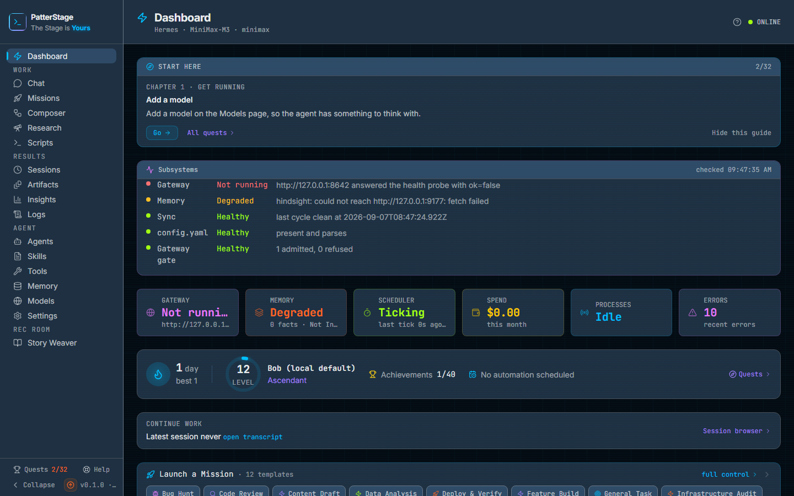
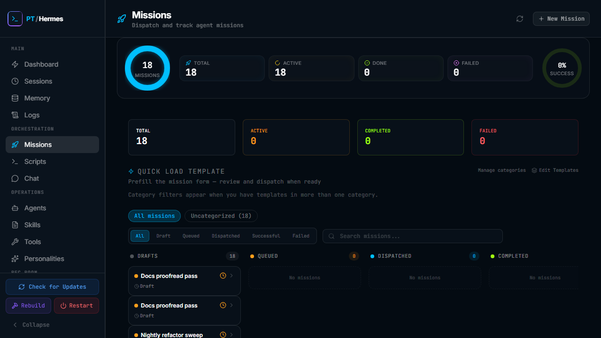
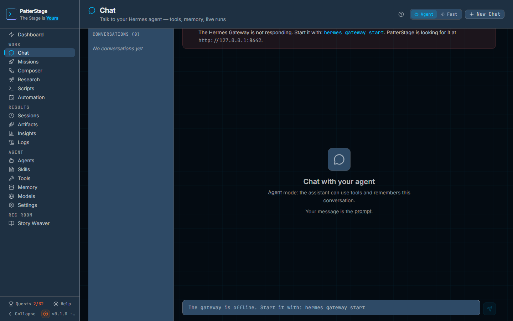
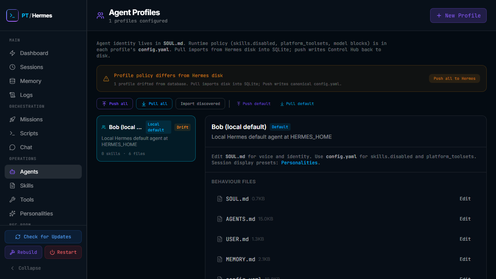
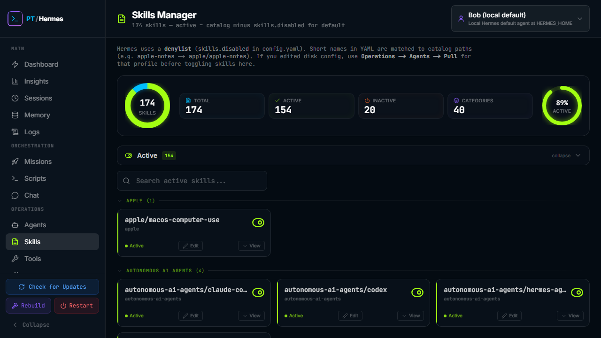
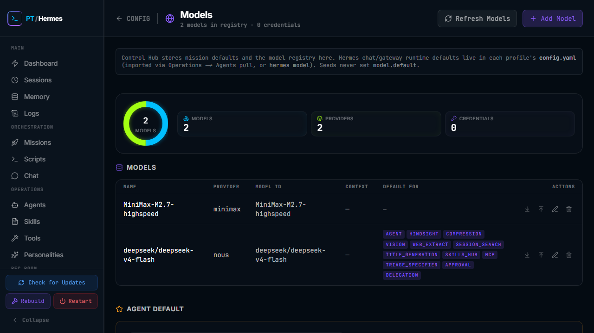

# Control Hub — User walkthrough

This guide is the **operator manual** for Control Hub. It describes every area of the web app and how to use it day to day. It is for **operators** who already installed Hermes and Control Hub (see [README](../README.md)). For REST API details and deployment, use the [documentation index](README.md).

The guide is written for the **Junior developer / operator** — every page is documented, every common action has a "Typical use" walkthrough, and "Notes" call out non-obvious behaviour. If you have not used Control Hub before, read the "What Control Hub is" section and the "Dashboard" section first, then jump to the page you need.

**How this guide is organised:** one section per sidebar entry, in the order you see them in the app. Cross-references to the sibling technical docs ([MISSIONS.md](MISSIONS.md), [DEPLOY.md](DEPLOY.md), [API.md](API.md), [CATALOG_AND_PROFILES.md](CATALOG_AND_PROFILES.md), [TOOLS_AND_MISSIONS.md](TOOLS_AND_MISSIONS.md), [MIGRATION.md](MIGRATION.md), [ENV_REFERENCE.md](ENV_REFERENCE.md), [TESTING.md](TESTING.md), [SYSTEM-CRON.md](SYSTEM-CRON.md), [HERMES_CONFIG_INTEGRATION.md](HERMES_CONFIG_INTEGRATION.md), [CONTROL_HUB.md](CONTROL_HUB.md)) are made inline.

---

## Table of contents

1. [What Control Hub is](#what-control-hub-is)
2. [Dashboard](#dashboard)
   - [Main → Insights](#main--insights)
3. [Orchestration → Missions](#orchestration--missions)
4. [Orchestration → Scripts](#orchestration--scripts)
5. [Orchestration → Chat](#orchestration--chat)
6. [Operations → Agents](#operations--agents)
7. [Operations → Skills](#operations--skills)
8. [Operations → Tools](#operations--tools)
9. [Operations → Personalities](#operations--personalities)
10. [Main → Sessions](#main--sessions)
11. [Main → Sessions (detail)](#main--sessions-detail)
12. [Main → Memory](#main--memory)
13. [Main → Logs](#main--logs)
14. [Config → All Settings](#config--all-settings)
15. [Config → Models](#config--models)
16. [Config → A section](#config--a-section)
17. [Config → Seed](#config--seed)
18. [Rec Room → Story Weaver (dashboard)](#rec-room--story-weaver-dashboard)
19. [Rec Room → Story Weaver / create](#rec-room--story-weaver--create)
20. [Rec Room → Story Weaver / library](#rec-room--story-weaver--library)
21. [Rec Room → Story Weaver / characters](#rec-room--story-weaver--characters)
22. [Rec Room → Story Weaver / themes](#rec-room--story-weaver--themes)
23. [Rec Room → Story Weaver / [id] — Story Reader](#rec-room--story-weaver--id----story-reader)
24. [Sidebar deploy buttons (Update / Rebuild / Restart)](#sidebar-deploy-buttons-update--rebuild--restart)
25. [Suggested workflows](#suggested-workflows)
26. [Related documentation](#related-documentation)

---

## What Control Hub is

**Hermes Agent** runs on your machine: it executes tools, delegates sub-tasks to subagents, talks to chat platforms, and stores config under `~/.hermes/`.

**Control Hub** is the **web dashboard** for that install. You use it to see health at a glance, dispatch missions, schedule recurring work, run host scripts, browse sessions, tune models, and edit agent behaviour — without living in the terminal.

Control Hub is **a Next.js app** that talks to a SQLite database under `~/control-hub/data` and to the active Hermes install under `~/.hermes`. Everything you can do in the dashboard, you can also do through a REST API — see [API.md](API.md). The dashboard never bypasses the API to write files on disk directly, so the data path is auditable.

**Why a separate app and not just a CLI?** Some things are easier in a UI: a session transcript with markdown rendering, a kanban mission board, a per-profile drift banner, a per-row Push/Pull on model records. Control Hub is the place to drive those workflows.

**The sidebar groups features into five sections:**

| Section | Purpose |
|---------|---------|
| **Main** | Overview, sessions, memory, logs |
| **Orchestration** | Missions (one-off + recurring), Scripts (host cron), gateway chat |
| **Operations** | Agent profiles, skills, tools, personalities |
| **Rec Room** | Story Weaver (interactive fiction) |
| **Config** | Models, HERMES.md, environment, YAML sections |

At the bottom of the sidebar are three deploy buttons — **Update**, **Restart**, and **Rebuild** — that talk to the host's `ch-deploy.sh` and rebuild the running Control Hub process. See [Sidebar deploy buttons](#sidebar-deploy-buttons-update--rebuild--restart) and [DEPLOY.md](DEPLOY.md).

---

## Dashboard

The dashboard is your **status board**, not the primary place to launch missions. It is meant to answer "what is happening on this machine right now?" at a glance, and to give you one-click access into the deeper pages. Polls `/api/monitor` every 10 seconds, `/api/agents` every 15 seconds, and `/api/missions` every 15 seconds.

### What you see

**Header bar**
- Live clock and weekday/date, updating every 1 second.
- **ONLINE** status dot (green) when the dashboard's own `/api/status` is responsive; otherwise **OFFLINE**.
- Subtitle showing the active model, read from `~/.hermes/config.yaml` first and from the Models registry as a fallback. If the registry disagrees, a hint suggests "push Bob to write config.yaml".

**Compact stat row (four pills)**
- **Processes** — number of active Hermes processes. Shows "N Active" when there is at least one agent running, "Idle" when no agents are running, and "Offline" when the agent detector is unreachable.
- **Cron Jobs** — count of enabled agent cron jobs from the most recent `/api/monitor` snapshot.
- **Sessions** — total session count plus "N active · M last 7d" to summarise recent activity.
- **Memory** — fact count and provider name (Holographic, Hindsight, or whatever the active backend is).

**Continue work card**
- A link to the most recent session with "open transcript" and "X minutes ago".
- A "Session browser →" link into `/sessions` for the full history.

**Mission Dispatch strip**
- Header: "Mission Dispatch · full control →".
- Collapsed: a horizontal pill strip of up to twelve mission templates; an "N more" pill expands it.
- Expanded: templates grouped by category in accordions.
- Clicking a pill opens the mission composer with that template pre-filled at `/orchestration/missions?template=ID&compose=1`.

**Active Missions list** (only when count > 0)
- One row per active mission: status dot, name, dispatch mode badge, last session id (links to transcript), status badge, "X ago" timestamp, and a **Cancel** button with a two-step confirm.
- Empty mid-mission rows show "Session loading…" until the first session record arrives.

**Three-panel system monitor**
- **Cron Jobs panel** — every job, with an inline `IntervalSelector` for the schedule, a caption span showing "in 3m", "running 2m", etc., and a `CronStatusBadge` indicating the state.
- **Platforms panel** — one row per configured Hermes platform with a status dot, a "Configured" or "Not configured" label, and a background-sync line ("Sync: 5m ago ✓") with a "Sync now" button.
- **Errors panel** — pill filter for All / Error / Warning, deduplicated by source and message with a "(×N)" suffix on repeats.

**Running Hermes Processes**
- A section header with a refresh button.
- Cards for each process: name, status, type, model (when known), turn count, last activity timestamp.
- Empty: "No Active Processes Detected".

**Rec Room card** (bottom)
- A link into `/recroom/story-weaver`.

### Typical use

1. Open Control Hub after install and confirm **ONLINE** is showing, the model name matches what you expect, and Hermes paths resolve.
2. Glance at the four stat pills; if Memory shows 0 and you expected facts, see [Main → Memory](#main--memory) to investigate.
3. Check **Running Hermes Processes** if a mission feels stuck — the list tells you what is actually executing.
4. Use **Sync now** on the Platforms panel when you have changed Hermes config outside the UI (via `hermes config edit` on the host, for example). Otherwise the next 5-minute background sync will pick it up.
5. Follow **Continue work** to the latest session, or click **Sessions** in the sidebar for the full history.
6. For mission work, go to **Orchestration → Missions**. The dashboard strip is for one-click dispatch of templates; the full composer is on the missions page.

---

## Main → Insights

**Main → Insights** (`/insights`) is the analytics + achievements view. It reads
the `analytics_events` interaction log (via `/api/analytics`) plus the dashboard
stats, so it starts empty and fills in as you use Control Hub.

### What you see

- A **level / streak** header with a headline-metric strip: total interactions,
  active days (last 30), achievements unlocked (`N / 36`), and the longest streak.
- **Activity — last 30 days:** an area chart of daily interaction volume.
- **By category:** a ring that folds the 14 event types into 6 readable buckets
  (Missions, Stories, Sessions, Automation, Config, Chat).
- **Run activity — last 91 days:** the GitHub-style contribution heatmap.
- **Achievements:** the full grid of ~36 badges with progress bars; locked badges
  show a lock + how close you are.

### Typical use

1. Dispatch a few missions, write a Story Weaver chapter, fire a schedule.
2. Open **Insights** — the activity chart and category ring update on a 30s cadence,
  and achievement progress advances (e.g. *Dispatcher*, *Wordsmith*, *Set & Forget*).
3. Newly-earned achievements pop a 🏆 toast **on the Dashboard** (the Insights grid
  is read-only and never double-fires the toast).

### Notes

- Events are recorded **server-side** only (there is no public write endpoint), so
  the numbers reflect real activity and can't be forged from the client.
- Achievements are **derived live** from your activity — there is no separate save;
  full reference in [ANALYTICS.md](ANALYTICS.md).

## Orchestration → Missions

The mission board is where you **compose, dispatch, schedule, and cancel** agent work. Almost all logic lives in `hooks/useMissionsPage.ts` and `components/missions/`; the page is a thin view-model wiring it all up.

### What you see

**Header**
- Refresh button to re-fetch the mission list.
- **+ New Mission** button that opens the composer sheet.

**Stat row (four cards)**
- Total, Active, Completed, Failed counts.

**Quick templates strip** (only when the composer is closed)
- Category filter pills at the top.
- Template cards below, showing the icon, name, and short description.
- **Manage templates** button opens the `TemplateManagerModal`.
- **Manage categories** button opens the `CategoryManagerModal`.

**Kanban board (five columns)**
- **Draft** — missions saved as drafts (`status=queued`, `queued_for_run=0`). They are not yet submitted to Hermes.
- **Queued** — missions waiting for the worker (`status=queued`, `queued_for_run=1`). The `MissionQueueSync` runs every 15 seconds and dispatches the oldest queued mission when no mission is currently dispatched (single-flight).
- **Dispatched** — currently running or about to run.
- **Successful** — completed successfully. This column is collapsed by default; click the chevron to expand.
- **Failed** — cancelled, errored, or terminated unexpectedly. This column is also collapsed by default.

**Filters and search above the board**
- Status filter pills (all / draft / queued / dispatched / successful / failed) that reset pagination to 0 when toggled.
- A search box that filters the visible mission names.

**Per-mission card**
- Status dot, name, age, dispatch mode badge, latest session id, optional cronJob id, optional error message.
- Clicking the card expands an inline `MissionEditorPanel` with the full mission.

**Per-mission actions (in the expanded panel)**
- **Copy prompt** — copy the assembled agent prompt to the clipboard.
- **Duplicate** — clone the mission as a new draft.
- **Edit** — re-open the composer for the existing mission (the form title becomes "Edit Mission" or "Re-Dispatch: <name>" depending on status).
- **Delete** — two-step confirm; removes the mission and any linked schedule (or legacy cron job).
- **Cancel** — two-step confirm; stops the running agent. Works for **running** and **queued** missions. The UI updates immediately; the underlying `hermes chat` process is stopped in the background.

**Composer sheet (opens for new / edit / re-dispatch / template-apply)**

The composer is the full form. It is organised into five sections, each collapsible:

1. **Category and name** — the category combobox is a controlled list with the eight default categories plus any user-created ones. The name is what shows on the board and in the Active Missions list.
2. **Instruction and goals** — the instruction is required, free-form, and becomes the agent's primary prompt. Goals are one per line. Context is an optional block of additional framing.
3. **Mission parameters** (optional, collapsible) — local directories (path + branch + directory picker modal), references, skills, toolsets, output format, constraints. The **ToolsetSelector** only lists toolsets enabled on the selected profile.
4. **Runtime** (optional, collapsible) — profile, model, provider, schedule type (interval / wall-clock / post-run), schedule string, mission duration in minutes, and timeout in minutes.
5. **Assembled agent prompt** (preview pane) — shows the XML payload that will be sent to Hermes, with a **Human** / **AI** toggle (Human is the form mirror; AI is the stored agent prompt) and a copy button.
6. **Dispatch footer** — four actions:
   - **Save draft** — `dispatchMode: save`. Persists as a draft in the **Draft** column.
   - **Queue** — `dispatchMode: queue`. Persists as queued for run; the worker will pick it up.
   - **Run now** — `dispatchMode: now`. Creates the mission and dispatches immediately via `dispatchMissionNow()` (an HTTP run on the runtime).
   - **Schedule** — `dispatchMode: cron`. Creates a Control Hub **`schedules`** row (mission-linked) that the built-in scheduler fires — there is no Hermes `jobs.json` bridge. The first run starts immediately; later runs follow the schedule. Recurring missions appear in the **Scheduled missions** section below the board.

The composer also has a **Save as Template** button that stores the current form as a reusable custom template in the templates table.

### Typical use

1. Click **+ New Mission** (or pick a template from the strip).
2. Fill in the instruction and (optionally) goals.
3. Expand **Runtime** if you want a non-default profile or model.
4. Expand **Assembled agent prompt** to sanity-check the agent-facing text.
5. Click **Run now** for immediate runs, or **Schedule** for recurring work.
6. Watch the card move from **Queued** to **Dispatched**, then to **Successful** or **Failed**.
7. To stop early, expand the card and click **Cancel**. The card moves to **Failed** immediately; the agent process stops shortly after (the Hermes delegation pattern: stopping the parent run stops delegated subagents).

For mission lifecycle details (single-flight queue, model resolution, cancel signal sequence, session closure bridge), see [MISSIONS.md](MISSIONS.md).

### Notes

- Cancel is implemented for Linux and macOS only. On other platforms, the DB and cron-pause still apply; check `~/.hermes/logs` for the underlying process state.
- "Re-Dispatch" opens the same composer with the existing fields; choosing a dispatch mode creates a brand-new mission id (not an in-place update of the completed one).
- Promoting a draft or queued mission uses `action: "promote"` on `POST /api/missions` — the route the API uses depends on the mission's current status, and the UI handles this for you.

### Scheduled missions

Below the board is the **Scheduled missions** section — the recurring agent work that the Control Hub scheduler fires (no Hermes `jobs.json`). Each row shows **name · cadence · next run · last status** with **Pause/Resume**, **Run now**, and **Delete**. New recurring missions land here automatically when you dispatch with **Schedule**; you can also put an existing saved mission on a timer with **Schedule a mission** (pick the mission, a cadence like `every 30m` or `0 9 * * *`, and a catch-up policy). Deleting a mission removes its schedule.

This replaced the separate "Schedules" page — scheduling now lives with the missions it drives.

---

## Orchestration → Scripts

The **Scripts** page is a file-aware manager for **host shell scripts** under `CH_DATA_DIR/scripts` — backups, cleanups, health checks — separate from agent missions. (Scheduling *agent* work is done from the Missions composer's **Schedule** mode; see the [Scheduled missions](#scheduled-missions) note above.) It reads the script files (`/api/scripts`), cross-references the host crontab for each one's schedule, runs them on demand, and tails their logs. The bundled `ch-backup.sh` ships under `scripts/hardware/` and is copied into `CH_DATA_DIR/scripts` during `setup.sh`.

### What you see

A row per `.sh` file in `CH_DATA_DIR/scripts`, each showing **name · size · schedule (or "not scheduled") · last run**, with actions:
- **Run now** — execs the script server-side (path-validated, no shell) and appends output to its log.
- **Logs** — opens a modal tailing the script's log under `CH_HARDWARE_LOG_DIR`.
- **Schedule** — puts the script on the host crontab (a 5-field cron); once scheduled it shows the cadence and an **Unschedule** action.
- **Refresh** — re-reads the files + crontab.

Drop a new `.sh` file into `CH_DATA_DIR/scripts` and it appears automatically.

### Typical use

1. Drop or edit a script under `CH_DATA_DIR/scripts` (e.g. `ch-backup.sh`).
2. **Run now** to test it; check **Logs** for output.
3. **Schedule** it with a cron expression so the host runs it on a timer (or **Unschedule** to stop).

### Notes

- Running execs the script with the Control Hub process's permissions, the same as a crontab entry would — only files directly under `CH_DATA_DIR/scripts` can be run (no traversal, `.sh` only, no shell interpolation).
- The legacy agent-cron **Cron** page (Hermes `jobs.json`) has been **removed** — scheduled *agent* work belongs in **Missions**; existing cron jobs migrate to schedules automatically on update.

For the bundled host-script catalogue (e.g. `ch-backup.sh` for a Hindsight memory snapshot) and the script-level env vars, see [SYSTEM-CRON.md](SYSTEM-CRON.md).

### Notes

- Scripts run via the **OS scheduler** (host crontab) — "the OS does work". Scheduled *missions* run via the Control Hub scheduler — "Hermes does work". They are deliberately separate surfaces.
- The legacy agent-cron **Cron** page (Hermes `jobs.json`) has been **removed**; new scheduled agent work belongs in **Missions**, and existing cron jobs are migrated to Control Hub schedules automatically on update (see [MIGRATION.md](MIGRATION.md)).

---

## Orchestration → Chat

**Orchestration → Chat** is a **web chat** against the Hermes gateway — not the same as dispatching a mission. Missions use non-interactive `hermes chat -q` with a structured mission prompt; chat uses the gateway completion path with full conversation history. Sessions persist to localStorage so they survive page reloads.

### What you see

**Header**
- **Model selector** (`InlineSelect`, purple accent) — a merged list of registry models and gateway models. The model you pick here is **per-session**: switching it on one session does not affect other sessions.
- **+ New Chat** button — starts a fresh session.

**Left sidebar (always visible)**
- "Sessions (N)" header.
- A list of saved sessions (filtered to those with messages, capped at `CHAT_MAX_SESSIONS`).
- Per session: title, message count, hover actions (**Download as JSON** with an "as CSV" submenu, and **Delete**).
- Active session highlighted with a neon-cyan left border.

**Main area**
- **GatewayBanner** at the top (when no active session is selected): one of four banners — **offline** (gateway unreachable), **auth-missing** (gateway up but Control Hub can't authenticate — set `API_SERVER_KEY`), **model-missing** (no agent default set), or **checking** (initial load).
- **Empty state** when nothing is selected: a large icon, "Chat with your agent" prompt, and short instruction text.
- **Message thread** when a session is active: user bubbles on the right (neon-cyan tint) and assistant bubbles on the left (neon-purple icon). Assistant messages are markdown-rendered with copy buttons on code blocks. Timestamps in 24-hour format.
- **TypingIndicator** while the assistant is streaming.

**Bottom input**
- Auto-grow textarea.
- **Enter** to send, **Shift+Enter** for a newline.
- **Send** button that becomes a **Stop** (abort) button while a stream is in progress.

### Typical use

1. Pick a model from the dropdown — this is per-session, so different sessions can use different models.
2. Type a question and press **Enter**.
3. If the answer is taking too long, hit **Stop** to abort.
4. To save the session, just leave it — it persists in localStorage.
5. To export, hover a session in the sidebar and choose **Download as JSON** or **Download as CSV**.

**Model resolution.** Inference uses whichever model is selected in the dropdown. If that model is not the Models registry's agent default, the dropdown value still wins for this session. For global default behaviour, set **Agent default** at **Config → Models** and **Sync to Hermes** so `config.yaml` matches.

### Notes

- Chat uses the **gateway completion path**; missions use `hermes chat -q`. They have separate session lifecycles. Mission sessions show up under **Main → Sessions**; chat sessions live in this page's localStorage.
- Per-session model is restored when you switch back to a session.
- `CHAT_DEFAULT_MODEL` in `.env.local` sets the default for new sessions.

---

## Operations → Agents

**Operations → Agents** is the agent-profile editor. It lists **professional profiles** (QA, SWE, DevOps, Data Scientist, Creative Lead, Support, DevOps Engineer) plus the default **Bob** persona, and lets you edit each profile's behaviour files, push and pull between Control Hub SQLite and `HERMES_HOME/profiles/`, and clone / delete profiles.

### What you see

**Header**
- Subtitle: "N profiles configured".
- **+ New Profile** button — opens a modal with name, description, and a "clone from" select (Default / Bob, or any other profile).

**Agent performance strip**
- Above the profiles, a per-agent analytics strip shows each agent's **real** usage — runs · mission success% · tokens · average run time — derived from `/api/stats` (`src/lib/stats/agent-stats.ts`). It surfaces how each profile is actually performing; agents with no activity yet are omitted.

**Drift banners (when applicable)**
- **ProfilesDriftBanner** — shows when any profile has `syncStatus="drift"` or `"error"`, with a single **Push all** action.
- **ProfileSyncBar** — for the selected profile, with **Push one**, **Push all**, **Pull one**, **Pull all**, and **Import discovered** actions.

**Two-column layout**

*Left column* — list of profile buttons:
- Default profile: cyan border, "Local default" badge.
- Custom profiles: purple border.
- Drift / Sync error badges on the relevant rows.
- Slug line for non-default profiles.
- Two-line description clamp.
- Footer showing "N skills · M files".

*Right column* — selected profile detail:
- Header: name, badge, slug, description, **Delete profile** button (custom profiles only).
- Info line: SOUL.md is voice/identity; `config.yaml` is runtime policy; link to **/operations/personalities** for prompt presets.
- **Behaviour files** list — each row shows file name, size, missing flag, and **Edit** or **Create** button.
- File editor (when open): preview / edit toggle, **Reset**, **Save** (with save status: idle | saving | saved | error), and **Close**.

**Modals**
- **New Agent Profile** — name, description, cloneFrom.
- **Delete Profile** — confirm.

### Typical use

1. Click a profile on the left to see its detail.
2. Edit a behaviour file (preview first, then switch to edit, then **Save**). A backup is created on every save.
3. After editing multiple files, hit **Push all** so `HERMES_HOME/profiles/<slug>/` matches SQLite.
4. If you edited `HERMES_HOME/profiles/<slug>/` on the host, hit **Pull one** or **Pull all** to absorb those edits into SQLite.
5. To start a new profile, click **+ New Profile** and either clone from Bob / another profile, or describe a new role.
6. To delete a custom profile, click **Delete profile** in the right column. Default profile cannot be deleted.

**Behaviour files.** The set of files for a profile is **profile-defined** from the profile's `files` array. The most common entries are `SOUL.md`, `AGENTS.md`, `HERMES.md`, `config.yaml`, `memories/USER.md`, and `memories/MEMORY.md`. The UI shows whatever the profile declares — including non-Markdown files like `config.yaml`.

### Notes

- Control Hub SQLite is the **source of truth** for profiles; Hermes disk is the **runtime mirror**. Push and pull keep them in sync. The data flow and sync contract are in [CATALOG_AND_PROFILES.md](CATALOG_AND_PROFILES.md).
- **Import discovered** scans `HERMES_HOME/profiles/` and imports any directories that are not yet in SQLite. Useful after a manual `cp -r` on the host.
- Bob lives in the `agent_root` SQLite row, not in `agent_profiles`. Sync uses `root: true` on push / pull. The UI shows Bob as the "Default" profile with `id: "default"`.

---

## Operations → Skills

**Operations → Skills** shows the skills available to the active profile, grouped by category. Skills are denylisted per profile via `skills.disabled` in the Hermes `config.yaml`. The UI reads from `~/.hermes/skills/` and applies the profile's denylist to compute the **Active** vs **Inactive** split.

### What you see

**Header**
- **Profile selector** (compact=false) — switch which profile you are managing skills for. Bob is the default.

**Helper text** (above the lists)
- Explains the denylist model: "Active" means not in the profile's `skills.disabled` list.
- Reminds you to run **Pull** (on **Operations → Agents**) after editing disk config so SQLite catches up.

**Active section** (collapsible)
- Search box (green accent).
- `SkillCategoryGrid` — groups skills by category; each category is itself collapsible.
- Per-skill card: name, description, **Active** toggle (optimistic — the UI flips first, then the server confirms), **View** (expand inline to read content), **Edit** (open the edit modal).

**Inactive section** (collapsible, default collapsed)
- Same shape; white accent; default collapsed so the active list dominates.

**Empty state** (total = 0)
- "Import skills from Hermes" button that runs the global import.

**Edit modal**
- Size `lg`; textarea with 320px minimum height.
- **Reset** (revert to original), **Cancel**, **Save**.
- Save shows "Saved!" feedback and closes on success.

**View expansion (inline, not a modal)**
- Loads `/api/skills/<name>?profile=...` and renders the content in a `<pre>` block.

**Full-page viewer** — `/operations/skills/[...path]`
- Standalone read-only SKILL.md viewer.
- Back link "← SKILLS", "Raw" / "Rendered" toggle (default Rendered).
- Title, subtitle (path · size · last modified).
- Two-column body on large screens: main (rendered markdown or raw text) and sidebar (YAML metadata panel + linked files list).
- Defensive: rejects malformed paths (embedded slashes, empty segments).

### Typical use

1. Pick a profile from the selector — you are managing **that** profile's skill set.
2. Use the search box if you have many skills. The category headers collapse.
3. Toggle **Active** on a skill to add it to the profile; toggle off to disable it. The change is optimistic; the UI confirms on success.
4. **View** a skill to read its full content. **Edit** to open the modal and tweak the SKILL.md text.
5. After editing on disk (`~/.hermes/skills/...`), go to **Operations → Agents** and run **Pull** so SQLite re-reads the catalog. The skills page will then reflect the disk state.

### Notes

- Skills live at `~/.hermes/skills/<category>/<name>/SKILL.md` and may have `references/`, `templates/`, `scripts/`, and `assets/` siblings.
- **Active** is computed as "exists in `~/.hermes/skills/` AND not in the profile's `skills.disabled` list". There is no per-profile copy of a skill on disk.
- Missions can include `recommended_toolsets` in the assembled prompt — see [TOOLS_AND_MISSIONS.md](TOOLS_AND_MISSIONS.md) for the relationship between mission toolset hints and the profile's `platform_toolsets`.

---

## Operations → Tools

**Operations → Tools** edits **`platform_toolsets`** for each agent profile. Source of truth is SQLite; on save / push, the assembled config is mirrored to `~/.hermes/config.yaml`.

### What you see

**Header actions**
- **Pull from Hermes** — POST `/api/agent/profiles/sync/pull`, reloads from disk.
- **Push to Hermes** — POST `/api/agent/profiles/sync/push`, writes the canonical config.
- **Save & push toolsets** — PUT `/api/agent/profiles/<id>/toolsets`, then pushes. This is the "I edited in the UI and want it on disk" action.

**Banners (conditional)**
- **Drift banner** when `syncStatus="drift"` on the selected profile: "Toolset policy on disk differs from Control Hub. Pull imports disk into SQLite; Save & push or Push writes canonical config.yaml to ~/.hermes."
- **Sync-error banner** when `syncStatus="error"`.
- **Platforms diverged banner** when different platforms have different toolset configs on disk (rare; usually means you hand-edited `config.yaml` for one platform only).

**Body**
- Profile selector (left).
- "Hydrated from <source>" note — `config_yaml` (disk) or `seed pack` (catalog).
- **Enabled toolsets grid** — one button per Hermes toolset from the `HERMES_CONFIGURABLE_TOOLSETS` catalog. Click to toggle. On save, the enabled set is **fanned out to all platforms** automatically. This is the same behaviour as `hermes tools` in "configure all platforms" mode.
- "Show / Hide advanced JSON" toggle — for hand-editing the raw `platform_toolsets` object per-platform instead of using the unified grid.
- **Reference panel** — a catalog of all Hermes toolset IDs plus descriptions. Read this when you are not sure what a toolset does.

### Typical use

1. Pick the profile that will run your missions.
2. Click the toolset buttons in the grid to enable / disable. Each click updates the SQLite row immediately.
3. When the grid matches what you want, click **Save & push toolsets**. This writes to `~/.hermes/config.yaml` (or `~/.hermes/profiles/<slug>/config.yaml` for non-default profiles).
4. If you have edited `config.yaml` on the host, click **Pull from Hermes** to import disk state into SQLite.
5. If a platform needs to be different (rare), toggle **Show advanced JSON** and edit the per-platform JSON directly. The UI will warn if the platforms diverge.

### Notes

- The UI is a **unified enabled list**, not per-platform checkboxes. This is intentional: most operators want the same toolset for CLI, Discord, Telegram, etc. The advanced JSON view exists for the rare cases where you need per-platform differences.
- This page does not change which **tools** the runtime can call — only which toolset IDs are listed in `platform_toolsets`. The Hermes runtime interprets those IDs.
- For how mission "recommended toolsets" (a prompt hint) relate to runtime tools, see [TOOLS_AND_MISSIONS.md](TOOLS_AND_MISSIONS.md).

---

## Operations → Personalities

**Operations → Personalities** is the personality manager. It stores **SOUL-style identity prompts** per Hermes profile — the agent's voice and tone — as presets you can switch between at runtime. Editing the **raw SOUL.md** for a profile lives at **Operations → Agents**; this page is for managing the **presets** that can be applied to a profile.

### What you see

**Header**
- Subtitle: "Hermes identities are SOUL.md files. Edit profile identity from Agents or this page."
- Active personality indicator line: "Active: <name>".

**Toolbar**
- Search (purple accent).
- **+ New** button — opens the `EditPersonalityModal` in create mode.

**List**
- Sorted: active first, then alphabetical.
- Per-personality card: emoji (from `getPersonalityEmoji(name)`), name, "ACTIVE" badge when active, prompt preview (collapsible expand for long prompts), action row (**expand toggle**, **copy-to-clipboard**, **Set as active** with a Sparkles icon — only when not active, and **edit**).
- Empty state: "No personalities yet" or "No matches".

**Edit modal** (size `lg`)
- Name (lowercase identifier; used in `config.yaml` and the CLI).
- System prompt (textarea, with character count and a live preview pane).
- Validation: name and prompt both required.
- Submit: POST (create) or PUT (edit) to `/api/personalities`.

**Info panel at the bottom**
- Explains how personalities work: SOUL.md for Bob and each profile; SQLite pushes to Hermes on save; `config.yaml` is for runtime policy (skills.disabled, platform_toolsets).

### Typical use

1. Click **+ New** and write a system prompt — the agent's voice for this profile.
2. Save and then click **Set as active** on the card to make it the active personality.
3. Use **copy-to-clipboard** to grab a prompt for use elsewhere.
4. **Edit** revises; **Set as active** is a single click and persists across the active Hermes install.

### Notes

- This page is for **presets**. The raw SOUL.md for a profile (its actual identity) is at **Operations → Agents**. The two are intentionally separate: presets are reusable across profiles; SOUL.md is per-profile identity.
- Activating a personality writes through to `~/.hermes/config.yaml` on save.

---

## Main → Sessions

**Main → Sessions** is the unified session history. It reads from the Control Hub SQLite `sessions` table, which is populated by the dispatcher when missions are created and by the recurring sync that pulls CLI / cron / api sessions from `~/.hermes/<profile>/sessions/`. Pagination is 50 per page.

### What you see

**Header**
- "Session History — N recorded sessions across all agents".

**Search and filters row**
- Search input (orange accent) that matches against title, id, profile, and mission id.
- "All" plus per-source filter pills (`cli`, `cron`, `mission`, `api`) with icon and label.

**View options row**
- **Group by mission** toggle (persisted to localStorage; default ON). When ON, sessions from the same mission are grouped under a `MissionGroupCard`; when OFF, every session is a row.
- **Hide API noise** toggle (persisted; default OFF). When ON, short `api`-source sessions under 1 KB or under 1 minute are hidden. Useful when you are looking for substantial runs.
- "= live" legend explains the pulsing dot.

**List — single-session cards** (`SessionCard`)
- Pulsing `LiveDot` when active.
- `MessageSquare` icon, title, time-ago / live-elapsed, source badge, profile name, model badge, "N msgs" badge, size in KB.
- Mission badge linking to `/orchestration/missions/<id>`.
- Chevron to expand.

**List — mission group cards** (`MissionGroupCard`) when grouping is on
- Green border, "N sessions" header, "M active" pill, time-ago range, mission id, "↗ Mission" link, chevron to expand to the underlying session cards.

**Title fallback for cron sessions** uses `~/.hermes/cron/jobs.json` to give cron sessions human-friendly names like "Cron: <job> — <date>".

### Typical use

1. Pick a source filter (`cli`, `cron`, `mission`, `api`) or leave it on "All".
2. Search by title, id, profile, or mission id.
3. Toggle **Group by mission** ON to see mission runs as units (default). Toggle OFF to see every session as a row.
4. Toggle **Hide API noise** ON to skip tiny background sessions.
5. Click a row to open the transcript at `/sessions/[id]`.

### Notes

- "Active" sessions (the ones with a pulsing dot) are sessions that have a recent message but no end-time row. The session-closure bridge in `src/lib/session-repository.ts` keeps these in lockstep with the mission lifecycle, so a session is only "active" when its parent mission is actually running.
- The session-closure logic has two safety paths: parent-mission-gated (close when the parent is no longer dispatched) and age-only fallback (close parentless sessions after 30 minutes, with a 5-minute boot window for new sessions).

---

## Main → Sessions (detail)

**Main → Sessions / [id]** is the transcript viewer for a single session. Fetches from `/api/sessions/[id]` and renders message-by-message.

### What you see

**Header**
- Back link "← SESSIONS".
- Title: `data.title` or `data.id`.
- Subtitle: model · messageCount · size.
- "↗ Mission" link if `data.missionId`.
- **⟳ Refresh** button (only when the session is still running — empty messages + a "Session still running — refresh in a moment" note).
- Role count badges (per role). Click to filter; double-click to jump to the next message of that role; "clear" pill to unset the filter.

**Message list**
- `MessageBubble` per message.
- Role styling: user (right), assistant (left), tool (left small), system (small italic).
- Code blocks have a copy button (delegated click handler in `chat-utils`).
- Filtered count line: "Showing N role messages of M total".

**Empty messages + note (still running)**
- Shows `data.note` (e.g. "Session still running — refresh in a moment").
- "Open the parent mission →" link if `missionId` is set.

**Not-found state**
- "Session Not Found" with the back link.

### Typical use

1. Click a session from **Main → Sessions**.
2. Use the role badges to filter to a single role (e.g. just `tool` messages to see what the agent did).
3. Double-click a role badge to jump to the next message of that role.
4. Click a code block's copy button to grab a snippet.
5. If the session is still running, hit **⟳ Refresh** to reload.

### Notes

- The detail page is read-only. To dispatch a new mission, use **Orchestration → Missions**.
- The "↗ Mission" link jumps to the mission board filtered by mission id (the board will scroll to and highlight that mission).

---

## Main → Memory

**Main → Memory** is the Hindsight Memory Browser. The actual UI lives in `components/memory/HindsightBrowser.tsx`. The page title is "Hindsight Memory — Knowledge graph memory with semantic search".

### What you see

**Three tabs at the top**
- **Memories** (default) — the fact list.
- **Directives** — file-text icon.
- **Mental Models** — settings icon.

**HealthBanner at the top** (only when Hindsight is unavailable)
- Error message and a **Retry** button.

**Search bar (Memories tab)**
- Search input (semantic).
- **Recall** button — POST `/api/memory/hindsight?action=recall`. Runs semantic search and renders results.
- **Reflect** button — POST `/api/memory/hindsight?action=reflect`. Renders an AI-reflection result panel using the matched facts.
- **Add Memory** button — opens the `AddMemoryModal`.
- On mount, the 50 most recent memories are auto-loaded.

**Memories tab content**
- `MemoryTab` — list of memories, each clickable to expand the fact.
- **Refresh** button (re-runs recall or reloads).

**Directives tab content**
- `DirectivesTab` — list of directives. Toggle active / inactive, edit, delete.
- **+ New Directive** button → `DirectiveModal`.
- `DirectiveModal` — name, content, priority, tags (create + edit modes).

**Mental Models tab content**
- `MentalModelsTab` — list of mental models.
- **+ New Model** button → `MentalModelModal`.
- `MentalModelModal` — name, source_query, tags (create + edit modes).
- Per-row **Refresh** button to re-run model generation.
- Per-row **Delete** (no two-step confirm — just an X).

### Typical use

1. Land on the **Memories** tab.
2. Type a question in the search bar and hit **Recall** for semantic search, or **Reflect** for a synthesised answer grounded in the matched facts.
3. **Add Memory** when you want to seed the system with a fact the agent should remember.
4. Use the **Directives** tab to author higher-priority instructions (the "always do X" kind of memory).
5. Use the **Mental Models** tab to define reusable query templates that the agent can reflect against.

### Notes

- Memory is provided by **Hindsight**. If Hindsight is unavailable, the HealthBanner explains why. The most common cause is `memory: { provider: "hindsight" }` not being set in `~/.hermes/config.yaml`. After a deploy that strips Hindsight config, see [DEPLOY.md](DEPLOY.md#hindsight-memory----safe-reconnection-after-deploy) for recovery.
- The `/api/memory/hindsight` route uses an `action` field for `list`, `recall`, `reflect`, `directives`, `mental-models`, `health`, and `count` on GET; `retain`, `create-directive`, `create-model`, `update-directive`, `update-model`, and `refresh-model` on POST. See [API.md](API.md#hindsight-actions).

---

## Main → Logs

**Main → Logs** is a live viewer for Hermes log files under `~/.hermes/logs/`. Polls `/api/logs` every 5 seconds when auto-refresh is on.

### What you see

**Header actions**
- **Auto-refresh toggle** button (animated spin-slow icon when on).
- **Line-count select** — 100, 200, 500, or 1000 lines.
- **Refresh** button (manual, button-spinner when active).
- **Delete All / Confirm Clear** button (two-step) — deletes all log files; shows "Cleared N log file(s)." action message.
- **Cancel** button (only when armed).

**Layout (two columns)**
- **Left** — file picker with a filter input and grouped log files (groups come from `GROUP_ORDER` and `GROUP_LABELS` in `components/logs/constants`).
- **Right** — terminal-style viewer.
  - "Traffic light" header.
  - "Filter lines" / search input (toggled via a Search pill).
  - "Latest lines" pill (only when auto-scroll is off).
  - Per-line `LogRow` with time, level, and message.
  - "Showing N/M" counter in the header.
  - Auto-scroll: ON by default; flips OFF if you scroll down.

**Error banner** at the top if `loadError`. Action message banner ("Cleared N").

### Typical use

1. Open the page and pick a log file from the left.
2. Toggle **Auto-refresh** to keep the view live (5-second polling).
3. Use the line-count select if the default 100 is too few.
4. Use the search input to filter lines (e.g. "ERROR").
5. **Delete All** is a two-step action — useful when logs are getting unwieldy. The action message confirms how many files were cleared.

### Notes

- Log files are read-only from the dashboard. You cannot tail a non-Hermes log without restarting Control Hub.
- The two-step confirm on **Delete All** matters: it removes the underlying files. There is no undo.

---

## Config → All Settings

**Config → All Settings** is the index/landing for the 25+ editable config sections in `~/.hermes/config.yaml`. Two halves: **quick-link cards** for the dedicated editors (Personalities, Toolsets), then **grouped section cards** for every other section.

### What you see

**Quick-link cards**
- **Personalities** → /operations/personalities.
- **Toolsets** → /operations/tools.

**Six grouped categories** (from `lib/config-schema.ts` `CONFIG_SECTIONS`)
- **Core** — agent, display, memory.
- **Infrastructure** — terminal, compression, browser, checkpoints, code_execution, logging.
- **Security** — security, privacy, approvals.
- **Voice & Audio** — tts, stt, voice.
- **Automation** — delegation, cron, session_reset, skills.
- **Integrations** — discord, streaming, web, platform_toolsets, smart_model_routing, human_delay.

**Per-section card**
- Section icon, title, description, "N field(s)" pill, "configured" pill (if the section is present in `/api/config`), "+N advanced" pill for complex keys.

**Pinned entries above the groups** (in the sidebar)
- `/config/models` — models registry editor.
- `/config/hermes_md` — `HERMES.md` (file section).
- `/config/env` — `.env` (file section, read-only).

### Typical use

1. Open **Config → All Settings** to see the full map of editable sections.
2. Click a section card to open its editor at `/config/[section]`.
3. Use the quick-link cards for the dedicated pages (Models, Tools, Personalities).

### Notes

- Sections that are file-backed (`hermes_md`, `env`) get their own special-case editor. The generic YAML editor handles the rest.
- The schema that drives this grid lives in `src/lib/config-schema.ts`; section metadata (icon, description, order) is in there.

---

## Config → Models

**Config → Models** is the **model registry**: credentials, defaults, and the fallback chain. Writes through to `~/.hermes/.env` (for credentials) and `~/.hermes/config.yaml` (for the model block).

### What you see

**Header actions**
- **Refresh Models** — sync from `~/.hermes/config.yaml` and `~/.hermes/.env` into the registry.
- **Add Model** — opens the `ModelEditor` modal in create mode.

**Four stacked sub-sections**
1. **ModelsTableSection** — registry table. Per-row default badges, **Add / Edit / Delete**, **Push / Pull** at the table level.
2. **ModelsAgentDefaultSection** — **Agent default** + bulk auxiliary defaults (sets all 11 auxiliary task types in one action).
3. **ModelsFallbackSection** — ordered fallback chain. Reorder, toggle, delete, edit, add from registry, add custom. `FallbackConfigPanel` for retry threshold and cooldown. **Sync to Hermes** and **Import from config** actions.
4. **ModelsTaskDefaultsSection** — per-task-type grid (vision, simple, code, etc.) — 12 slots driving `model.*` and `auxiliary.<task>.*` in YAML.

**Modal** — `ModelEditor`
- Add or edit a model record (name, provider, model id, API credential picker).

**Drift banner** — shown when on-disk config diverges from the registry.

### Typical use

1. **+ Add Model** and attach API credentials.
2. Set **Agent default** for mission and chat runs.
3. Configure the **Fallback chain** for resilience, then **Sync to Hermes** so `config.yaml` matches.
4. Use **Import from config** when Hermes was edited outside Control Hub.

### Notes

- The Models registry is the **source of truth** for credentials and defaults. `~/.hermes/config.yaml` is the runtime target. **Sync to Hermes** (or `ch-deploy.sh update` at deploy time) keeps them aligned.
- The "agent default" in this page is what mission dispatch and chat sessions fall back to when no model is set on the mission or chat session. The Models registry's agent default takes precedence over the bare `config.yaml` `model.default` field.
- After **Push Bob** (root), Control Hub runs `finalizeRootConfigOnDisk()` so `model.*` and `auxiliary.*` from the Models registry are re-applied to `~/.hermes/config.yaml` and stored back in `agent_root.config_yaml`. This prevents a chat session from wiping the model block.

---

## Config → A section

**Config → [section]** is the **generic editor** for any config section listed in **Config → All Settings**. Renders the section based on `lib/config-schema.ts`. Handles three flavours:

1. **YAML sections** (most) — typed fields with a Save button.
2. **File sections** — `HERMES.md` is a Markdown textarea; `.env` is a read-only masked key/value list.
3. **Dynamic-keys** — `platform_toolsets` derives its keys dynamically from loaded values (so new Hermes platforms appear without a schema change). Rendered as a read-only JSON-ish preview.

### What you see

**Header**
- Back link "← CONFIG" → /config.
- **Save** (primary) and **Reset** (ghost) buttons.
- "UNSAVED" warning pill when `hasChanges`.
- Save status states: idle | saving | saved (✓ for 2s) | error.

**Form body**
- Per-field `ConfigField` rendering the matching widget (string input, number input, select, boolean toggle, textarea).
- For sections with complex keys: read-only JSON-ish preview.
- Error banner above the form on save failure.

**File-section behaviour**
- `HERMES.md`: a textarea editor. Save creates a backup on the file sections.
- `.env`: read-only, masked keys. Sensitive = true, no edit.

### Typical use

1. From **Config → All Settings**, click a section card.
2. Edit the fields you need.
3. Click **Save** — the button briefly shows a checkmark then resets to idle.
4. **Reset** discards in-flight edits.

### Notes

- The generic editor does not know about every field in every section. Sections with complex keys get a read-only preview with a hint to edit them through their dedicated page.
- Save status is local UI state; "saved" persists for 2 seconds then resets so the button does not look "stuck on success".

---

## Config → Seed

**Config → Seed** restores the **shipped professional catalog** (Bob + named profiles + mission templates + default categories). Two entry points: "merge missing defaults" (additive) or "replace" (full restore).

### What you see

**Pre-run banner**
- Reminder: if `~/.hermes` exists, run `npx tsx scripts/tooling/import-hermes-state.ts` (or `setup.sh` / `ch-deploy.sh`) **before** merge seed — merge never overwrites imported Bob / profiles.

**Reseed all section**
- **Restore entire default catalog** — two-step confirm; replaces Bob + all bundled profiles + templates + categories.
- **Restore Bob only** — single click; replaces only Bob (default).
- "Last run: <timestamp>" line if a previous run is recorded.

**Professional agents section**
- One row per bundled, non-default profile: name, sync status (Synced / Drift / Sync error), **Restore this agent** two-step button.

**Mission templates section**
- Scrollable list of seeded templates with per-row **Restore** button.

**Categories & advanced section**
- **Restore categories** — replaces the category set.
- **Merge missing defaults** — additive merge.

### Typical use

1. Read the pre-run banner. If `~/.hermes` exists, the merge seed will **not** overwrite your imported Bob / profiles. Run `import-hermes-state.ts` first if you want your disk state to be the source of truth.
2. **Restore entire default catalog** if you have trashed the SQLite and want a clean re-seed. Two-step confirm.
3. **Restore Bob only** if you just want to reset the default persona.
4. Per-profile / per-template restore is for when you want to keep most things and just bring back one specific row.

### Notes

- Seed state is tracked at `CH_DATA_DIR/seed-state.json` so re-seeding is idempotent.
- Catalog seeding happens automatically during `setup.sh` and on `ch-deploy update`. The "Last run" timestamp is updated by either.

---

## Rec Room → Story Weaver (dashboard)

**Rec Room → Story Weaver** is the Story Weaver dashboard — collaborative interactive fiction. Shows library stats, navigation buttons, and recent stories.

### What you see

**Stat row (5)**
- Stories, Complete, In Progress, Chapters, Words Written.

**Action row (buttons)**
- **Create** → `/recroom/story-weaver/create`.
- **Library** → `/recroom/story-weaver/library`.
- **Characters** → `/recroom/story-weaver/characters`.
- **Themes** → `/recroom/story-weaver/themes`.

**Recent stories grid (top 3)**
- `StoryCard` — title, status (Complete / N/M chapters), last updated, chapter progress bar.
- On click → `/recroom/story-weaver/<id>`.
- Per-card **Delete** with a browser-native `confirm()`.

**Empty state**: "Your story awaits" with a sparkles icon.

### Typical use

1. **Create** a new story.
2. **Library** to see your bookshelf.
3. **Characters** to manage reusable character sheets.
4. **Themes** to save and reuse story premises and tags.
5. Click any **Recent story** card to jump into the reader.

### Notes

- Story Weaver is the only section under **Rec Room**.
- Deletion is via the browser's `confirm()` dialog (not the in-house two-step pattern). This is intentional for the Rec Room flows where the cost of an accidental delete is low.

---

## Rec Room → Story Weaver / create

**Rec Room → Story Weaver / create** is the story creation workshop. V3 — themes, characters, story details. Six-panel form: title, premise, genres, era, moods, setting, POV, length, word-count range, characters.

### What you see

**Auto-save**: drafts persist to `localStorage` under `story-weaver-draft`.

**URL params**: `?theme=<id>` on load applies that theme to the form.

**UI features**
- **Apply template** (built-in `STORY_TEMPLATES`) — sets all fields and characters.
- **Apply theme** (saved StoryTheme) — sets premise and tags, not characters or params.
- **Tag pickers** for Genres / Moods / Setting — toggle pills with a "+ Add" custom input.
- **Era** radio (single-select).
- **POV** select.
- **Length** select.
- **Word-count range** segmented control (short / medium / standard / long / epic / marathon).
- **Character cards** (collapsible): name, role, description, personality, appearance, backstory, speech patterns, relationships.
- Per-character **Save to Library** button (POSTs to `/api/stories action=characters,subAction=create`).
- **Import Character** modal — pick from previously saved character sheets.
- **Save as Theme** modal — save the current premise + tags + characters as a reusable theme.
- **Generate** → POST `/api/stories action=create`. On success, navigates to `/recroom/story-weaver/<storyId>`.
- Error banner: "Story generation failed" with a retry hint.
- **GenerateOverlay** — spinner + completion animation.

### Typical use

1. Start from a template, a theme, or blank.
2. Fill title, premise, and tags.
3. Adjust era, POV, length, and word-count range.
4. Add or import characters.
5. Click **Generate** to start the chapter-by-chapter generation.

### Notes

- Drafts persist in `localStorage` so a browser refresh does not lose your work. Clear the key (`story-weaver-draft`) to start fresh.
- The 8 character roles are: protagonist, ally, antagonist, supporting, mystery, mentor, trickster, guardian.
- The word-count range is a coarse slider, not exact. Actual chapter length is driven by the **Length** setting per chapter.

---

## Rec Room → Story Weaver / library

**Rec Room → Story Weaver / library** is your bookshelf — every saved story in one place.

### What you see

**Stats (3)**
- Total Stories, Completed, Words Written.

**Filters**
- All (N) · Completed (N) · In Progress (N) — segmented pills.

**List (one card per story)**
- Book-spine vertical bar (green = complete, purple = in-progress).
- Title, genre, "N chapters · N words · ~N min read".
- Per-row **Delete** (browser-native `confirm()`, hover-revealed).
- Complete / N-M chapters badge.
- Premise (2-line clamp).
- Chapter progress bar (if in-progress).
- "Last updated" / "Finished" timestamp.

**Empty state** (filtered or empty library): "Your bookshelf is empty" + "Create a Story" CTA (only on the "all" filter).

### Typical use

1. Use the filter pills to switch between All, Completed, and In Progress.
2. Click a story card to open it in the reader.
3. Hover a card and click the trash icon to delete it (browser `confirm()`).

---

## Rec Room → Story Weaver / characters

**Rec Room → Story Weaver / characters** is the character sheets CRUD. Reusable across stories.

### What you see

**Header**
- Subtitle: "N characters".
- **+ New Character** button → opens the Edit modal.

**Character sheet modal** (size `2xl`)
- Name (required).
- Role (select from 8: protagonist, ally, antagonist, supporting, mystery, mentor, trickster, guardian).
- Description, Appearance, Backstory, Speech Patterns, Relationships (textareas).
- Personality Traits — array of chips with add / remove.
- Tags — array of chips (genre associations).
- Cancel / Save Character.

**List**
- Expandable cards: name, role badge (coloured per role), description.
- On expand: Appearance / Backstory / Speech / Relationships / Personality sections.
- Tags shown as small pills.
- Edit (pencil) and Delete (trash) per card (trash shows loader while deleting).

**Empty state**: "No characters yet" + "Create Your First Character" CTA.

### Typical use

1. **+ New Character**, fill the modal, save.
2. Find the character in the list and expand to read all sections.
3. **Edit** to revise.
4. **Delete** when you no longer need the character.

### Notes

- Characters are not per-story; they live in a global library and can be **Import**ed from the create page.
- Deletion is no two-step confirm (matches the "small" intent of this surface).

---

## Rec Room → Story Weaver / themes

**Rec Room → Story Weaver / themes** is the saved story themes CRUD.

### What you see

**Header**
- Subtitle: "N themes".
- **+ New Theme** button → opens the Edit modal.

**Theme modal**
- Name (required), Premise (required).
- Genre pills (multi-select from `DEFAULT_GENRES`, with custom add).
- Era pills (single-select from `DEFAULT_ERAS`).
- Mood pills (multi-select from `DEFAULT_MOODS`).
- Setting (free-text).
- Notes (free-text).
- Cancel / Save Theme.

**List** (2-col grid on `md+`)
- Theme name, premise (3-line clamp).
- Genre / era / mood pills.
- **Use** button (→ `/recroom/story-weaver/create?theme=<id>`).
- **Edit** / **Delete** per card.

**Empty state**: "No saved themes yet" + "Create Your First Theme" CTA.

### Typical use

1. **+ New Theme**, fill the modal, save.
2. Find the theme in the list and click **Use** to start a new story with that theme pre-applied.

---

## Rec Room → Story Weaver / [id] — Story Reader

**Rec Room → Story Weaver / [id]** is the Story Reader V2 — read, continue, edit chapters. Sidebar chapter list + main reader pane.

### What you see

**Header (sticky)**
- Back chevron → `/recroom/story-weaver`.
- Title and "Story Weaver" eyebrow.
- **Continue** button (only when `allComplete`) — opens the Continue modal.
- **Retry** button (only when `anyFailed`) — retries the first failed chapter.
- **Chapters** sidebar toggle.
- **ReaderSettings** — Kindle-style: font size, font family, line height, brightness, page theme (dark / black / sepia / light). Persisted to `localStorage`.

**Chapter indicator dots row** (under the header)
- One dot per chapter; click completed chapters to jump.

**Left sidebar** (collapsible, default open on `lg`)
- `ChapterList` — all chapters with status (writing / pending / complete / failed / unread / read).
- Click to navigate; current chapter highlighted.

**Reader body**
- Chapter title + status.
- Markdown-rendered chapter content (`chapterContents[currentChapter]`).
- Per-chapter edit button (pencil) — opens the Edit Chapter modal.
- Navigation: prev / next chapter chevrons (only enabled when the adjacent chapter is complete).
- Failed chapters: **Retry this chapter** button.

**Continue Story modal**
- Direction textarea.
- "Additional Chapters" (2/3/4/5 segmented).
- "Chapter Length" (short / medium / standard / long / epic / marathon).
- Continue / Cancel.

**Edit Chapter modal**
- Edit prompt textarea.
- "Chapter Length" segmented.
- "Chapters to Regenerate" (2/3/4/5 segmented).
- Edit Chapter / Cancel.

**Error banner**: "Story generation failed" + "Retry from Create" button.

**Auto-generation**: on mount, if any chapter is "pending" and none is "writing", the reader auto-calls `generateNext` in a `useEffect`.

**GenerateOverlay**: spinner during continue / edit / initial generation.

### Typical use

1. Open a story from the dashboard or the library.
2. Read chapters in order. Use the prev / next chevrons to navigate.
3. When all chapters are complete, click **Continue** to add 2–5 more.
4. To rewrite a chapter, click the pencil, set the new prompt and length, and **Edit Chapter** (regenerates the current chapter plus the next N).
5. If a chapter fails, click **Retry this chapter** or the **Retry** button in the header.
6. Tweak the **ReaderSettings** to your taste — settings persist across stories and reloads.

### Notes

- The reader auto-generates the next pending chapter on mount, so reloading a story resumes generation automatically.
- The Continue modal adds 2–5 new chapters after the last complete one.
- Edit Chapter regenerates the current chapter and the next N. Use it for rewrites, not for adding new chapters.

---

## Sidebar deploy buttons (Update / Rebuild / Restart)

The three buttons at the bottom of the sidebar — **Update**, **Restart**, and **Rebuild** — talk to the host's `ch-deploy.sh` and rebuild / restart the running Control Hub process. The full deployment story is in [DEPLOY.md](DEPLOY.md); this section is the user-side walkthrough.

### What you see

- **Check** — compares the local checkout to the remote `dev` (or whichever branch `CH_UPDATE_GIT_BRANCH` is set to) and shows a "behind" / "in sync" indicator.
- **Update** — `POST /api/update` with `action: "update"`. Fetches + resets to `origin/<CH_UPDATE_GIT_BRANCH>`, runs `npm install` if lockfiles changed, runs `npm run build`, restarts.
- **Rebuild** — `POST /api/update` with `action: "rebuild"`. Builds the current working tree (no `git pull` / reset). Use this when you have local-only changes you want to deploy.
- **Restart** — `POST /api/update` with `action: "restart"`. Stops whatever is on `PORT` and starts `next start -H 0.0.0.0`.

### Typical use

1. **Check** first to see whether you are behind.
2. **Update** when behind and you want the upstream changes.
3. **Rebuild** when you have a local working-tree change (e.g. you edited a file on the host).
4. **Restart** for a clean restart without rebuild — useful after editing a config or env that the running process already loaded.

### Notes

- All three require `CH_ENABLE_DEPLOY_API=1` to be set in `.env.local`. Otherwise the route returns 403.
- The sidebar polls `GET /api/update?deploy=1` while a deploy is in progress; the message in the sidebar updates as the deploy moves through `state: success` or `failed`.
- Status file: `~/.hermes/logs/ch-deploy.status`. Logs: `ch-build.log`, `ch-restart.log`, `ch-update.log` (also listed under **Logs**).
- Concurrent deploys return **409** from the API and exit 1 from the script.

---

## Suggested workflows

### Dispatch and cancel a mission

1. **Orchestration → Missions** → **+ New Mission**.
2. Choose a template or write an instruction → **Run now**.
3. Card appears under **Dispatched**; expand to watch the brief and metadata.
4. To stop early: **Cancel** → confirm. Card moves to **Failed** immediately; agent process stops shortly after.

### Schedule recurring work

1. In the composer, choose **Schedule** and enter a schedule (e.g. `every 5m` or `0 9 * * *`).
2. Dispatch; a Control Hub schedule is created, visible in the **Scheduled missions** section on the Missions page.
3. Pause/resume or run-now from that section; deleting the mission removes its schedule.

### Switch agent profile for one job

1. In **New Mission**, expand **Runtime**.
2. Select a profile (e.g. QA, Data Scientist, DevOps).
3. Optionally override the model; dispatch.

### Enable a skill for a profile

1. **Operations → Skills** → pick the profile in the selector.
2. Find the skill category → toggle **Active**.
3. Dispatch a mission using that profile.

### Set a default model

1. **Config → Models** → set **Agent default**.
2. **Sync to Hermes**.
3. Verify in **Orchestration → Chat** or dispatch a short test mission.

### Edit a profile's voice (SOUL-style identity)

1. **Operations → Personalities** → **+ New** (or **Set as active** on an existing card).
2. Write the system prompt and save.
3. Verify in the profile detail at **Operations → Agents** that the active personality matches.

### Push a freshly-edited profile to Hermes

1. **Operations → Agents** → select the profile.
2. Edit a behaviour file (Preview, switch to Edit, **Save**).
3. **Push one** to write the file to `~/.hermes/profiles/<slug>/`. Or **Push all** for all profiles.

### Pull Hermes changes into SQLite

1. **Operations → Agents** → **Pull all** (or **Pull one** for a single profile).
2. The UI reloads with the disk state.

### Restore the shipped catalog

1. **Config → Seed** → **Restore entire default catalog** (two-step).
2. Or per-profile / per-template restore for surgical resets.

### Diagnose a stuck mission

1. **Dashboard** → check the **Active Missions** list and **Running Hermes Processes**.
2. **Orchestration → Missions** → expand the mission card → **Cancel** (two-step).
3. If the cancel did not stop the underlying process, check **Main → Logs** for the relevant log file and `~/.hermes/logs/` on the host.

### Read a long conversation

1. **Main → Sessions** → pick a session.
2. Use the role badges to filter; double-click a badge to jump to the next message of that role.
3. Click a code block to copy.

### Browse or search memory

1. **Main → Memory** → type a question → **Recall** (semantic) or **Reflect** (synthesised).
2. **Add Memory** to seed a new fact.
3. **Directives** tab for higher-priority instructions.
4. **Mental Models** tab for reusable query templates.

### Run a long story

1. **Rec Room → Story Weaver** → **Create** → fill the form → **Generate**.
2. The reader auto-generates the next pending chapter; reload to resume.
3. **Continue** to add 2–5 more chapters when all are complete.
4. **Edit Chapter** (pencil) to rewrite the current chapter and the next N.

---

## Related documentation

| Topic | Document |
|-------|----------|
| Install & quick start | [README.md](../README.md) |
| Architecture map | [CONTROL_HUB.md](CONTROL_HUB.md) |
| Mission prompts & cancel | [MISSIONS.md](MISSIONS.md) |
| Profiles & catalog seed | [CATALOG_AND_PROFILES.md](CATALOG_AND_PROFILES.md) |
| Toolsets & mission tool hints | [TOOLS_AND_MISSIONS.md](TOOLS_AND_MISSIONS.md) |
| REST API | [API.md](API.md) |
| Deploy & updates | [DEPLOY.md](DEPLOY.md) |
| Environment variables | [ENV_REFERENCE.md](ENV_REFERENCE.md) |
| Data directory & migrations | [MIGRATION.md](MIGRATION.md) |
| Hermes config checklist | [HERMES_CONFIG_INTEGRATION.md](HERMES_CONFIG_INTEGRATION.md) |
| System / hardware cron | [SYSTEM-CRON.md](SYSTEM-CRON.md) |
| Testing (Jest + Playwright) | [TESTING.md](TESTING.md) |
| Schema versioning & changelog | [schema/SCHEMA_VERSIONING.md](schema/SCHEMA_VERSIONING.md), [schema/CHANGELOG.md](schema/CHANGELOG.md) |
| Design tokens | [design-tokens.md](design-tokens.md) |
| Contributing | [CONTRIBUTING.md](CONTRIBUTING.md) |
| Support | [SUPPORT.md](SUPPORT.md) |
| Security | [SECURITY.md](SECURITY.md) |
| Code of conduct | [CODE_OF_CONDUCT.md](CODE_OF_CONDUCT.md) |
| Platform vision | [PLATFORM_VISION.md](PLATFORM_VISION.md) |
